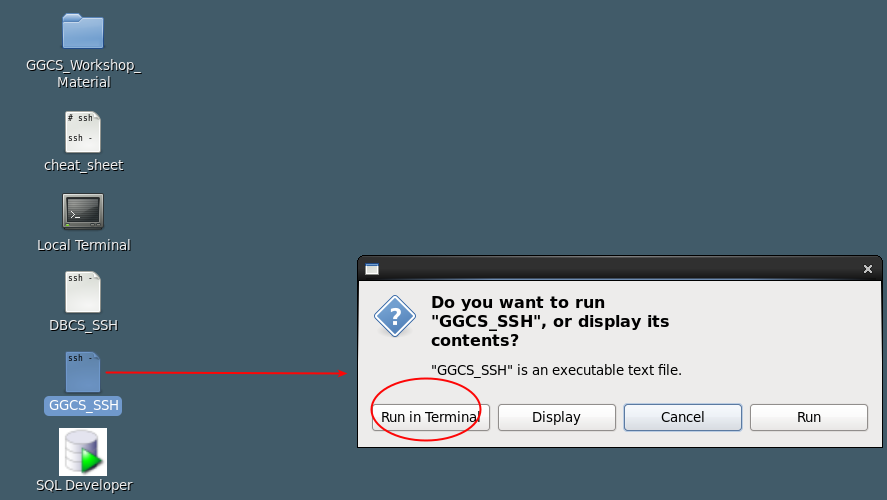
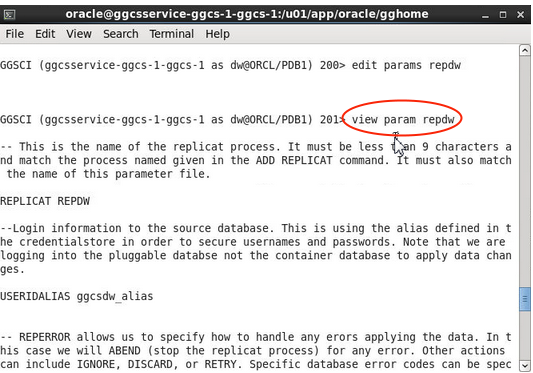
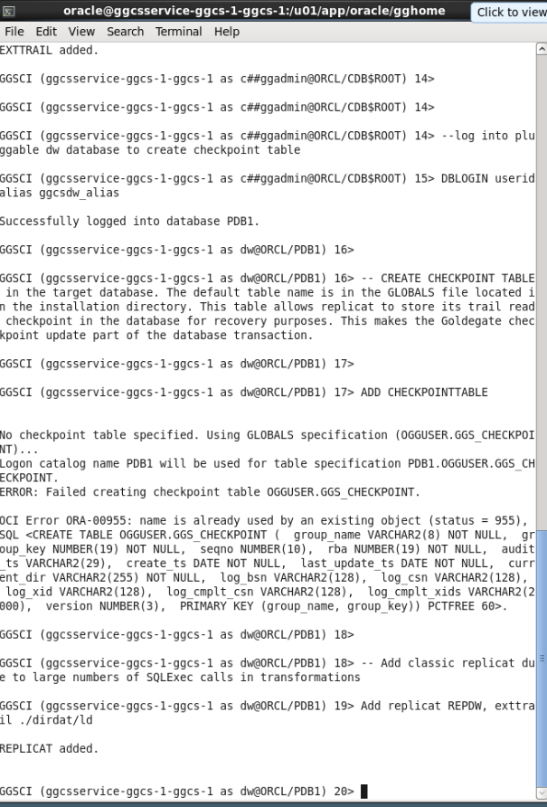
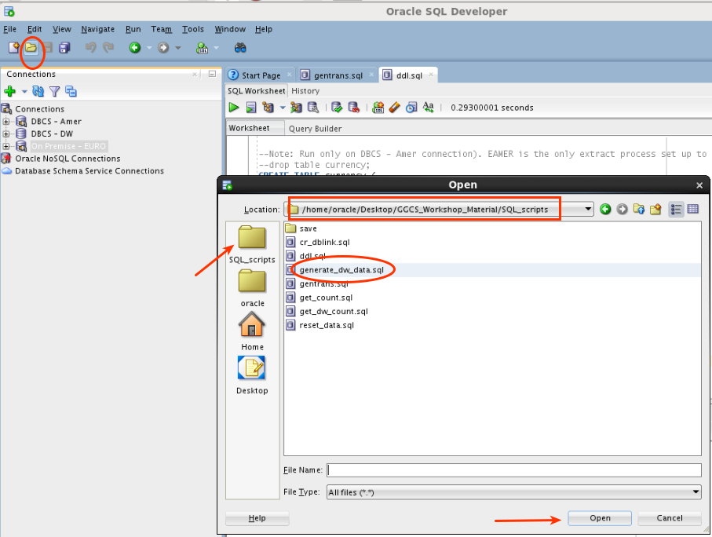
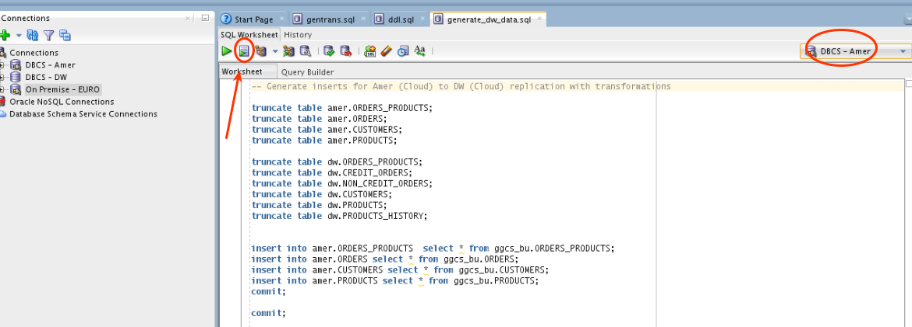
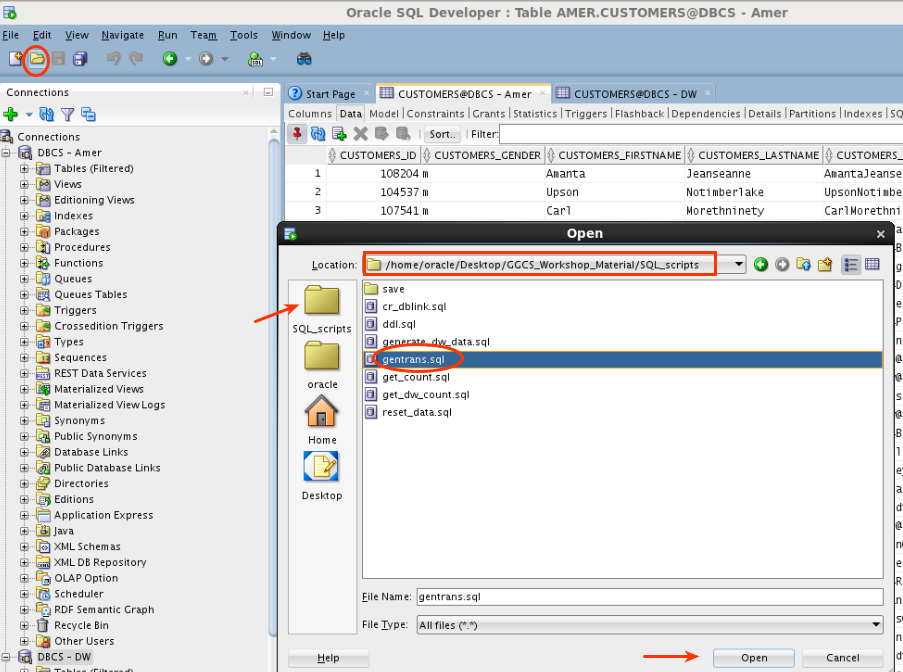
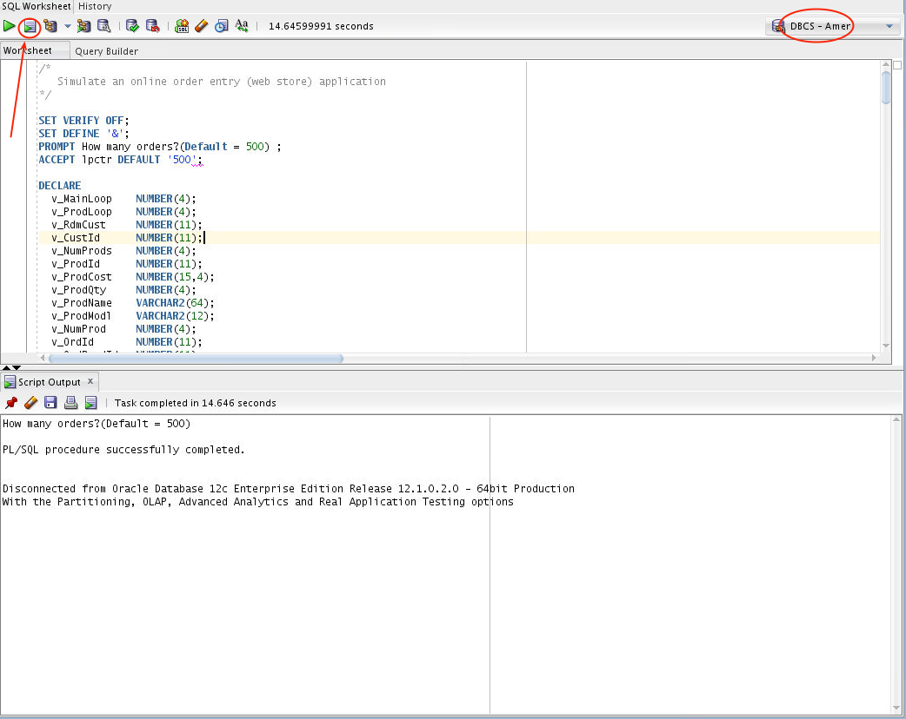

Update May 2, 2017

## Introduction

This is the third of five GoldenGate Cloud Service labs, and covers the second use case: Replication and transformation of data from a DBCS 12c pluggable database to a DBCS 12c reporting data warehouse.

This workshop will walk you through replication of data from a DBCS 12c Pluggable database to another DBCS 12c Pluggable database.  This lab will introduce data transformations as part of the replication process.

To log issues and view the lab guide source, go to the [github oracle](https://github.com/pcdavies/GoldenGateCloudService/issues) repository.

## Objectives

- Configure GGCS extract and replicat processes for data replication between DBCS 12c Pluggable Databases.
- Process data transformations as part of the data replication process.
- Review auditing support for before/after image (record) capture.

## Required Artifacts

- Access to your Oracle Cloud account and services DBCS, GGCS, and Compute.

### **STEP 1**: Configure GoldenGate Cloud Service (GGCS)

- We will use ssh on the OGG Compute image and log into GGCS from there. Double click on the `GGCS_SSH` shortcut on the desktop.  

    

- Enter the following commands:
    - **Switch to user oracle:** `sudo su - oracle`
    - **Switch to GGHOME:** `cd $GGHOME`
	- **Start a gg command shell:** `ggsci`

    

- View extract and replicat configuration.  Note we are configuring both extract (source) and replicat (target) in an oby file.  Note the use of two different credentials.
    - **Enter the following:** `view param dirprm/ADD_DW_ALL.oby`  Read comments.

    

- View parameter file `repdw`.  This parameter file implements the data transformations you will see later in the lab.
    - **Enter the following:** `view param repdw`  Scroll down to view transformations.

    

- Create/add extract and replicat processes.
    - **Enter the following:** `obey dirprm/ADD_DW_ALL.oby`

    

- Review processes.
    - **Enter the following:** `info all`

    

- Start a new DW processe.
    - **Start DW Processes:** `start *DW`
    - **Review results:** `info all`

    

### **STEP 2**: Generate Insert Transactions and Review Data on Source and Target

- Start SQLDeveloper and run script `generate_dw_data.sql` to generate insert transactions.  Open the script.
 
    

- Run `generate_dw_data.sql` against Amer

    

- Review results.  Scroll up and down to see all stats.
    - **Enter the following in ggsci:** `stats *DW total`

    

- Review results.  open the sql script `get_dw_count.sql`.

    

- Run `get_dw_count.sql` using connection DBCS - Amer.

    

- Browse the following tables in SQLDeveloper to compare AMER and DW tables to see that the following transformations occurred.  **NO DETAILED SCREEN SHOTS**.  Note the parameter file `repdw` in the `dirprm` directory implements the transformations you see in the database tables.
- **CUSTOMERS:** `CUSTOMERS_FIRSTNAME` and `CUSTOMERS_LASTNAME` concatenated into `CUSTOMERS_NAME` column.
- **CUSTOMERS:** mail address stripped out and only domain mapped into `CUSTOMER_EMAIL_DOMAIN` column.
- **ORDERS:** split into `CREDIT_ORDERS` and `NON_CREDIT_ORDERS` tables based on content of  `PAYMENT_METHOD` column.
- **ORDERS:** `ORDERS_STATUS_DESC` column filled in by SQL lookup of value from `ORDERS_STATUS_LOOKUP` table.
- **ORDERS_PRODUCTS:** `FINAL_PRICE` column calculated via stored procedure (they can look at the stored procedure `DW.SP_TOTAL` via GUI if desired)
- **PRODUCTS:**  `PRODUCTS_TAX_CLASS_DESC` column filled in by using case statement
- **PRODUCTS_HISTORY** auditing table populated by inserting all records (note additional columns).

    

### **STEP 3**: Review Audit Support

- We need to generate some transactions for the audit process.  Open gentrans.sql.

    

- Execute with the AMER connection.  You will be prompted for number of transactions - enter 500.

    

- Review `PRODUCTS_HISTORY` in `DW` auditing table to see that updates include the BEFORE and AFTER images of updates.

    
