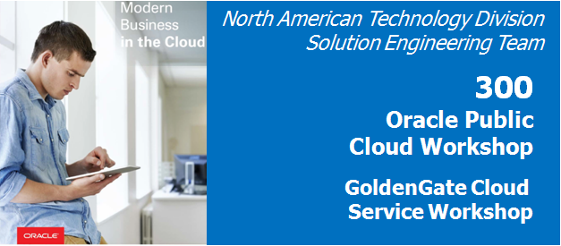
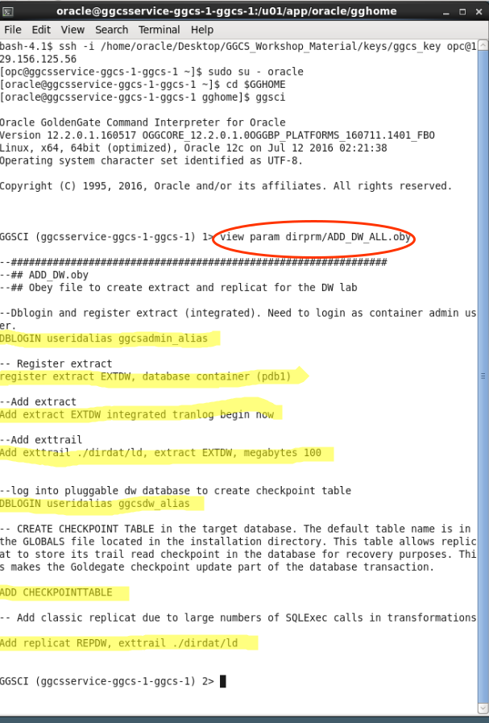
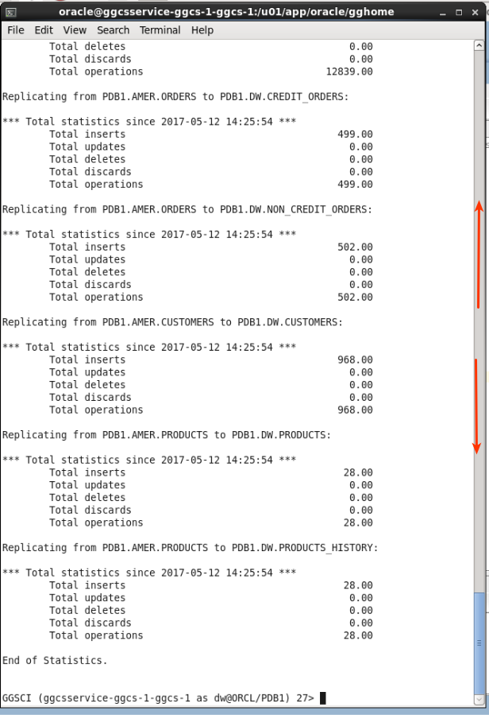
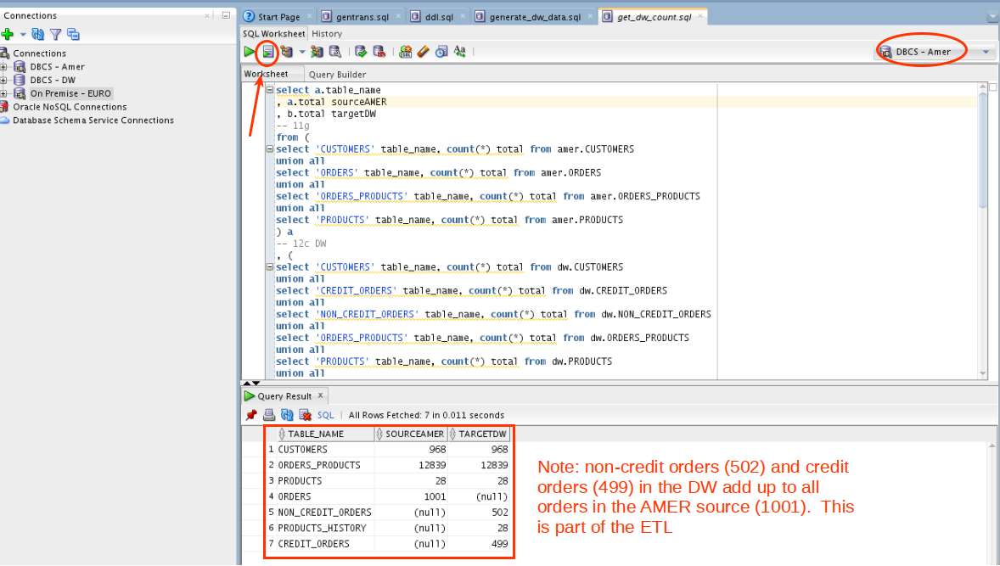
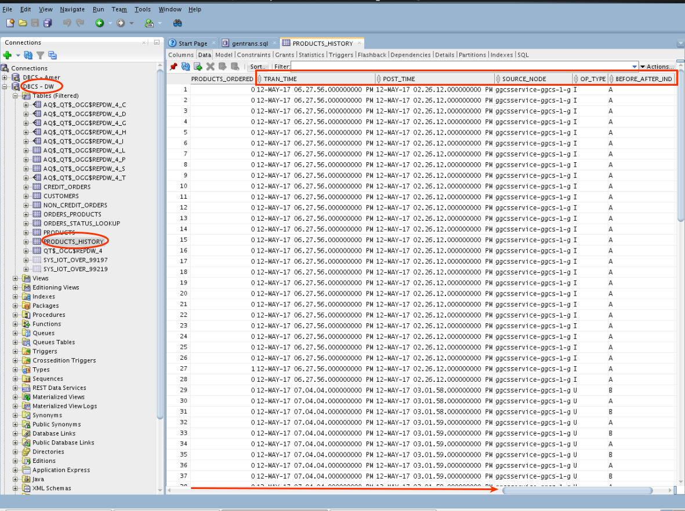
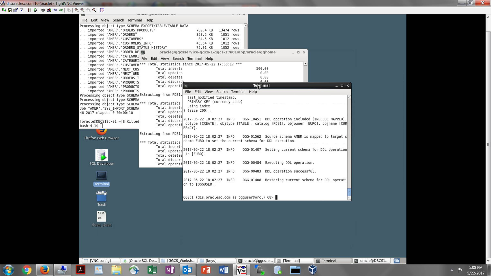

Update May 2, 2017

## Introduction

This is the third of five GoldenGate Cloud Service labs, and covers the second use case: Replication of data from a DBCS 12c multi-tenant Pluggable Database back to an on-premise 11g Database

This workshop will walk you through replacation of data from a DBCS 12c Pluggable database back to an 11g On-premise Database.  Note that the 11g Database used in this Workshop is running on compute and does not require a VPN (or dedicated) network, but in practice you would need a VPN (or Corente or other) network connection to replicate data from the cloud to a customer database.

To log issues and view the lab guide source, go to the [github oracle](https://github.com/pcdavies/GoldenGateCloudService/tree/master/workshops/goldengate) repository.

## Objectives

- Configure GGCS extract processes for data replication to 11g Database on-premise.
- Configure OGG replicat processes for data replacation from DBCS 12c in the Cloud.
- Generate Transactions and view data movement statistics to monitor activity.

## Required Artifacts

- Access to your Oracle Cloud account (used in Lab 100 and Lab 200) and services DBCS, GGCS, and Compute.

### **STEP 1**: Configure GoldenGate Cloud Service (GGCS)

- Open a terminal window on the OGG Compute image and ssh to GGCS:
	- **SSH to GGCS:** `ssh -i /home/oracle/Desktop/GGCS_Workshop_Material/keys/ggcs_key opc@129.156.125.56`
	- **Switch to user oracle:** `sudo su - oracle`
    - **Switch to GGHOME:** `cd $GGHOME`
	- **Start a gg command shell:** `ggsci`

	    

- Review amer extract configuration:
    - **Enter the following:** `view param dirprm/ADD_AMER_EXTRACT.oby`  Read comments

	

- Add amer extract:
    - **Enter the following:** `obey dirprm/ADD_AMER_EXTRACT.oby`

	

- Review the processes:
	- **Enter the following:** `info all`

	

- Note in the screen shot above we have added EXTRACT processes.  There is currently a REPLICAT (RAMER) running.  That is from the previous lab, and was used to apply updates to DBCS.  We will stop that process.
	- **Enter the following:** `stop RAMER`
	- **Wait a few seconds and then enter:** `info all`

	

- Edit pump parameters and update the target IP address.  Also note/read other highlighted parameters.  **Note the use of linux 'vi' editor to update, which requires specific keys to navigate:**
	- **Enter the following:** `edit params dirprm/PAMER.prm`
	- **Note navigation keys (case sensitive):** `j - down, k - up, h - left, l - right`
	- **To set insert mode:** `i to insert (above keys no longer navigate), esc to get out of insert mode`
	- **To delete characters:** `x`
	- **To save and exit:** `first :, then x`

	

- Start new extract process and confirm process are running.  Stop RAMER (from last Lab).
	- **Enter the following:** `start *`  This starts all processes
	- **Enter the following:** `info all` note you may need to wait a few seconds
	- **Stop Replicat:** `stop RAMER`
	- **Confirm status:** `info all`
	- **! will repeat last command**

	

### **STEP 2**: Configure Oracle GoldenGate (OGG) On-Premise (11g Database)

- Exit out of the current terminal window.  Enter exit at least twice to ensure you are NOT still in GGCS.  Open a NEW terminal window:
	- **Enter the following:** `cd $GGHOME`
	- **Start a new GG Command shell:** `./ggsci`

	

- View pre-configured REPLICAT:
	- **Enter the following:** `view param dirprm/ADD_EURO_REPLICAT.oby`  Read comments.

	

- Add new REPLICAT:
	- **Enter the following:** `obey ./dirprm/ADD_EURO_REPLICAT.oby`

	

- Review processes, start manager, and start replicat, and confirm processes are running:
	- **Enter the following:** `info all`
	- **IF the manager is not running enter the following:** `start mgr`
	- **Stop Extract EEURO (from Lab 200):** `stop EEURO`
	- **Stop Pump PEURO (from Lab 200):** `stop PEURO`
	- **Start new Replicat REURO:** `start REURO`
	- **Confirm Lab 300 services are running:** `info all`

	

### **STEP 3**: Generate Transactions and Review Results

- Open SQLDeveloper and open the sql file gentrans.sql using the amer connection:

	

- Execute the script, enter 500 for the number of transactions:

	

- Open a new terminal window for GGCS (DBCS 12c), and position it on the left.  SSH into GGCS.
	- **SSH to GGCS:** `ssh -i /home/oracle/Desktop/GGCS_Workshop_Material/keys/ggcs_key opc@129.156.125.56`
	- **Switch to user oracle:** `sudo su - oracle`
    - **Switch to GGHOME:** `cd $GGHOME`
	- **Start a gg command shell:** `ggsci`
	- **Enter:** `stats * total`

	

- Open a new terminal window for OGG (11g On Prem) and position it on the right.
	- **Change to gg home:** `cd $GGHOME`
	- **Start ggsci:** `ggsci`
	- **Enter stats reuro total`

	

- Compare stats for GGCS and OGG:

	

- **LEAVE THESE TWO WINDOWS OPEN AND Return to SQLDeveloper and run get_count.sql

	

- Execute script against EURO.  Note the row counts match proving replication.

	

- We will now replicate DDL (table definition changes and other SQL that creates objects, not just data inserts/updates/deletes).  Open file ddl.sql

	

- Note the following and then run the script:
	- Note the tables do not yet exist in connection AMER.
	- Select AMER connection on the left.
	- Execute the script.

	

- Note table currency has been created in AMER and user CURRENCY_ADMIN has also been created.

	

	

	

- Compare with OGG/11g:

	

- Return to your OGG terminal window on the right and review stats:
	- **Enter the following:** `stats reuro` scroll back up after the command

	

- Show DDL report	
	- **Enter the following:** `view report reuro`.  Scroll up and down to view the entire report.

	
