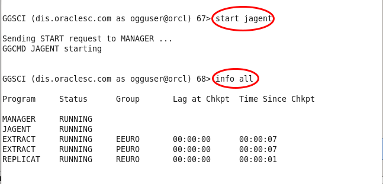

Update May 2, 2017

## Introduction

This is the fourth of five GoldenGate Cloud Service labs, and covers the third use case: Replication and transformation of data from a DBCS 12c pluggable database to a DBCS 12c reporting data warehouse with Business Intelligence analytics access.

This workshop will walk you through replacation of data from a DBCS 12c Pluggable database to another DBCS 12c Pluggable database.  This lab will introduce data transformations as part of the replication process, and will show how you can deliver real-time analytics through Oracle Business Intelligence data visualizations and dashboards.

To log issues and view the lab guide source, go to the [github oracle](https://github.com/pcdavies/GoldenGateCloudService/tree/master/workshops/goldengate) repository.

## Objectives

- Configure GGCS extract and replicat processes for data replication between DBCS 12c Pluggable Databases.
- Process data transformations as part of the data replication process.
- Review auditing support for before/after image (record) capture.
- Show how real time data replication supports real time analytics and reporting.

## Required Artifacts

- Access to your Oracle Cloud account and services DBCS, GGCS, Compute, and BI Cloud Service (BICS).

### **STEP 1**: Configure GoldenGate Cloud Service (GGCS)

- Open a terminal window on the OGG Compute image and ssh to GGCS:
	- **SSH to GGCS:** `ssh -i /home/oracle/Desktop/GGCS_Workshop_Material/keys/ggcs_key opc@129.156.125.56`
	- **Switch to user oracle:** `sudo su - oracle`
    - **Switch to GGHOME:** `cd $GGHOME`
	- **Start a gg command shell:** `ggsci`

    

- View extract and replicat configuration.  Note we are configuring both extract (source) and replicat (target) in on oby file.  Note the use of two different credentials.
    - **Enter the following:** `view param dirprm/ADD_DW_ALL.oby`  Read comments

    

- Create/add extract and replicat processes.
    - **Enter the following:** `obey dirprm/ADD_DW_ALL.oby'

    

- Review processes.
    - **Enter the following:** `info all'

    

- Stop Lab 300 processes and start new DW (Lab 400) processes.
    - **Stop EAMER:** `stop EAMER`
    - **Stop PAMER:** `stop PAMER`
    - **Start DW Processes:** `start *DW`
    - **Review results:** `info all`

    

### **STEP 2**: Generate Insert Transactions and Review Data on Source and Target

SQLDeveloper:  run gen_DW_data.sql against Amer
On ggcs:              ggsci> stats *DW total
ggsci> lag reuro  (we will have to redo screenshot when/if we fix time zone issue otherwise we drop this). Once “at EOF” all records have been replicated
ggsci> !                               will repeat last command

SQLDeveloper:  run get_dw_count.sql and show that counts match

use GUI to compare amer and dw tables to see that the following transformations occurred
- CUSTOMERS : customers_firstname and customers_lastname concatenated into customers_name column.
- CUSTOMERS: email address stripped out and only domain mapped into customer_email_domain column.
- ORDERS: split into CREDIT_ORDERS and NON_CREDIT_ORDERS tables based on content of  payment_method column.
- ORDERS: orders_status_desc column filled in by SQL lookup of value from orders_status_lookup table.
- ORDERS_PRODUCTS: final_price column calculated via  stored procedure (they can look at the stored procedure dw.sp_total via GUI if desired)
- PRODUCTS:  products_tax_class_desc column filled in by using case statement
- PRODUCTS_HISTORY auditing table populated by inserting all records (note additional columns).

### **STEP 3**: Generate Update Transactions and Review Audit Support

SQLDeveloper:  run gentrans.sql against Amer

Use GUI to review PRODUCTS_HISTORY auditing table to see that updates include the BEFORE and AFTER images of updates.

### **STEP 4**: Access BICS Dashboards and Review GGCS Replicated Data

