Update May 2, 2017

## Introduction

This is the fifth of five GoldenGate Cloud Service labs, and will review GGCS monitoring.

To log issues and view the lab guide source, go to the [github oracle](https://github.com/pcdavies/GoldenGateCloudService/tree/master/workshops/goldengate/issues) repository.

## Objectives

- Configure GGCS for monitoring.
- Start monitoring services and review activity.

## Required Artifacts

- Access to your Oracle Cloud account, and GGCS and the Compute image.

### **STEP 1**: Configure On-premise

- Log into VNC and open file browser in the Compute instance.
	- **Edit the following file and udate the IP address with the GGCS IP:** `/u01/app/oracle/product/ggcc_instance/conf/agent.properties`

- Update the following fields:
    - **ggInstanceHost=** `<ip address of on prem vm>`
    - **ggccServiceHost=** `<ip address of ggcs vm>`
    - **proxy-127.0.0.1=** `<ip address of ggcs vm>`

- Start GoldenGate Cloud Service agent:
    - **Open the workshop folder on the desktop.**
    - **Double click on the following file:** `start_ggccagent.sh` 
    - **Select Run in Termainl.  LEAVE THIS WINDOW OPEN**

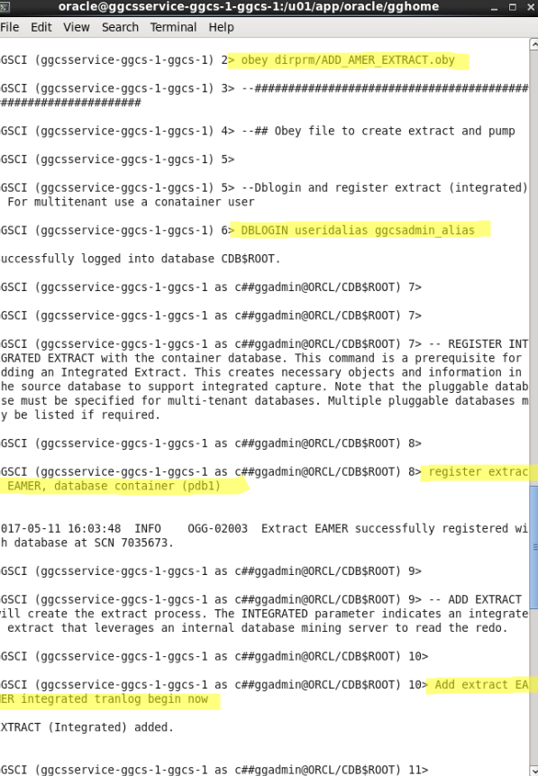

-  Open a new terminal window:
    - **Enter the following:** `cd $GGHOME`
    - **Start ggsci:** `./ggsci`
    - **Start jagent:** `start jagent`

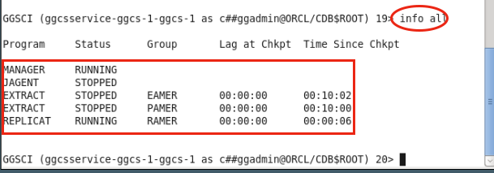

### **STEP 2**: Configure GGCS

- Open a terminal window on the OGG Compute image and ssh to GGCS:
	- **SSH to GGCS:** `ssh -i /home/oracle/Desktop/GGCS_Workshop_Material/keys/ggcs_key opc@<your ggcs IP address>`
	- **Switch to user oracle:** `sudo su - oracle`
    - **Enter the following:** `cp /u02/data/ggcc/agent/conf/agent.properties /u02/data/ggcc/agent/conf/agent.properties_bu`
    - **Edit the file and replace 11.111.111.111 placeholders with student ip addresses of the ggcs VM. Leave other parameters at the default:** `vi /u02/data/ggcc/agent/conf/agent.properties`
        - `ggInstanceHost=11.111.111.111`
        - `ggccServiceHost=11.111.111.111`
	- **Use the arrows on your keyboard to navigate to the IP address**
	- **Use the `i` character to enter insert mode and the `[ESC]` key to exit insert mode**
	- **Enter your DBCS IP address:** see highlighted text below
	- **Use the `x` key to delete characters**
	- **To save enter `:` character and then `x` character**

- Open a ggsci command shell and enter the following.
    - **Enter:** `cd $GGHOME`
    - **Start ggsci:** `./ggsci`
    - **Create datastore:** `create datastore`
    - **Review processes:** `info all`
    - **Stop processes:** `stop *`
    - **Stop Manager:** `stop mgr`
    - **Start Manager:** `start mgr`
    - **Start DW Processes:** `start *DW`

- Add weblogic credentials by executing the following: (**Note - screen shot below shows creds have already been created at the point of screen capture for this lab doc)
    - **Exit ggsci:** `exit`
    - **Enter:** `/u01/app/oracle/middleware/ggccagent/bin/ggccAgent.sh /u02/data/ggcc/agent/conf/agent.properties createServerCred`
    - **You will be prompted for weblogic username and password:**
        - `weblogic`
        - `ggcs2017_`
        - **Following screenshot may need to be replaced.**

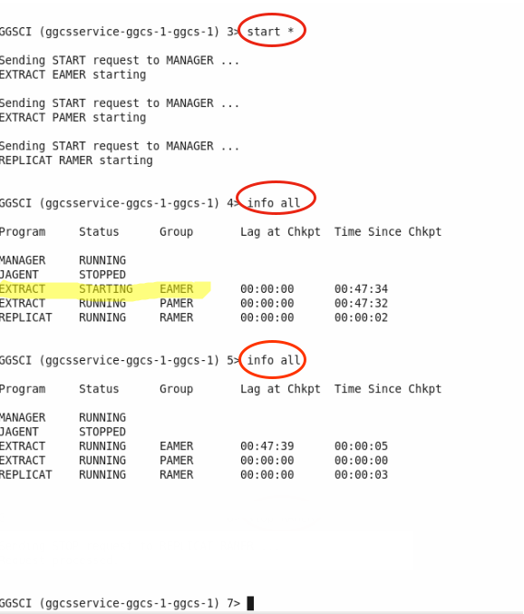

- Start the agent by running the following.  **BE SURE TO LEAVE THIS WINDOW OPEN, DO NOT CLOSE IT!**
    - **Run the following:** `/u01/app/oracle/middleware/ggccagent/bin/ggccAgent.sh /u02/data/ggcc/agent/conf/agent.properties start`

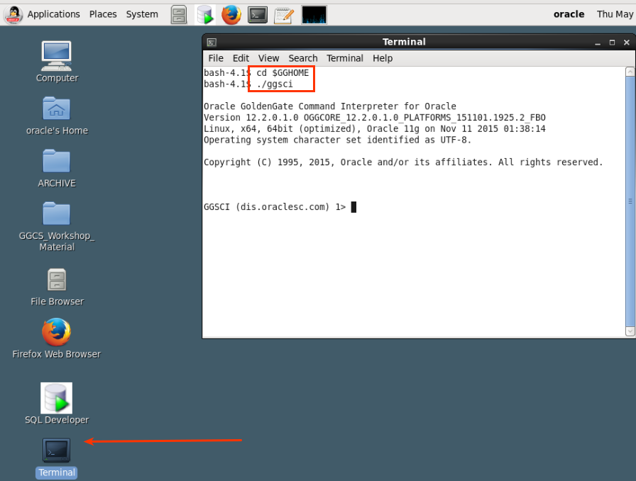

- Open a new terminal window and SSH into ggcs.  Run a process that Integrates the agent with the GoldenGate instance. 
	- **SSH to GGCS:** `ssh -i /home/oracle/Desktop/GGCS_Workshop_Material/keys/ggcs_key opc@<your ggcs IP address>`
	- **Switch to user oracle:** `sudo su - oracle` 
    - **Run the following:**  `/u01/app/oracle/middleware/ggccagent/bin/ggccAgent.sh /u02/data/ggcc/agent/conf/agent.properties intgGGSCI $GGHOME`

- Start ggsci and then  jagent
    - **Enter:** `ggsci`
    - **Enter:**  `start jagent`
    - **Confirm the agent is runnning:** `info all`

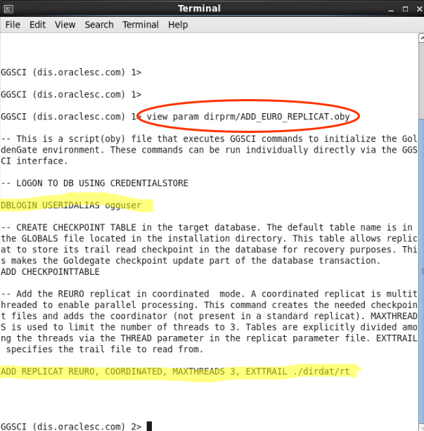

### **STEP 3**: Review Monitoring Services

- Return to your web browser and log into Oracle Cloud and open GoldenGate Control Console from GoldenGate Cloud Service Console (hamburger menu to right of service name)
    - **Log into Oracle cloud:** `<use your cloud account userid and password>`

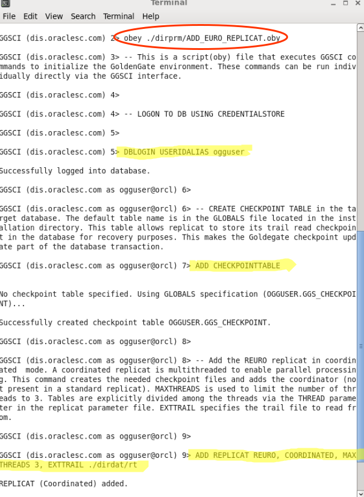

- Access the console using the hamburger menu on the right and log into the Console:
    - **Username:**  weblogic
    - **Password:**  `ggcs2017_`

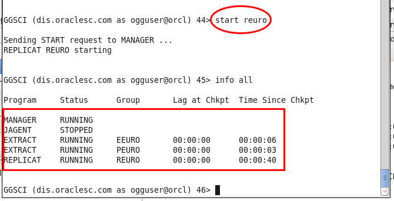

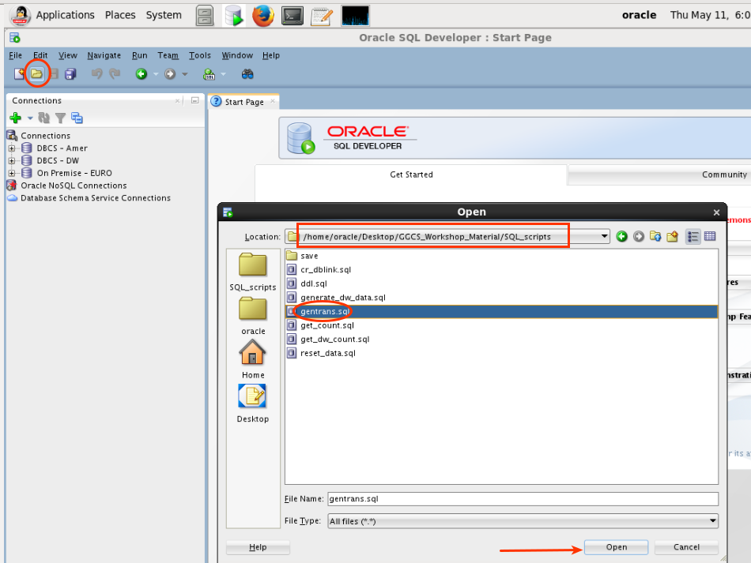

- Review
    - **Catalog/Instances**
    - **Catalog Tasks**
    - **Policies**

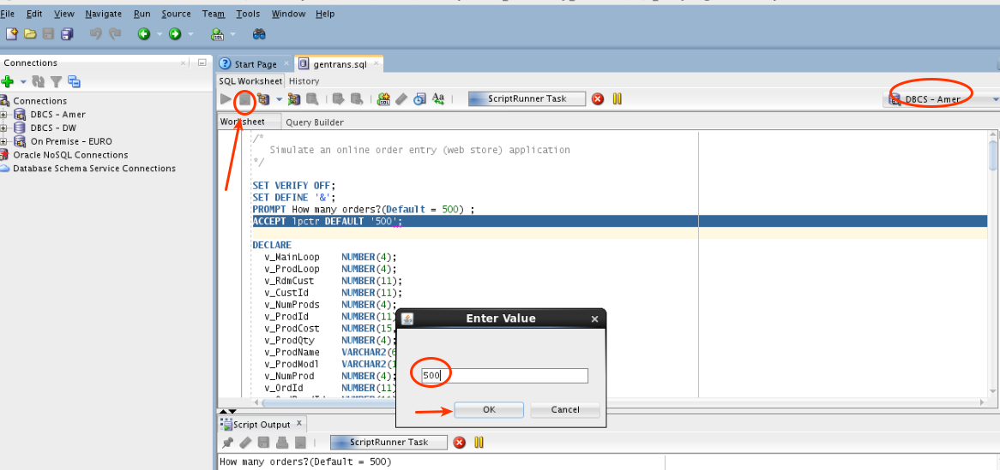

- Review Dashboard Hot Tables.  Click on the largest bar graph.

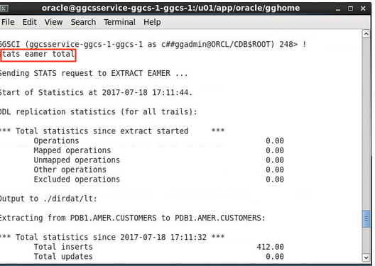

- Note the replication detail.

- Navigate to instances and not GGCS is up and available.

- Return to ggsci and stop EXTDW process.  You may need to open a new terminal window (if you closed it previously):
	- **SSH to GGCS:** `ssh -i /home/oracle/Desktop/GGCS_Workshop_Material/keys/ggcs_key opc@<your ggcs IP address>`
	- **Switch to user oracle:** `sudo su - oracle` 
    - **Enter the following:**  `stop EXTDW`

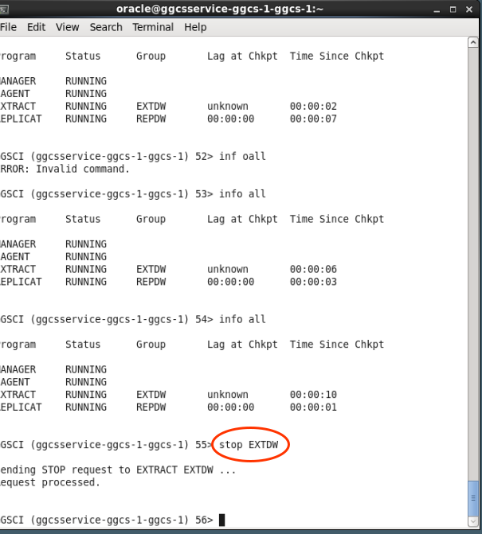

- Return to the Console and review Changes in status in instances, tasks.  

- Review Notifications.  Note the service is down.

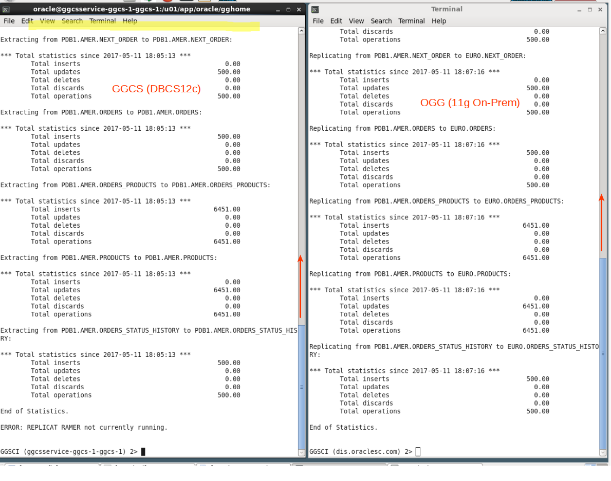

- Go back to ggsci and start EXTDW process.
    - **Enter the following:** `start EXTDW`

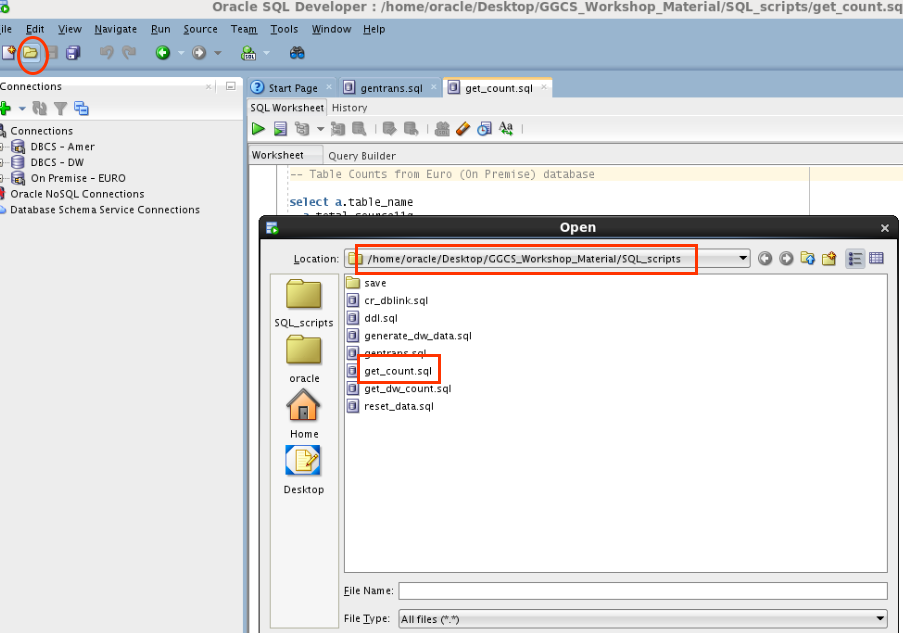

- Return to the Console and review changes in status in instances, tasks. Note service is back up.

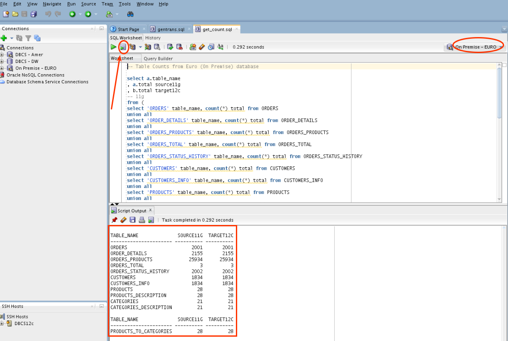
