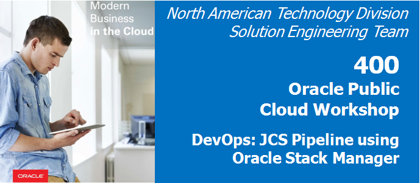  
Update: October 14, 2017

## Introduction

This is the fourth of several labs that are part of the **DevOps JCS Pipeline using Oracle Stack Manger workshop**. This workshop will walk you through the Software Development Lifecycle (SDLC) for a Java Cloud Service (JCS) project that goes through Infrastructure as Code and deployment of a Struts application.

In this lab, Lisa Jones (The Project Manager) will complete the Sprint and view the Agile reports provided by the Oracle Developer Cloud Service

***To log issues***, click here to go to the [github oracle](https://github.com/oracle/cloud-native-devops-workshop/issues/new) repository issue submission form.

## Objectives
- Access Developer Cloud Service
- Complete Sprint
- Run Backlog and Sprint Reports
- Review Administrative Tasks

## Required Artifacts
- The following lab requires an Oracle Public Cloud account that will be supplied by your instructor.

# Close the Sprint

## Connect to the Develop Cloud Service

### **STEP 1**: Login to your Oracle Cloud Account

- This Lab assumes that you completed Lab 100, 200, and 300 and are still connected to the Oracle Cloud, that you're still in the Developer cloud Service Dashboard, and you're viewing the "Alpha Office Product Catalog Project". If for some reason that is not the case, follow the first several Steps of Lab 100 to once again view the Developer Cloud Service Console.

- Although you will remain connected to the Oracle Cloud using the user account you were provided, you are to take on the Persona of ***Lisa Jones*** as you perform the following steps.

      

- Click on **Agile** on the AlphaOffice Board.

    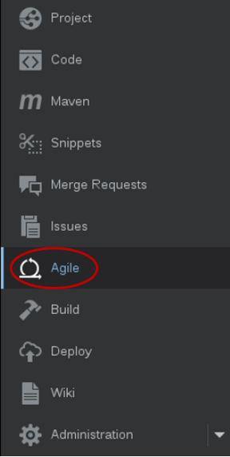  

- Click on the **Reports** Button and explore the **Burndown Chart**.

    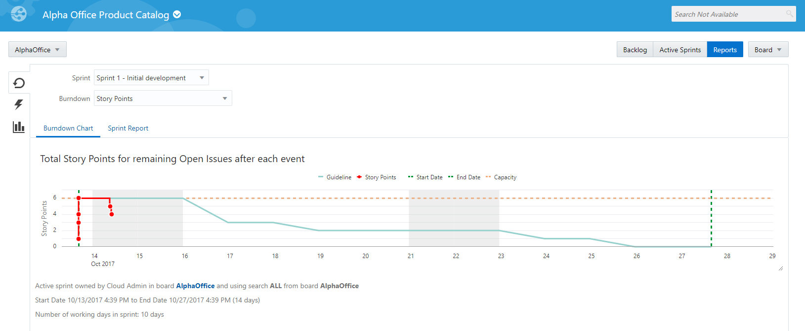  

- Click on the **Sprint** report.

    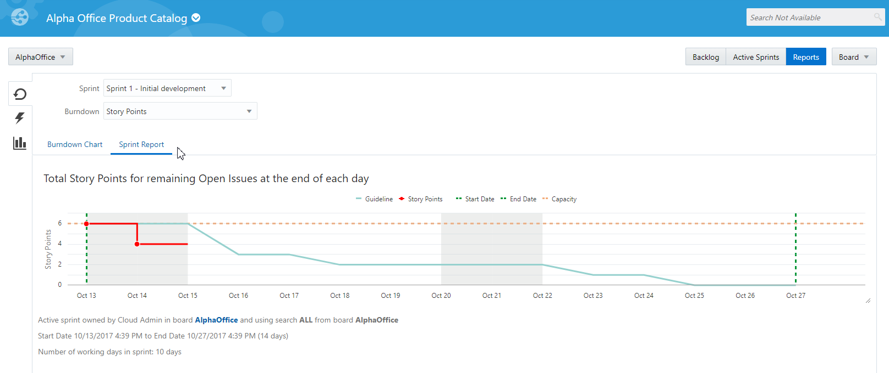  

### **STEP 2**: Complete the Sprint

- Click on to the **Active Sprints** button, then click **Complete Sprint**.

      

- **Confirm** and **Complete** the Sprint

      

# Project Administrative Features

## Review Administrative Features

### **STEP 4**: Review Administrative Options

- Click on **Administration** navigation to view the available administrative options. Click on the **Properties icon**.

    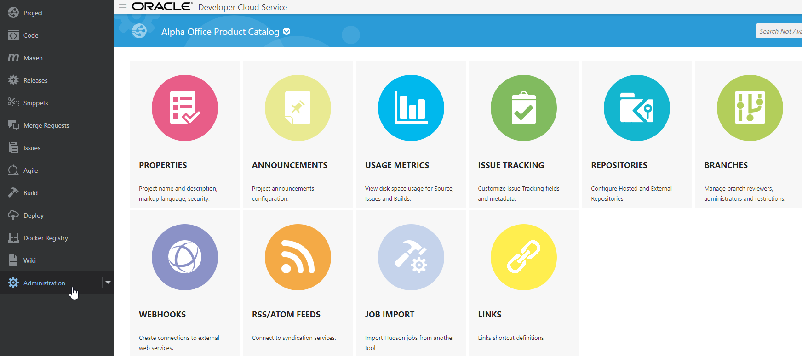  

- From this panel you are able to set the default properties for the Project. This is also the where the project can be deleted.

    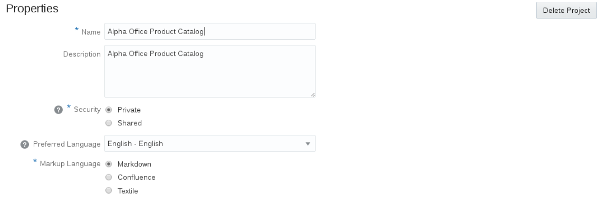  

- Click on the Administration drop down to view the other Administration options. Select the **Usage Metrics**.

    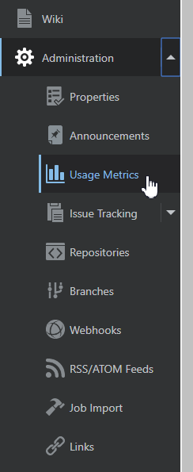  

- The Usage Metrics will display the available storage allocation and usage for Git, Maven, Hudson, Tasks and the Wiki.

    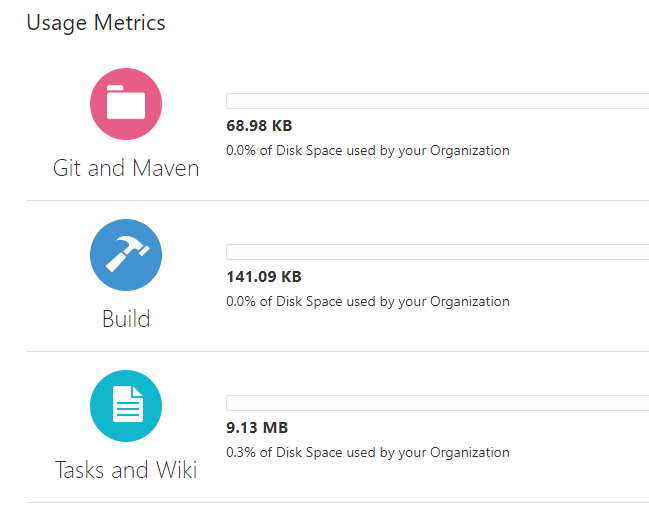  

- From the Menu options list select **Issues Tracking** to view the options available for Issue configuration.

    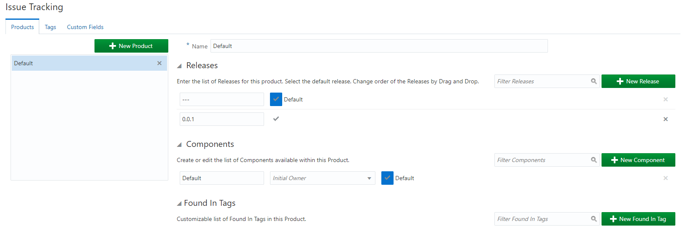  

- From the Menu options list, select **Repositories**. From this page you can create and delete repositores. You also have the ability to create reference to **External Repositories**.

    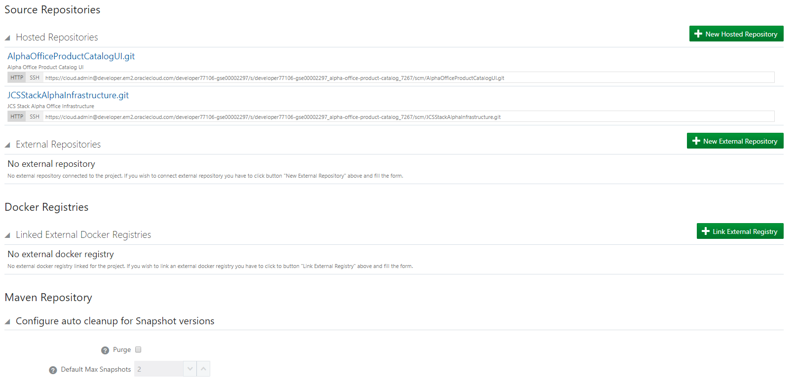  

- From the Menu options list, select **Branches** to view the repository branches by User or Branch.

    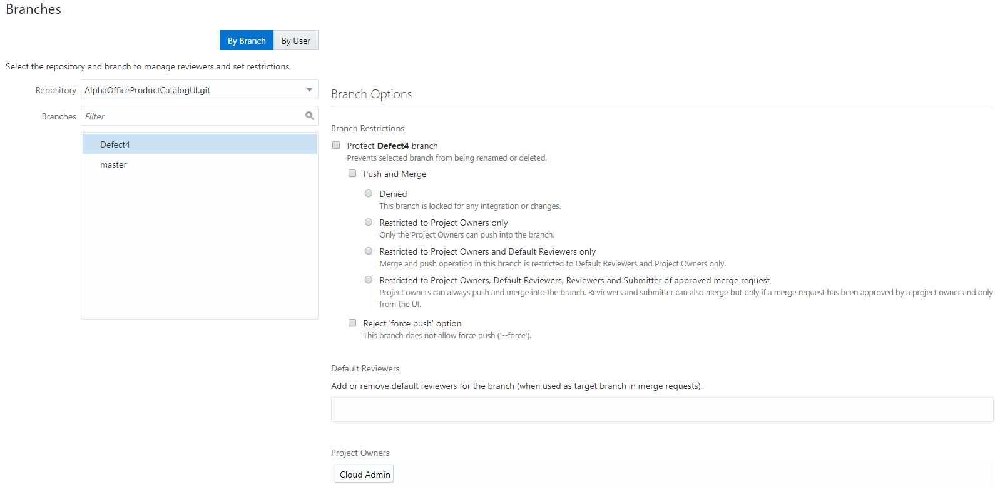  

- You have now completed this lab
