# Trial Account Student Guide


Update: December 7, 2017

## Overview of Tasks

You will need to **complete the following 3 Tasks** prior to attempting the Labs contained in this workshop

- **Acquire an Oracle Cloud Trial Account**
- **Configure Oracle Cloud Identity Information**
- **Install the required open source tools locally on your computer (e.g. Eclipse and Git)**

# Acquire an Oracle Cloud Trial Account

### **Step 1**: Getting your Trial Account

- Click on this URL [cloud.oracle.com/tryit](http://cloud.oracle.com/tryit&intcmp=DeveloperInnovation-HOL-11NOV17), and complete all the required steps to get your free Oracle Cloud Trial Account.
- You must wait to receive our account before continuing to the "**Configure Oracle Cloud Identity Information**" Section.

# Configure Oracle Cloud Identity Information

## Login to your Oracle Cloud Account

### **Step 2**: Record information from the welcome email

- During the provisioning of your account, you will receive two welcome email message. ***Note: You must wait for the 2nd email shown below***, as it contains information about the ***Traditional Account***, which is required for this workshop. If the second email does not appear within 30 minutes, please check your Junk or Promotions email folders (based on your email provider).


- For later use during the workshop labs, **record the following fields**, some of which you'll find in the email. The other **fields not found in the email** will be located shortly. This information will be ***used multiple times*** during the workshops Labs, so we recommend that you **copy the following list to a text document**, and then populate the fields as they are collected from the **Welcome Email** documented above.

```
Username:
Temporary Password (for Both Accounts):

Cloud Account Name:
Cloud Account Password:

Identity Domain Name:
Traditional Account Password:

Identity Tenant ID:
Data Center:
```

- ***(1)*** **Username**: With a trial account, this should be your email address.
- ***(2)*** **Temporary Password**: The first time you login, you will use this temporary password.
- ***(3)*** **Cloud Account Name**: This name will be used when you login  using the **Cloud Account with Identity Cloud Service**. ***Note***: When you click on Link **(5)** in the email, you will use this Cloud Account Name. This is the method by which all Oracle Services will eventually be authenticated.
- **Cloud Account Password**: You will login to your Cloud Account to set this password.
- ***(4)*** **Identity Domain Name**: This name will be used when you login with the **Traditional Cloud Services**. During this workshop, we will be use the Developer Cloud Services, which is currently a Traditional Cloud Services. ***Note***: When you click on Link **(6)** in the email, you will use this Identity Domain Name.
- **Traditional Account Password**: You will login to your Traditional Cloud Account to set this password in an upcoming step.
- **Identity Tenant ID**: We will locate this information later, but make a holding place in your notes for this field. This field will be used by PaaS Stack Manager for provisioning of Infrustructure.
- **Data Center**: We'll locate this information in an upcoming step, and this fields will also be used by PaaS Stack Manager for provisioning of Infrustructure.
- **Storage REST Endpoint**: We'll locate this information in an upcoming step, and this fields will also be used by PaaS Stack Manager for provisioning of Infrustructure.

### **Step 3**: Login to the Oracle CLoud

- Click on the link ***(5)*** **Cloud Account My Services URL** provided in the email.
- Follow the instructions to **set your password**, and then record in your notes the new password for this **Cloud Account Password** field.

- You are now have viewing the dashboard used to access all the Cloud Services managed by the Oracle Identity Cloud Services.

- Click on the **Customize Dashboard** box to add the some select services to the Dashboard.

    

- Located the **Identity Cloud** Services, and click on **Show**.

    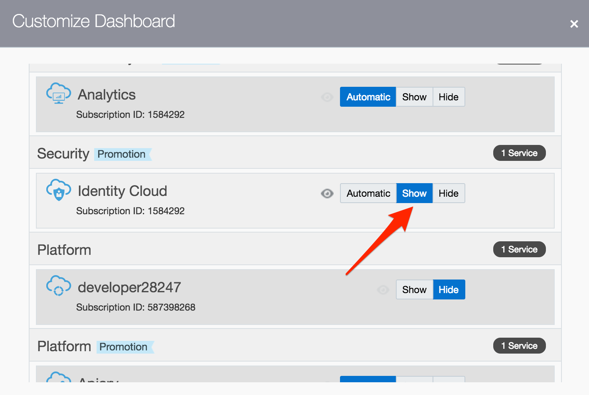

- Also locate and **Show** the **Storage Classic** and **Java** cloud services. Exit the Customization popup by clicking on the **X** in the upper right corner of the dialog.

    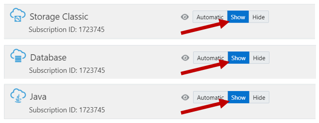

- To capture the **Tenant ID, Data Center and Storage REST Endpoint**, click on the **Storage Classic** cloud service you just added to the Dashboard.

    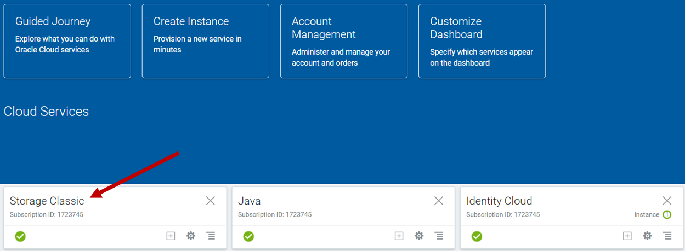

- Once the Console has loaded, The **Tenant ID** is labeled Identity Services ID. Copy and save the text enclosed in the red box's.

    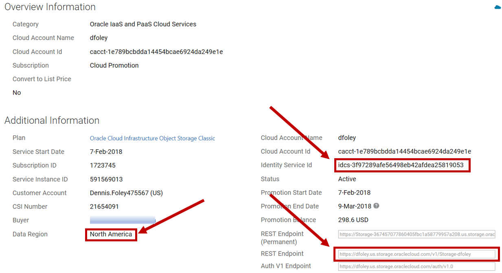

### **Step 4**: Check/Set Storage Replication Policy

Some services that we will use in this workshop require that your account's Replication Policy is set. The following steps will show you how to set your replication policy.

- On the same screen, Click **Open Service Console**

- If your replication policy has not yet been set, the following dialog will be displayed. Use the Default **Georeplication Policy**, and click on **Set Policy**.

    

- To return to the main **Dashboard**, click on the **Hamburger Menu**, and then click on the **My Services** menu option.

    

### **Step 5**: Set the Traditional Account Password

We will now set the Password for the **Traditional Account** User. This Account will allow you to access the **Developer Cloud Service**.

- Click on the link ***(6)*** **Traditional Cloud Account My Services URL** provided in the Welcome email sent from Oracle.

    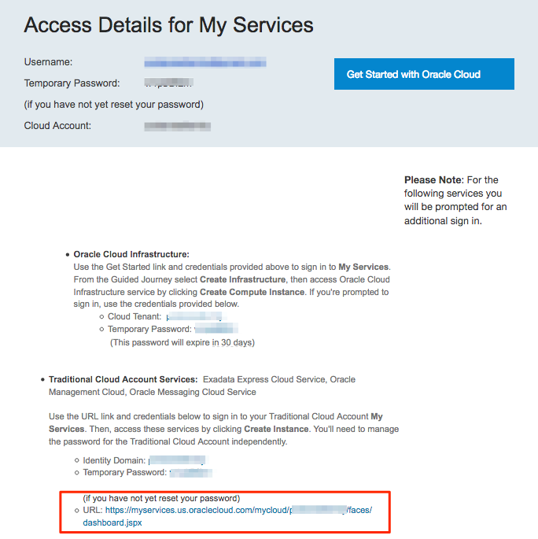

- Follow the instructions to **set your password**, and then record in your notes the new password for  **Traditional Account Password**.

### **Step 6**: Test Logging into your Multiple Accounts

It is important to fully understand how to login to both the **Standard Identity Cloud Service** managed account, and then login to the **Traditional** account at the same time. After this step, we'll assume you know how to switch between accounts and services during the upcoming labs. ***Note: Oracle will soon have all services merged under the Standard Identity Cloud Service Account.*** However, until that time, you need to be aware of your dashboard Account settings, and at times you will need to switch between the Regular Cloud Account and Traditional Cloud Account to view the right services in the Dashboard and Dashboard Menus.

- Fully exit/close your browser to logout and remove all session cookies

- Re-open your browser.

- Go to [cloud.oracle.com](http://cloud.oracle.com)

- Click on **Sign In** at the top of the page.

    

- Set the first field to **Cloud Account with Identity Cloud Service**, enter your **Cloud Account Name** recorded earlier in the second field, and click on **My Services**

    

- Enter the **Username** and **Cloud Account Password** recorded earlier, and click on **Sign in**.

    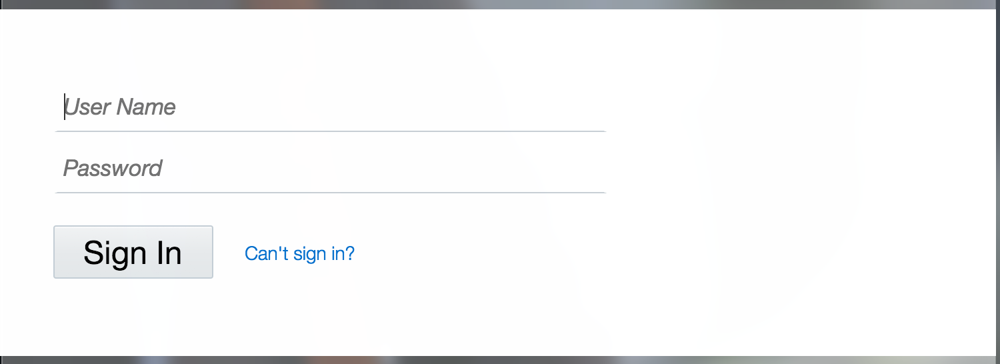

- View the available services after clicking on the Dashboard **Hamburger Menu**.

    

- Let's now connect to the **Traditional Account** at the same time. Open a new Browser tab window, got to [cloud.oracle.com](http://cloud.oracle.com) again, and click on **Sign In**.

    

- Select **Tradition Cloud Account** from the top drop-down. Next select your **Data Center**. In our example, our Data Center was US Commercial 2 - both "US Commercial 2" or "Public Cloud Services - US" work in that example. **Your selection will vary** based on what you recorded earlier in this guide.

- Click on **My Services**

    

- Enter the **Identity Domain Name** you recorded earlier, and click on **Go**

    

- Enter the **Username** and **Traditional Account Password** you recorded earlier, and click on **Sign In**

    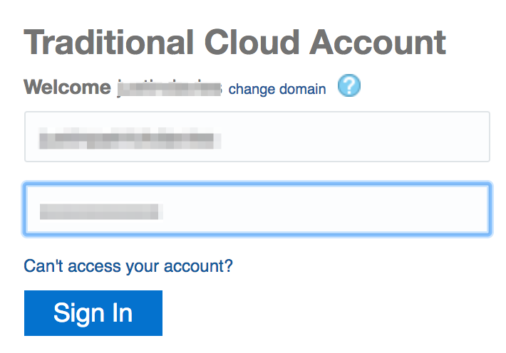

- Click on the Traditional Dashboard **Hamburger Menu**, and view the limited set of available services

    

- **Note**: you can change the account on the dashboard page between **Traditional** and the Standard **Identity Cloud Services** accounts, but one approach is to keep a tab/window open for each Account's dashboard.

    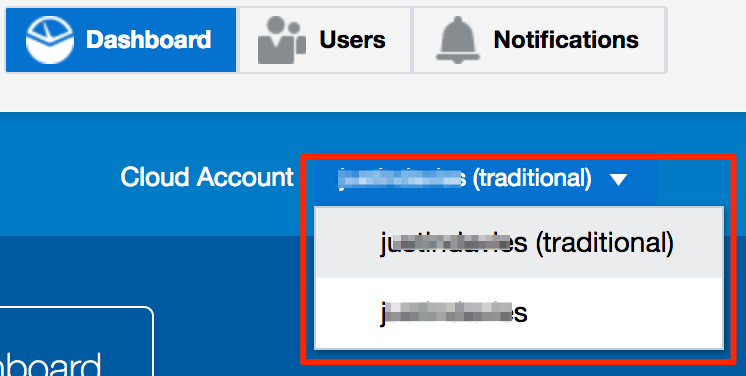


# Install the Open Source Tools

## Verify your version of the Java JDK

### **Step 7 (Windows Option)**: JDK Verification on Windows

**Note**: Eclipse requires that you have the a Java JDK 8 installed. Even if you have a JRE version 8, you still need to verify that you have a JDK 8 installed.

- On Windows, open a **cmd** window and enter `java -version`

```shell
C:\Users\usr>java -version
java version "1.8.0_121"
Java(TM) SE Runtime Environment (build 1.8.0_121-b13)
Java HotSpot(TM) Client VM (build 25.121-b13, mixed mode, sharing)
```

- If JDK/**Java version 1.8** is not installed,  you will need to download a [JDK 8](http://www.oracle.com/technetwork/java/javase/downloads/jdk8-downloads-2133151.html) from the Oracle Technology Network website, and install.

### **Step 8 (Mac Option)**: JDK Verification on a MAC

**Note**: Eclipse requires that you have the a Java **JDK** 8 installed. Even if you have a **JRE** version 8, you still need to verify that you have a JDK 8 installed.

- Open Terminal window and execute the following command: 

```bash
ls /Library/java/JavaVirtualMachines/
```

- If you do not have a JDK 1.8 folder, you will need to download the [JDK 8](http://www.oracle.com/technetwork/java/javase/downloads/jdk8-downloads-2133151.html) from the Oracle Technology Network website, and install.

## Download and Install Eclipse

### **Step 9**: Download Eclipse

***Note***: Even if you already have Eclipse installed, you need to install and use the version documented below. This version of Eclipse contains the ***Oracle Enterprise Pack for Eclipse***, which will be used during the workshop.

- Go to the [Eclipse](http://www.oracle.com/technetwork/developer-tools/eclipse/downloads/index.html) installation website

- Accept the **licensing agreement**, and then select the **Neon** version of Eclipse required for your operating system.

    

- Once you’ve downloaded eclipse, extract the zip file and install. ***Note:*** If you encounter an error when extracting Eclipse due to a "Path name too long" error on Windows, there are solutions that can be found by performing an internet search on the error to change the Windows allowed file length. Also, we have found that using the open source [7-zip](http://www.7-zip.org/download.html) tool can help overcome the file length errors encountered by the default windows zip file extraction tools.

### **Step 10**: Optionally Configure Proxies (if behind a firewall)

If you are running Eclipse behind a firewall, you need to configure the proxy setting. First, you need to ensure that Eclipse’s proxy is set. Next, you need to update the maven proxy setting, and then finally, you need to ensure that the Oracle Plugin will work with your proxy settings.

- To set configure Eclipse’s proxy, open Eclipse and navigate to the Properties menu. Depending on the operating system, this drop down is found either from the **Eclipse > Preferences, or Window > Preferences**

    

- From the preferences panel, enter “**proxy**” into the search window, and click on **Network Connections**. Select **Native** for the Active Provider and click on **OK**. This setting works well, but it requires that you have the proxy setting configured correctly on the system running Eclipse – e.g. Windows, MAC OS or Linux. Selecting Manual should also work, but some of the plugins require the underlying operating system’s proxy to be configured.

    

- To test that your connection works, select the menu option **Window > Show View > Other**

    

- Type “**web**” in the search field, select **Internal Web Browser** and click on **OK**

    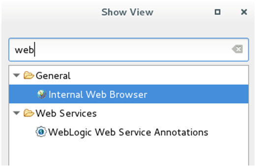

- Enter a **URL** into the browser and press **enter** to test your proxy settings.


### **Step 11**: Optionally Update the Eclipse / Maven proxy (if behind a firewall)

***Note:*** You will only do this optional Eclipse/Maven Proxy setup if you are behind a firewall. Otherwise, skip this step, and go to next step where you will download and install Brackets.

- From the **Eclipse > Preference or Window > Preferences** panel, type **Maven** into the search box. 
- Click on the Maven **User Settings**. Make note of the directory where the settings.xml file is to be located. In the example below, the Maven User Settings will be located in the **/home/oracle/.m2** directory

    

- **Cancel** out of the Maven dialog, and **Close** Eclipse

- If the directory does not exist where the settings.xml file is to be located, **create the directory**. In this example, we will create the **.m2** directory. 

- Also, create the **settings.xml** file, if it does not exist. Add the following to the settings.xml file (NOTE: you will need to use your correct **Host, Port, nonProxyHosts, username and Password settings**):

```xml
<?xml version="1.0" encoding="UTF-8"?>
<settings xmlns="http://maven.apache.org/SETTINGS/1.1.0" xmlns:xsi="http://www.w3.org/2001/XMLSchema-instance"
xsi:schemaLocation="http://maven.apache.org/SETTINGS/1.1.0 http://maven.apache.org/xsd/settings-1.1.0.xsd">
<proxies>
<proxy>
<active>true</active>
<protocol>http</protocol>
<username>proxyuser</username>
<password>proxypass</password>
<host>www-proxy.us.oracle.com</host>
<port>80</port>
<nonProxyHosts>local.net|some.host.com</nonProxyHosts>
</proxy>
<proxy>
<active>true</active>
<protocol>https</protocol>
<username>proxyuser</username>
<password>proxypass</password>
<host>www-proxy.us.oracle.com</host>
<port>80</port>
<nonProxyHosts>local.net|some.host.com</nonProxyHosts>
</proxy>
</proxies>
</settings>
```
- Reload Eclipse to use the new maven settings

### **Step 12 (Windows Only)**: Download/Install Git

- Go to the following URL: https://git-scm.com/downloads

    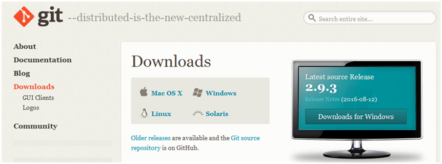

- Select your OS. In our example, we will show how to install on Windows. Click **Windows** Download and click **Save File**

    

- Select your download location and click **Save**. We will use D:\Software    

    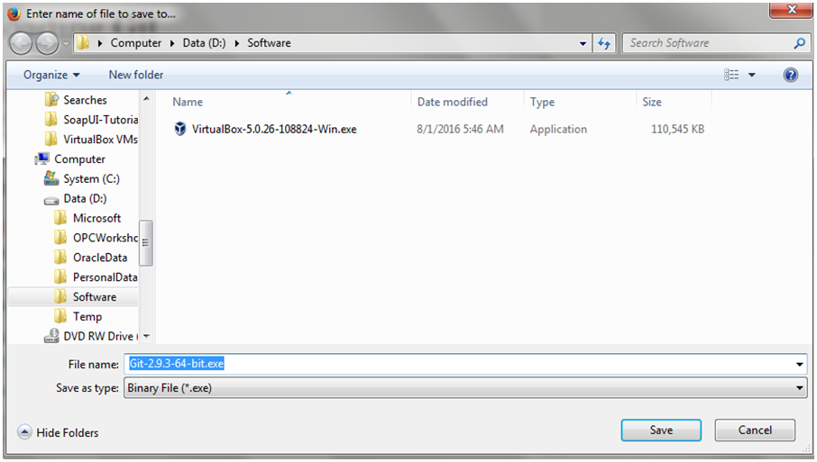

- Open Windows Explorer and navigate to where you downloaded the Git executable. Double click on the Git executable to start the install process.

    

- Run through the installation process. In our tests, we used the default installation settings.

    

- You can now ready to start on [Lab 100](JCSPipelineStackManager100.md) Lab
