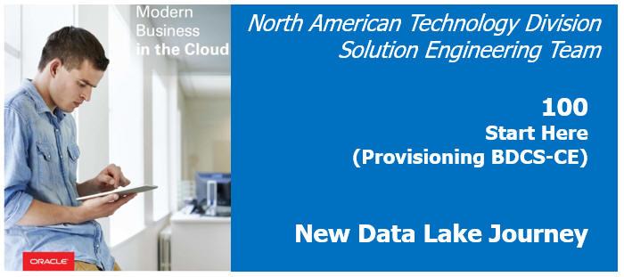  

Updated: March 8, 2018 for BDC Version 18.1.4

    
# Lab 100 : Provisioning Oracle Big Data Cloud

## Introduction

In this lab, you learn how to provision a **Oracle Big Data Cloud (BDC)** cluster.  

The Oracle Big Data Cloud (BDC) enables you to rapidly, securely, and cost-effectively leverage the power of an elastic, integrated Big Data Infrastructure to unlock the value in Big Data.   In this lab, we will walk you through the steps to quickly configure and create a Big Data Cloud instance.  When done you will see how to view the configuration and layout of your instance using the Oracle Big Data Console.  

Please direct comments to: David Bayard (david.bayard@oracle.com)

## Objectives

- Get access to the Oracle Public Cloud
- Learn how to upload a file to the Oracle Storage Cloud Object Store
- Learn how to provision a BDC instance
- Learn how to access your BDC instance

# Get access to the Oracle Public Cloud

Your first step is to get access to the Oracle Public Cloud.  There are a couple of ways:

+ You may already have access to an the Oracle Public Cloud environment.  Provided that you have the ability to create new instances of Big Data Cloud Service Compute Edition (BDC) and Oracle Event Hub Cloud Service (OEHCS) as well as the ability to upload files to the Storage Cloud, then you should be able to use your exisitng environment.
+ If you are a customer or prospect, you can sign-up for the free $300 Trial Account.  Please refer to the instructions here: [$300 Trial](xtra300Trial.md)
+ If you are an Oracle employee, you can request a temporary environment from the GSE demo.oracle.com website.  Please refer to the instructions here: [Employee GSE request](xtraGSErequest.md)

In any case, follow one of the above approaches to obtain access to an Oracle Public Cloud account with the ability (and quota) to create new instances.

## A note about Oracle Cloud Infrastructure and Oracle Cloud Infrastructure Classic

Assuming your cloud account allows it, Oracle Big Data Cloud can be deployed to both OCI and OCI-Classic data centers.  This journey was originally built against Oracle Cloud Infrastructure Classic, but it does work with OCI as well.

The choice of OCI or OCI-Classic is made when you provision a new BDC instance.  There will be a Region drop-down on the first page of the BDC Create Instance screen.  If you choose an OCI region, then you'll use OCI.  If you choose "No Preference", you'll use OCI-Classic.

These provisioning instructions have not been updated for OCI, so the screenshots and instructions will reflect using OCI-Classic.

If you do use OCI, you'll be using the OCI Object Storage service which is distinct from the OCI-Classic Object Store.  The instructions in this document show you how to upload the bootstrap.sh script to the OCI-Classic Object Store.  If using OCI, you'll need to instead use the OCI Console to create a "journeyC" bucket in the OCI Object Store and upload the bootstrap.sh to the "bdcsce/bootstrap/bootstrap.sh" location prior to creating your BDC instance.  You'll also need to complete the pre-requisite steps for running PAAS services in OCI (https://docs.us-phoenix-1.oraclecloud.com/Content/General/Reference/PaaSprereqs.htm).

## Know your identity domain

Write down the name of your Identity Domain in a document as you will need it later: 
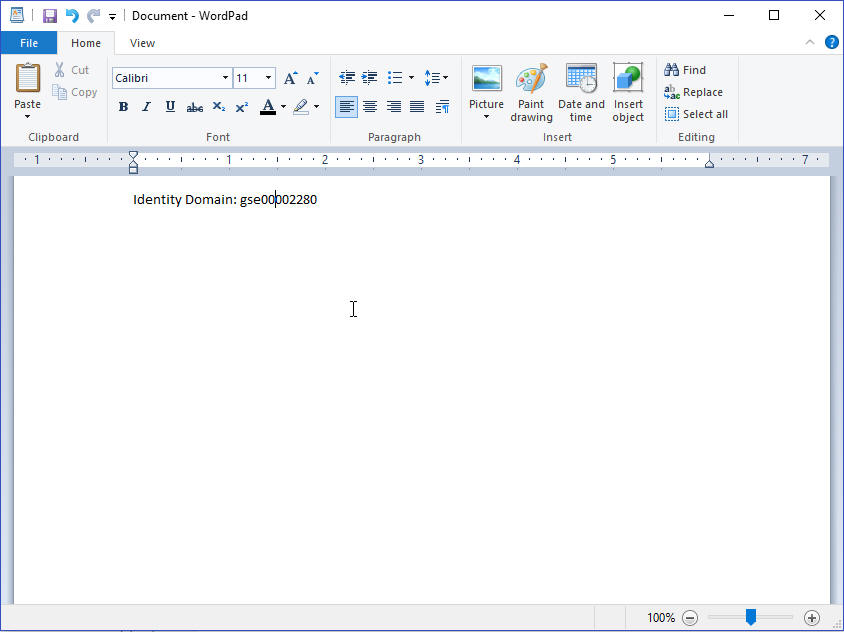 

+ Hint: you should also write down the data center if you have it (for instance, "US Commerical 2")

# Section1: Create a container in the Storage Cloud and upload a file

Next, we will create a container in the Storage Cloud to hold the files and data used by this workshop.  This container will be the "default" container used by the BDC instance we will create.  And we will upload to this container a special "bootstrap.sh" file that will be used to customize our BDC instance as it is provisioned.

If you are using OCI (instead of OCI-Classic), be sure to to read the note above about OCI and OCI-Classic as the instructions in this section do not apply to OCI.

## Create a new Storage Cloud Object Store container

### **STEP 1**: Navigate/login to the Oracle Cloud My Services Dashboard  

  + You should already know the URL to login to Oracle Cloud My Services dashboard and should use that to login directly.  But if you don't, navigate to <a href="https://cloud.oracle.com/home" target="_blank">here</a> . Then click Sign In:
   
    + Then you will need to specify the data center (hint: if you an internal employee and were given credentials via email, try US-Commericial 2 for the data center).  And then click My Services.

Once you login with your Public Cloud credentials, you will see the Oracle Cloud My Services Dashboard:
 

### **STEP 2**: Click on Customize Dashboard

 

### **STEP 3**: Scroll down to the IAAS section and click on Show for the Storage service

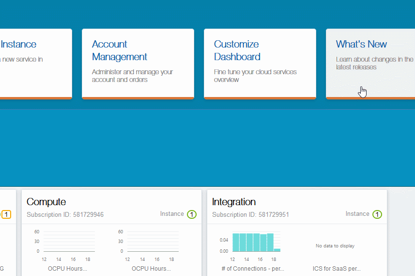 

### **STEP 4**: Click on Storage in the dashboard.  Then copy the REST Endpoint value and save it into your document for later use.

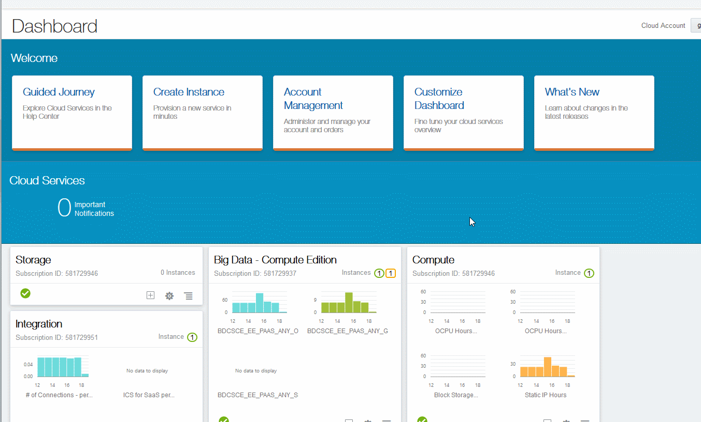 

### **STEP 5**: Using the upper right popup menu, navigate to Storage page

 

### **STEP 6**: Click on Create Container.  Name the container journeyC.  Write down the container name.

You are advised to name your container "journeyC" (case-sensitive), but the labs should work if you use your own name.  If you choose your own container name, do not use an underscore in the name.

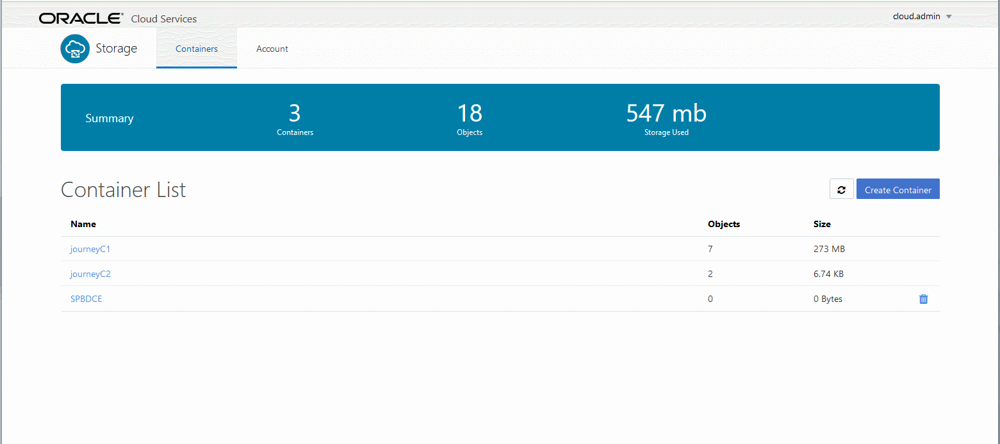 

## Upload the bootstrap.sh file to the container

### **STEP 1**: Download the bootstrap.zip file to your computer, unzip it, and save the bootstrap.sh file in a directory you can easily find.

Download the bootstrap.zip file from here: [https://github.com/millerhoo/journey2-new-data-lake/raw/master/workshops/journey2-new-data-lake/files/100/bootstrap.zip](https://github.com/millerhoo/journey2-new-data-lake/raw/master/workshops/journey2-new-data-lake/files/100/bootstrap.zip)

Be sure to unzip the bootstrap.zip file to extract/save the bootstrap.sh file to a directory on your local computer.

### **STEP 2**: Click on your journey container to open it.  Click on Upload Objects.  Select the bootstrap.sh file.  

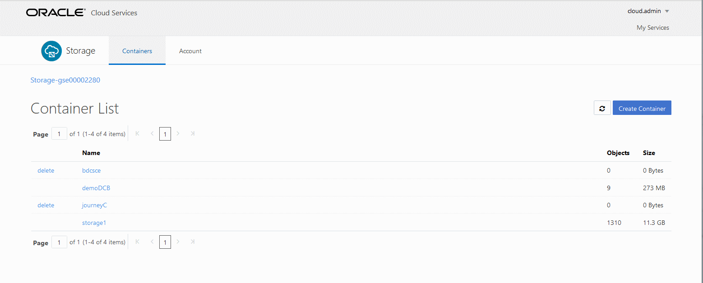 

### **STEP 3**: Click on the Actions menu for bootstrap.sh.  Choose copy.  Enter journeyC/bdcsce/bootstrap for the container.

This step copies our bootstrap.sh script into the exact location where it is needed.  Be sure you enter the value exactly (case-sensitive):  journeyC/bdcsce/bootstrap

**If you used a different container name than journeyC, substititute it accordingly.**  

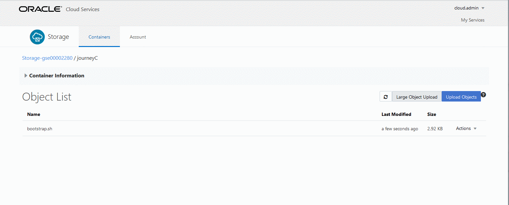 

### **STEP 4**: IMPORTANT.  Please double-check that you see a file bdcsce/bootstrap/bootstrap.sh in your journey container

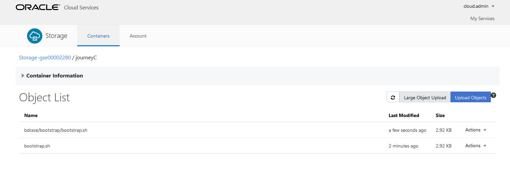 

### **STEP 5**: Click the My Services link in the upper right to return to Cloud My Services Dashboard

Note: In some cases, there may not be a My Services link in upper right of the Storage page.  You can return to the Cloud My Services Dashboard by either using the browser's back button or re-logging in.

# Provision a new BDC Instance

## Provision BDC

### **STEP 1**: Navigate/login to the Oracle Cloud My Services Dashboard  

 

### **STEP 2**: Using the upper left menu, navigate to Big Data - Compute Edition

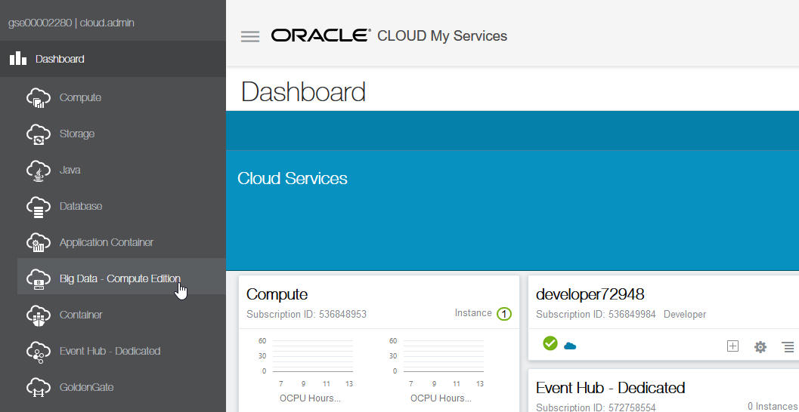 

### **STEP 3**: Click Create Service

  

### **STEP 4**: Fill in the Service Name, Description, Email and click Next
- You can choose whatever you want for Service Name.  It is an identifier to help you in case you create more than one BDCSCE cluster.
- In some cases, you might see a field labelled Region.  This happens if your OPC Identity Domain is mapped to more than 1 data center.  You should be OK leaving it as No Preference.  Note: if you pick an OCI data center, be sure to read the note at the top of these instructions about OCI and OCI-Classic.

  

### **STEP 5**: In the Cluster Configuration section, choose **Full** for the Deployment Profile, enter **1** for the Number of Nodes, and be sure to choose Spark Version 2.1.
- For this workshop, be sure to choose Full for the Deployment Profile.  The Full profile includes components like Hive which are not part of the Basic profile.
- We suggest you choose the Number of Nodes as 1 as that is sufficient to run the journey.  Keeping the number of nodes small will reduce your costs or allow your trial to last longer.
- Currently, the examples are built for Spark 2.1 so be sure to select that version.
- **Optionally**, you can choose OC3M for the Compute Shape.  OC3M will use 4 OCPUs.  This will avoid some potential issues in the labs.  You can use OC2M if you want to or need to, but there may be times when some steps will hang and you will need to follow some extra steps to continue (which we have tried to document).  **Our recommendation is to use OC3M unless you know you will need the extra 2 OCPUs for other services.**

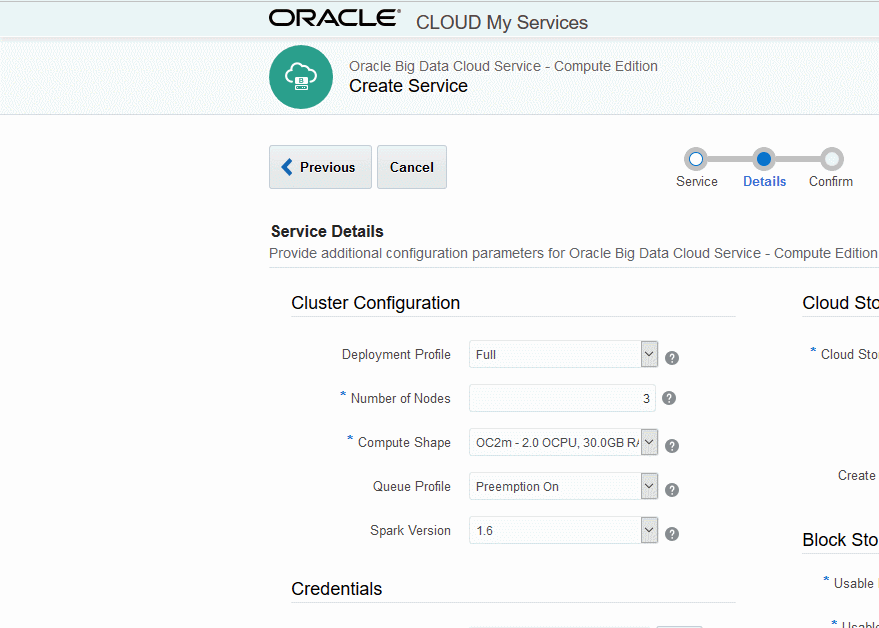  

### **STEP 6**: In the Credentials section, define your SSH public key and the desired username/password to use for the BDC cluster administrator.

- **Use IDCS (Identity Management)**: The instructions were written assuming you are NOT using IDCS, but the journey should work fine if you do select to use IDCS.  There are a few differences- mostly around connecting to Hive/Spark via JDBC- but we will try to document them in the appropriate places.  Currently, this option only appears in OCI-Classic data centers.
- **SSH Public Key**: There are various approaches you can use.  You can define a value for a VM Public Key, use a file with a VM Public Key or create a new key.
  - The easiest choice if new to this environment may be to create a new key.
  - Choose to Create a New Key and hit the Enter button.
  - Once you hit Enter, a File Folder Window will pop up to allow you to control where on your local computer you wish to store your SSH Key file (ex: sshkeybundle.zip).
  - Make sure and write down the location of this SSH key file.
  - The SSH Public Key field will then get filled in automatically.
- **Administrative User**: Define the user id for the administration user for your instance. (We suggest you leave it at its default: bdcsce_admin)
- **Password**: Enter a password to set for the administration user.  \"Password must be at least 8 characters long with at least one lower case letter, one upper case letter, one number and one special character. For example, Ach1z0#d\"
- Confirm Password: Re-enter the password for the administration user.
  

### **STEP 7**: In the Cloud Storage Credentials section, provide your Cloud Storage information.

- **Cloud Storage Container** – The full name of the Oracle Storage Cloud Service container to be associated with the cluster.
  - The format is RESTENDPOINT/CONTAINER, where RESTENDPOINT is the REST Endpoint of the Storage Service, and CONTAINER is the name of the container.
  - If you followed along with the instructions, you should have a document with these 2 pieces of information:
  

- **Username** – User name of the user who has access to the specified Oracle Storage Cloud Service container.
- **Password** – The password of the above user.
- **Create Cloud Storage Container** – you do not need to select this as we created the container earlier in this lab

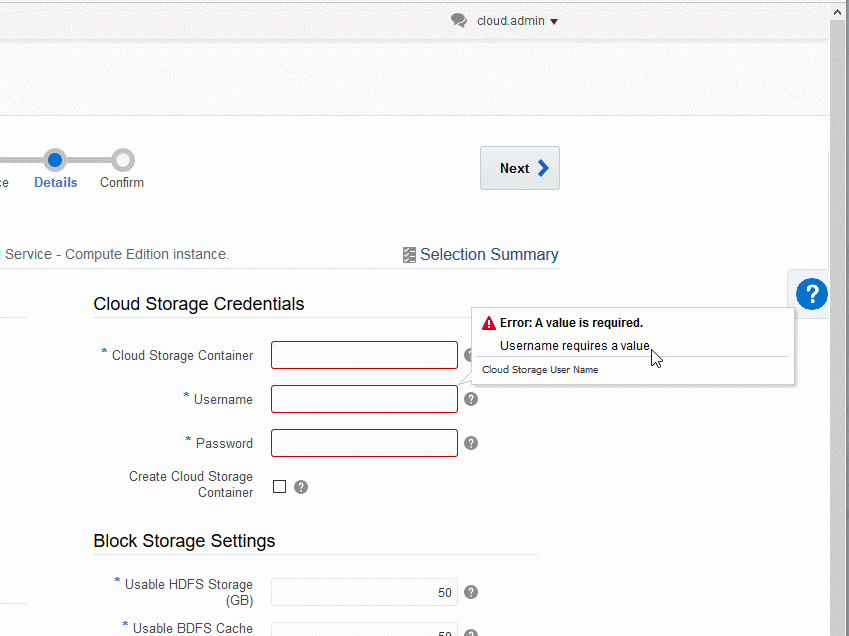 

### **STEP 8**: In the Block Storage section, leave the defaults for now.
  

### **STEP 9**: In the Associations section, leave the checkboxes unchecked for now.

- Associations will automatically create the necessary Access Rules between services.  For this workshop, we'll show you how to manually define Access Rules at a later point.
  

### **STEP 10**: Click Next.  Then, click Create.

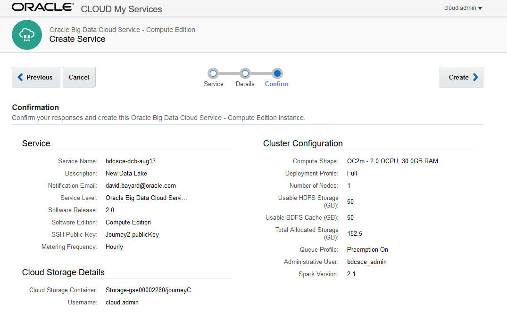  

### **STEP 11**: Wait for the BDC instance to be provisioned.

- While being provisioned, the Status will say "Creating service".  You can click on the status to get more information.
- As of 17.3.3-20, it can take about 15-20 minutes to finish creating the service.
  
- If you entered a valid email address, you will get an email the instance provisioning is finished:
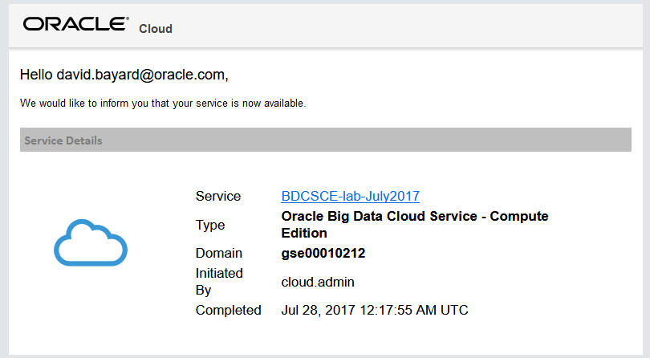  

### **STEP 12**: When the BDC instance is provisioned (the status is Ready), click on the name of the instance to go to the Service Overview page.
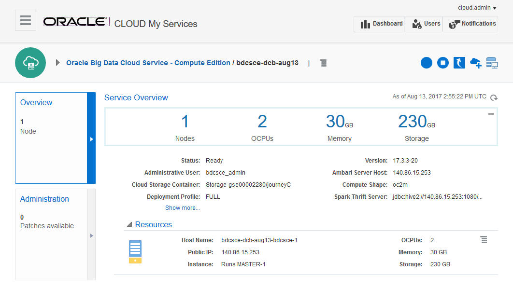  

### **STEP 13**: Review the details on the Service Overview Page
Sections include:
- **Overview** – displays the number of nodes, aggregate OCPU, Memory, and Storage
- **Administration** – displays if there are any patches available.
- **Service Overview** – displays summary information of the new Big Data Cloud Service.  This includes the Ambari Server Host whose IP address you can use to access Ambari from a URL in a browser.  As well as highlighting the Administrative user you created as well as the Cloud Storage Container and the Spark Thrift Server (part of the default configuration).  
  - Ambari is a Hadoop management web UI that can accessed through your Ambari Host Server IP address and port 8080 (ex:  http://xxx.xxx.xxx.xxx:8080).  Ambari is not covered in this Lab, but feel free to explore it on your own.
  - Note: to use Ambari, you will need to enable a Network Access rule for port 8080.
  - Your Ambari credentials will be your BDC username and password you defined when you created this instance. 
- **Resources** – displays information on the resources associated with your Service.  As you scale out and add more nodes, the new nodes as well as their Public IP address, OCPUs, Memory and Storage will be displayed.
- **Associations** – displays information on any additional resources associated with your Service.  Associations will automatically setup the necessary network Access Rules between services. 

### **STEP 14**: Record the IP address and host name in your document

 

### **STEP 15**: Review the Access Rules for your cluster
For now, you don't need to make changes to the default Access Rules.  In a later tutorial, we will use this to allow SSH access.  This is also the place where you can enable Ambari access (port 8080) which is disabled by default.  Note: There is no Access Rules option for OCI deployments as you control network access in OCI using the normal OCI VCN Security List functionality.
  

### **STEP 16**: Access the Big Data Cluster Console
- Launch the Big Data Cluster Console for your BDC cluster.  If this is your first time, you will likely need to allow your browser to accept the self-signed certificate for the web console application.
- You will be asked to provide a username/password.  Use the username and password you defined earlier when you created the BDC instance (the username defaults to bdcsce_admin).  
 

### **STEP 17**: Record the web URL of the Big Data Cluster Console in your document

# What you Learned

- Learned how to provision a BDC instance
- Learned how to access BDC

## Next Steps

- Proceed to the next Lab to learn how to use BDC's notebook and services like Hive, Spark, and SparkSQL.
