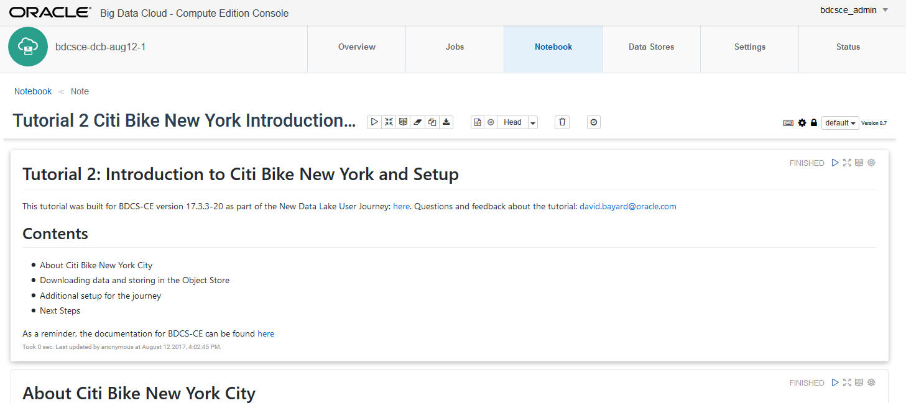
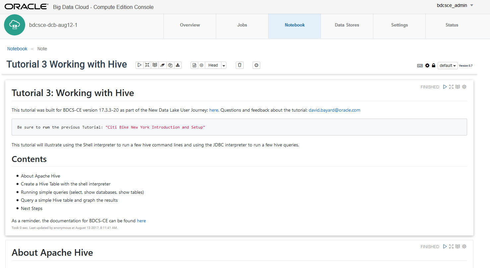

  
Updated: December 20, 2017 for BDC Version 17.4.6

## Introduction

This lab will walk you through getting to know **Oracle Big Data Cloud (BDC)**, also known as Oracle Big Data Cloud Service - Compute Edition (BDCS-CE).  

You will use the Notebook feature of BDC to run a series of tutorials that show you different aspects of functionality.  In this lab, you will learn how to work with the **Zeppelin Notebook**.  You will also be introduced to the New York City Citi Bike dataset that we will use for experimentation.  You will see how we can download some sample data and upload it to the **Oracle Cloud Storage Object Store**.  And finally, another tutorial will show you how to interact with **Hive**.   

Notebooks are used to explore and visualize data in an iterative and easily documented fashion. Oracle Big Data Cloud Service - Compute Edition uses Apache Zeppelin as its notebook interface and coding environment.  Information about Zeppelin can be found here: [https://zeppelin.apache.org/](https://zeppelin.apache.org/) .  To see examples of notes created and shared by other Zeppelin users, see [https://www.zeppelinhub.com/viewer](https://www.zeppelinhub.com/viewer) .

Please direct comments to: David Bayard (david.bayard@oracle.com)

## Objectives

- Learn how to import notes into the BDC Notebook
- Learn how to work with the BDC Notebook
- Learn about the Citi Bike dataset and upload it to Oracle CLoud Storage Object Store
- Learn how to work with Hive

## Required Artifacts

- A running BDC instance and Storage Cloud Object Store instance, created as per the instructions in lab 100.  These instructions included the use of a special "bootstrap.sh" script which sets up the BDC environment for this workshop.

## Connect to the BDC Console

### **STEP 1**: Navigate/login to the Oracle Cloud My Services Dashboard  

-  

### **STEP 2**: Navigate to the My Services page for your BDC cluster

-   

### **STEP 3**: Launch the Big Data Cluster Console

- Launch the Big Data Cluster Console for your BDC cluster.  If this is your first time, you will likely need to allow your browser to accept the self-signed certificate for the web console application.
- You will be asked to provide a username/password.  Use the username and password you defined earlier when you created the BDC instance (the username defaults to bdcsce_admin). 
  

# Learn the basics of the BDC Notebook

## Open and run the first Tutorial note in the notebook

### **STEP 1**: Click on the Notebook tab.

 

### **STEP 2**: Expand the Journeys folder.  Then expand the New Data Lake folder.  Then click on the title of the "Tutorial 1 Notebook Basics" note.

**If you do not see the "Journeys" folder or the "Extras" folder, then the bootstrap.sh script did not work correctly.  If this happened, most likely there was a problem with how you uploaded the bootstrap.sh and/or the exact syntax you specified for the Storage Cloud location when you provisioned your BDC instance.  Sorry, but you will want to delete your instance and re-follow the Lab 100 instructions again paying close attention to the instructions around bootstrap and Storage Cloud.**

### **STEP 3**: Read and follow the instructions in Tutorial 1

- The paragraphs of the note are displayed. 

Please walk through the paragraphs one by one. Read through the content of the paragraphs as you get to them. There is much useful information in the paragraphs that is not reproduced into these instructions.
 

# Learn about the Citi Bike Dataset and upload it to Object Store

## Open and run the second Tutorial note in the notebook

### **STEP 1**: Click on the Notebook tab. Expand the Journeys folder.  Then expand the New Data Lake folder. Then click on Tutorial 2 to open it. 

 

### **STEP 2**: Read and follow the instructions in Tutorial 2

- The paragraphs of the note are displayed. 

Please walk through the paragraphs one by one. Read through the content of the paragraphs as you get to them. There is much useful information in the paragraphs that is not reproduced into these instructions.

# Learn how to work with Hive

## Open and run the third Tutorial note in the notebook

### **STEP 1**: Click on the Notebook tab. Expand the Journeys folder.  Then expand the New Data Lake folder. Then click on Tutorial 3 to open it. 

 

### **STEP 2**: Read and follow the instructions in Tutorial 3

- The paragraphs of the note are displayed. 

# What you Learned

- Learned how to work with the BDC Notebook
- Learned about the Citi Bike dataset and how to upload it to the Oracle Cloud Storage Object Store
- Learned how to work with Hive

# Next Steps

- Proceed to the next Lab to learn about Spark and Spark SQL
