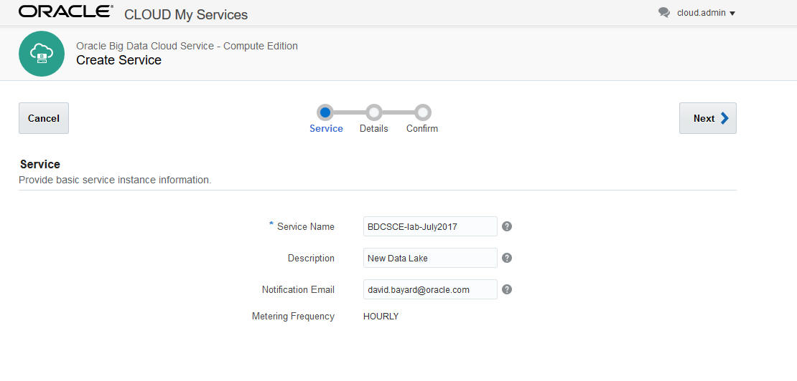
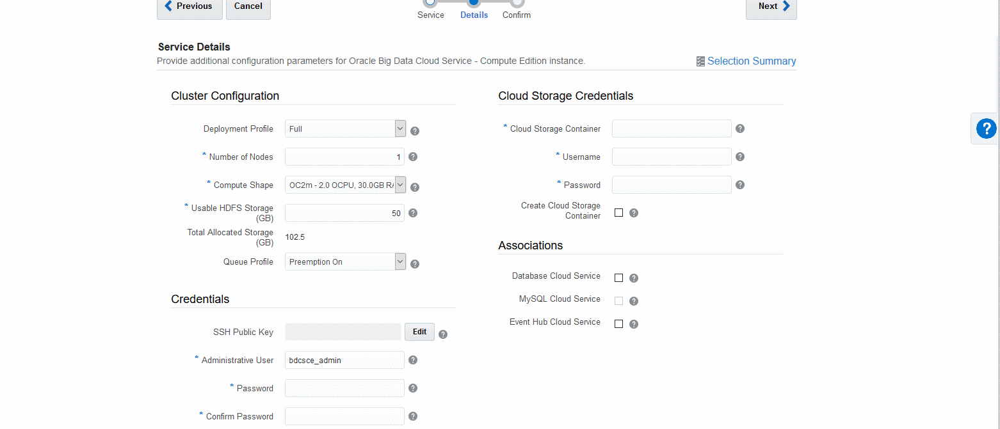
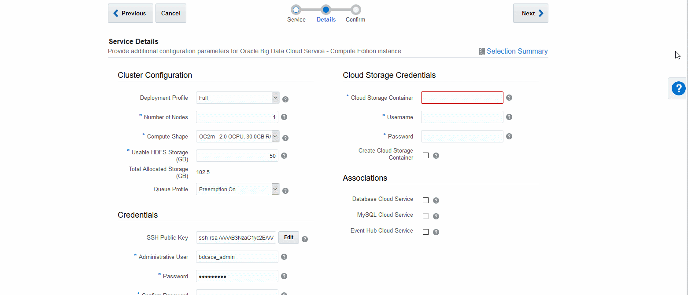
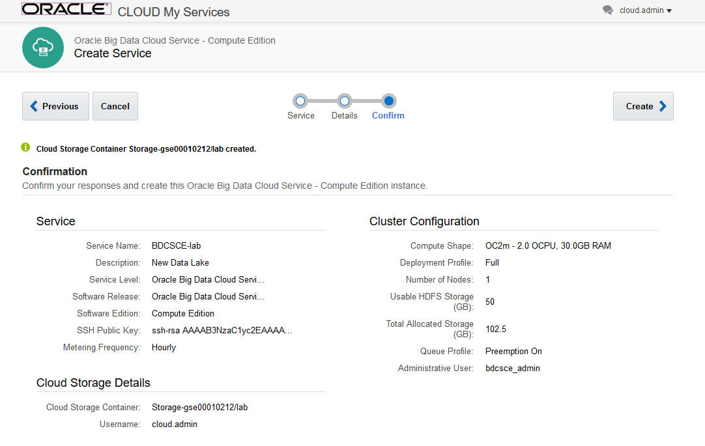
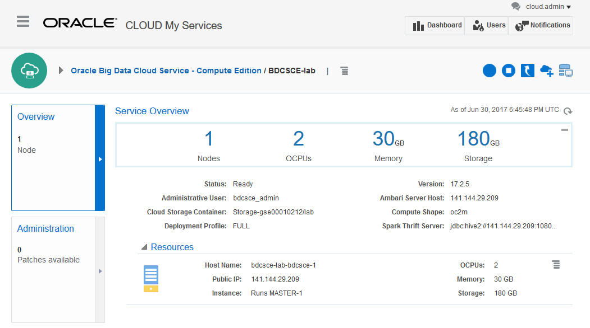

  

Updated: July 27, 2017 for BDCS-CE Version 17.3-1-20

    Note: if you are an Oracle employee following the Lab100GSE instructions to use a GSE Deal Server,
    the BDCS-CE instance should already be provisioned and you can skip this lab and move to lab 300.

## Introduction

In this lab, you learn how to provision a **Oracle Big Data Cloud Service - Compute Edition (BDCS-CE)** cluster.  

The Oracle Big Data Cloud Service - Compute Edition (BDCS-CE) enables you to rapidly, securely, and cost-effectively leverage the power of an elastic, integrated Big Data Infrastructure to unlock the value in Big Data.   In this lab, we will walk you through the steps to quickly configure and create a Big Data Cloud Service instance.  When done you will see how to view the configuration and layout of your instance using the Oracle Big Data Console.  

Please direct comments to: David Bayard (david.bayard@oracle.com)

## Objectives

- Learn how to provision a BDCS-CE instance
- Learn how to access BDCS-CE

## Required Artifacts

- Access to an Oracle Public Cloud identity domain (by following Lab100 or Lab100GSE)
- A provisioned Storage Cloud instance (included the Replication Policy setup, as described in Lab100 or Lab100GSE)

# Provision a new BDCS-CE Instance

## Provision BDCS-CE

### **STEP 1**: Navigate/login to the Oracle Cloud My Services Dashboard  

 

### **STEP 2**: Click the Create Instance link (in the Create Instance box under the Welcome layer)

### **STEP 3**: Click All Services, then click Create next to Big Data - Compute Edition
- This will take you to the BDCS-CE Services page.
- Here is an animation of Steps 2 and 3:
  

### **STEP 4**: Click Create Service on the BDCS-CE services page

  

### **STEP 5**: Fill in the Service Name, Description, Email and click Next
- You can choose whatever you want for Service Name.  It is an identifier to help you in case you create more than one BDCSCE cluster.

  

### **STEP 5**: In the Cluster Configuration section, choose **Full** for the Deployment Profile, enter **1** for the Number of Nodes, and be sure to choose Spark Version 1.6.
- For this workshop, be sure to choose Full for the Deployment Profile.  The Full profile includes components like Hive which are not part of the Basic profile.
- Currently, the examples are built for Spark 1.6 so be sure to select that version.

  

### **STEP 6**: In the Credentials section, define your SSH public key and the desired username/password to use for the BDCS-CE cluster administrator.

- **SSH Public Key**: There are various approaches you can use.  You can define a value for a VM Public Key, use a file with a VM Public Key or create a new key.
  - The easiest choice if new to this environment may be to create a new key.
  - Choose to Create a New Key and hit the Enter button.
  - Once you hit Enter, a File Folder Window will pop up to allow you to control where on your local computer you wish to store your SSH Key file (ex: sshkeybundle.zip).
  - Make sure and write down the location of this SSH key file.
  - The SSH Public Key field will then get filled in automatically.
- **Administrative User**: Define the user id for the administration user for your instance. (We suggest you leave it at its default: bdcsce_admin)
- **Password**: Enter a password to set for the administration user.  \"Password must be at least 8 characters long with at least one lower case letter, one upper case letter, one number and one special character. For example, Ach1z0#d\"
- Confirm Password: Re-enter the password for the administration user.
  

### **STEP 7**: In the Cloud Storage Credentials section, provide your Cloud Storage information.

- **Cloud Storage Container** – Name of an existing Oracle Storage Cloud Service container to be associated with the cluster, or a new one to be created.
  - The format is Storage-\<identity_domain\>/\<container\>, where \<identity_domain\> is the ID of the identity domain, and \<container\> is the name of the container, for example, _Storage-a405202/journeyTwo_.
  - Refer to Lab100's "Configure your Storage Replication Policy" section if you need to lookup the Identity Domain.  The instructions in that section show you where you can find it.

- **Username** – User name of the user who has access to the specified Oracle Storage Cloud Service container.
- **Password** – The password of the above user.
- **Create Cloud Storage Container** – select this if you provided the name of a new non-existing container.  If you are running this for the first time, most likely you will select this checkbox.

  

### **STEP 8**: In the Block Storage section, leave the defaults for now.
  

### **STEP 9**: In the Associations section, leave the checkboxes unchecked for now.

- Associations will automatically create the necessary Access Rules between services.  For this workshop, we'll show you how to manually define Access Rules at a later point.
  

### **STEP 10**: Click Next.  Then, click Create.

  

### **STEP 11**: Wait for the BDCS-CE instance to be provisioned.

- While being provisioned, the Status will say "Creating service".  You can click on the status to get more information.
- As of 17.3.1-20, it can take about 15-20 minutes to finish creating the service.
  
- If you entered a valid email address, you will get an email the instance provisioning is finished:
  

### **STEP 12**: When the BDCS-CE instance is provisioned (the status is Ready), click on the name of the instance to go to the Service Overview page.
  

### **STEP 13**: Review the details on the Service Overview Page
Sections include:
- **Overview** – displays the number of nodes, aggregate OCPU, Memory, and Storage
- **Administration** – displays if there are any patches available.
- **Service Overview** – displays summary information of the new Big Data Cloud Service.  This includes the Ambari Server Host whose IP address you can use to access Ambari from a URL in a browser.  As well as highlighting the Administrative user you created as well as the Cloud Storage Container and the Spark Thrift Server (part of the default configuration).  
  - Ambari is a Hadoop management web UI that can accessed through your Ambari Host Server IP address and port 8080 (ex:  http://xxx.xxx.xxx.xxx:8080).  Ambari is not covered in this Lab, but feel free to explore it on your own.
  - Note: to use Ambari, you will need to enable a Network Access rule for port 8080.
  - Your Ambari credentials will be your BDCS-CE username and password you defined when you created this instance. 
- **Resources** – displays information on the resources associated with your Service.  As you scale out and add more nodes, the new nodes as well as their Public IP address, OCPUs, Memory and Storage will be displayed.
- **Associations** – displays information on any additional resources associated with your Service.  Associations will automatically setup the necessary network Access Rules between services. 

### **STEP 14**: Review the Access Rules for your cluster
For now, you don't need to make changes to the default Access Rules.  In a later tutorial, we will use this to allow SSH access.  This is also the place where you can enable Ambari access (port 8080) which is disabled by default.
  

### **STEP 15**: Access the Big Data Cluster Console
- Launch the Big Data Cluster Console for your BDCS-CE cluster.  If this is your first time, you will likely need to allow your browser to accept the self-signed certificate for the web console application.
- You will be asked to provide a username/password.  Use the username and password you defined earlier when you created the BDCS-CE instance (the username defaults to bdcsce_admin).  

# What you Learned

- Learned how to provision a BDCS-CE instance
- Learned how to access BDCS-CE

# Next Steps

- Proceed to the next Lab to learn how to use BDCS-CE's notebook and services like Hive, Spark, and SparkSQL.
