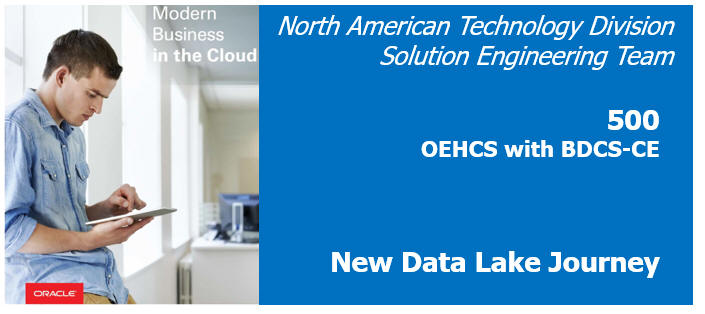
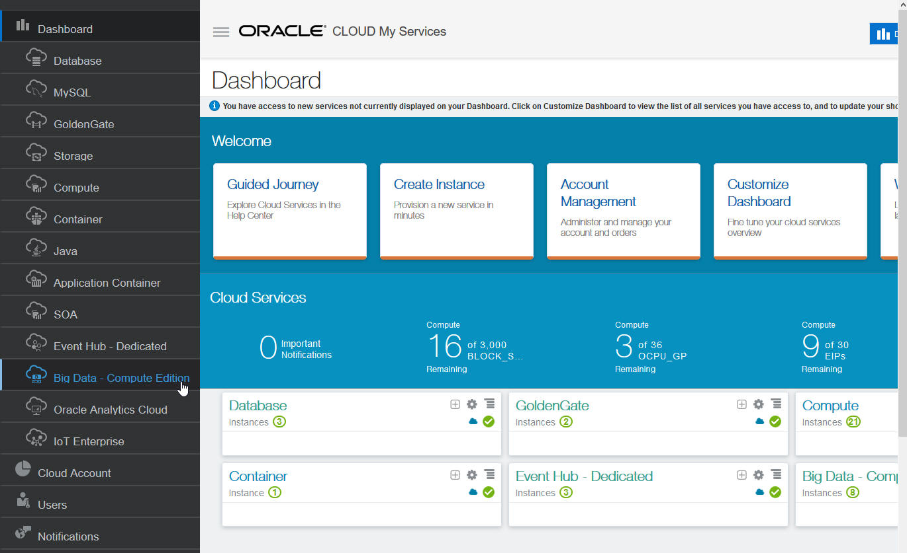
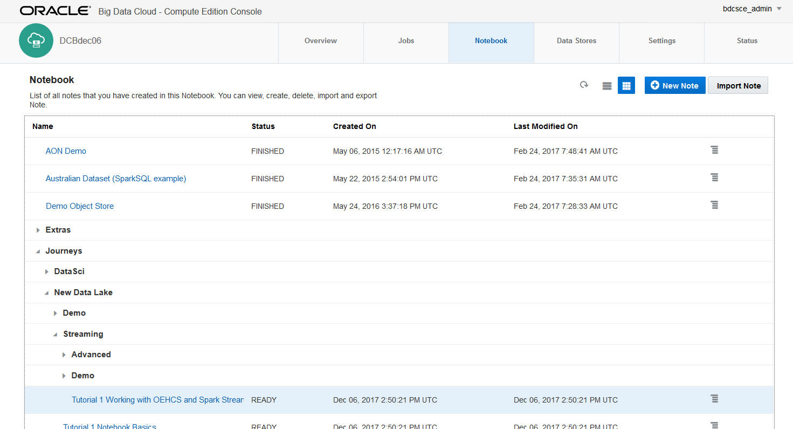
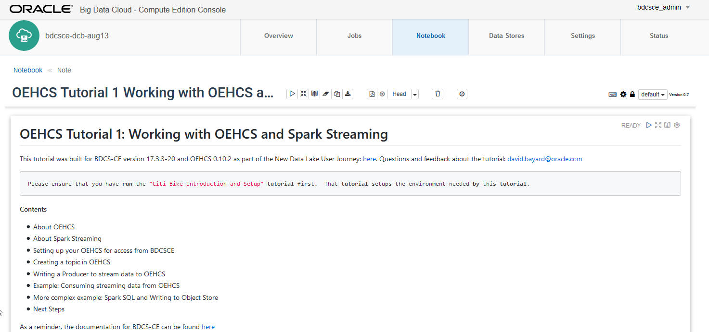
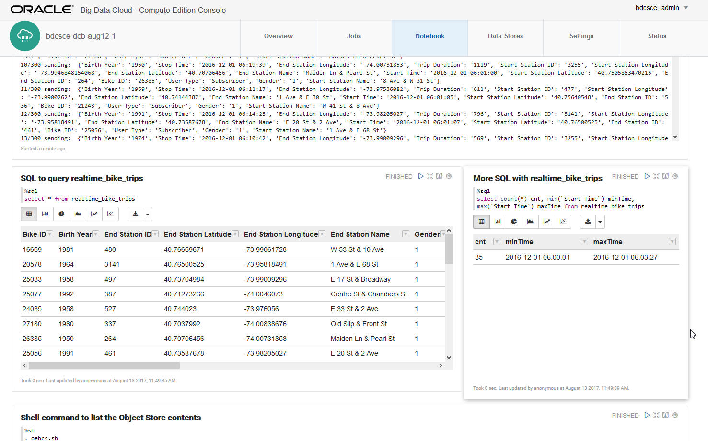
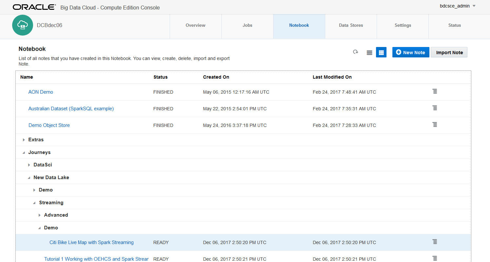
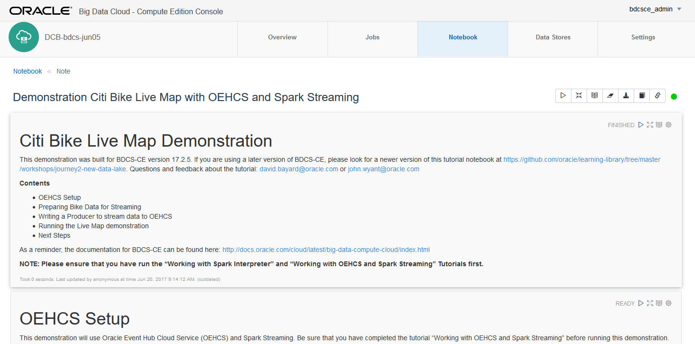

  
Updated: December 20, 2017 for BDC Version 17.4.6

## Introduction

In this lab, you will learn how to stream data into **Oracle Event Hub Cloud Service (OEHCS)** and process it with **Spark Streaming** on **Oracle Big Data Cloud**.  

Oracle Event Hub Cloud Service combines the open source technology Apache Kafka with unique innovations from Oracle to deliver a complete platform for working with streaming data.  Documentation for OEHCS can be found here: <http://docs.oracle.com/cloud/latest/event-hub-cloud/index.html>.  General info about Apache Kafka can be found here: <https://kafka.apache.org/>.

The integration between OEHCS and BDC leverages Spark Streaming to easily process the live streams of data from OEHCS.  In particular, while Spark Streaming can work with multiple types of sources, we will be using Spark Streaming's support for Kafka as OEHCS leverages Kafka internally.  Documentation about Spark Streaming can be found here: <http://spark.apache.org/docs/2.1.0/streaming-programming-guide.html>.  And the integration with Kafka here: <https://spark.apache.org/docs/2.1.0/streaming-kafka-integration.html>

Please direct comments to: David Bayard (david.bayard@oracle.com)

## Objectives

- Learn how to setup OEHCS to communicate with BDC
- Learn how to create a topic in OEHCS
- Learn how to write a producer to stream data to OEHCS
- Learn how to consume data from OEHCS with Spark Streaming
- Learn how to use Spark SQL with streaming data
- Learn how to write streaming data to the Object Store
- Learn how to use streaming data to update a Live Map

## Required Artifacts

- A running BDC instance and Storage Cloud Object Store instance, created as per the instructions in Lab 100.  These instructions included the use of a special "bootstrap.sh" script which setup the BDC environment for this workshop.
- You completed Lab 200 Getting to know BDC, Lab 300 More BDC, and Lab 400 OEHCS Provisioning

## Connect to the BDC Console

### **STEP 1**: Navigate/login to the Oracle Cloud My Services Dashboard  

 

### **STEP 2**: Navigate to the My Services page for your BDC cluster

  

### **STEP 3**: Launch the Big Data Cluster Console

  

# Work with OEHCS and Spark Streaming

## Open and run the "OEHCS Tutorial 1 Working with OEHCS and Spark Streaming" Tutorial note in the notebook

### **STEP 1**: Click on the Notebook tab. Expand the Journeys folder.  Then expand the New Data Lake folder. Then expand the Streaming folder.

 

### **STEP 2**: Click on the "Tutorial 1 Working with OEHCS and Spark Streaming" Tutorial to open it. 

 

### **STEP 3**: Read and follow the instructions in the Tutorial

The paragraphs of the note are displayed. 

Please walk through the paragraphs one by one. Read through the content of the paragraphs as you get to them. There is much useful information in the paragraphs that is not reproduced into these instructions.

**Pay attention to the instructions in the Tutorial note.  They will ask you to do a few steps outside of the notebook.  These steps need to be completed for the remaining steps to work properly.**

 

# Run the Citi Bike Live Map Demonstration

## Open and run the "OEHCS Demonstration Citi Bike Live Map with Spark Streaming" note in the notebook

### **STEP 1**: Click on the Notebook tab. Expand the Journeys folder.  Then expand the New Data Lake folder. Then expand the Streaming folder. Then expand the Demo folder.

 

### **STEP 2**: Click "Citi Bike Live Map with Spark Streaming" note to open it.  

 

### **STEP 3**: Read and follow the instructions in the Demonstration note.

The paragraphs of the note are displayed. 

Please walk through the paragraphs one by one. Read through the content of the paragraphs as you get to them. There is much useful information in the paragraphs that is not reproduced into these instructions.

 

# What you Learned

- Learned how to setup OEHCS to communicate with BDC
- Learned how to create a topic in OEHCS
- Learned how to write a producer to stream data to OEHCS
- Learned how to consume data from OEHCS with Spark Streaming
- Learned how to use Spark SQL with streaming data
- Learned how to write streaming data to the Object Store
- Learned how to use streaming data to update a Live Map

# Next Steps

- Experiment with your own data
