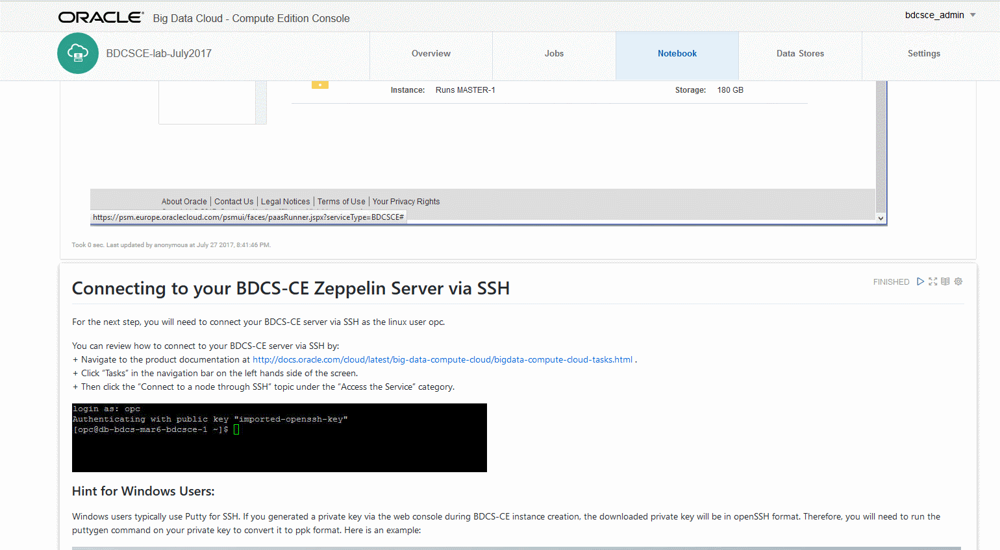
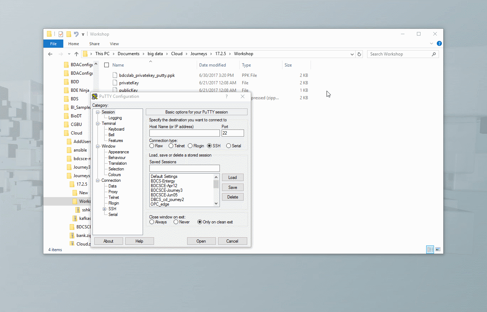

# Instructions to run the bootstrap.sh script manually

Updated: August 16, 2017

## Introduction

This journey provides instructions in [Lab 100 Start Here](LabGuide100StartHere.md) to use a provided bootstrap.sh script when the BDCS-CE instance is provisioned.  This bootstrap.sh does a number of key configuration steps for the journey, including populated the needed Zeppelin notebooks.

For a variety of reasons, the bootstrap.sh script might not end up being run correctly.  This document provides instructions on how to do this manually.

# Steps

## Open up network Access to your BDCS-CE instance for SSH

Our first step is to enable network access to our BDCS-CE server via the SSH protocol.  You will do this from the BDCS-CE Service Console.  Here are the steps:

 + From the BDCS-CE Service Console, navigate to Access Rules for your BDCS-CE instance.  

 + Then, on the Access Rules page, enable the ssh (port 22) access rule by choosing Enable from the clickable menu under the Actions column as shown below.

## Connect via SSH

For the next step, you will need to connect your BDCS-CE server via SSH as the linux user opc.  

### Connect now via SSH to your BDCS-CE Master Server.  Use the private key and connect as the user opc

You can review how to connect to your BDCS-CE server via SSH by:

+ Navigate to the product documentation at <http://docs.oracle.com/cloud/latest/big-data-compute-cloud/bigdata-compute-cloud-tasks.html> .  
+ Click “Tasks” in the navigation bar on the left hands side of the screen.  
+ Then click the “Connect to a node through SSH” topic under the “Access the Service” category.

### Hint for Windows Users: 
Windows users typically use Putty for SSH.  If you generated a private key via the web console during BDCS-CE instance creation, the downloaded private key will be in openSSH format.  Therefore, you will need to run the puttygen command on your private key to convert it to ppk format.  Here is an example:

Next, Windows users will specify the location of the private key (in .ppk format) when connecting.  Here is an example:

## run "sudo bash" to become root

    sudo bash

## set variables for your DOMAINID and CONTAINER.  Be sure to use your DOMAINID (it won't be gse000012345) and CONTAINER (it may be journeyC or you may have changed it)

    export DOMAINID=gse000012345
    export CONTAINER=journeyC

## copy and paste this into SSH (hint: in putty, right-click does a paste)

    echo DOMAINID=$DOMAINID
    echo CONTAINER=$CONTAINERID
    cat << EOF > /tmp/bootstrap_fix.sh
    #fix core-site.xml
    sed -i -- "s/storage.us2.oraclecloud/$DOMAINID.storage.oraclecloud/g" /etc/hadoop/conf/core-site.xml
    #download bootstrap.sh
    cd /tmp
    rm bootstrap.sh
    wget -nc https://github.com/millerhoo/journey2-new-data-lake/raw/master/workshops/journey2-new-data-lake/files/100/bootstrap.sh
    #run bootstrap.sh
    chmod u+x bootstrap.sh
    ./bootstrap.sh
    EOF
    #run our bootstrap_fix.sh script 
    chmod u+x /tmp/bootstrap_fix.sh
    cat /tmp/bootstrap_fix.sh
    /tmp/bootstrap_fix.sh &> /tmp/bootstrap_fix.log
    #display output
    cat /tmp/bootstrap_fix.log

## Begin Your Big Data Journey

Return to the instructions in [Lab200](LabGuide200.md) and start with Tutorial 1. 
