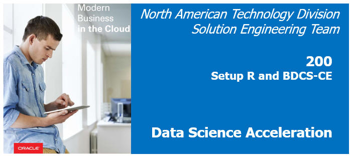
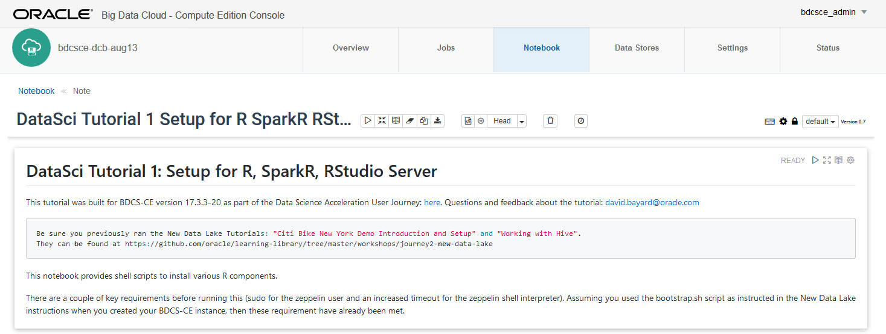
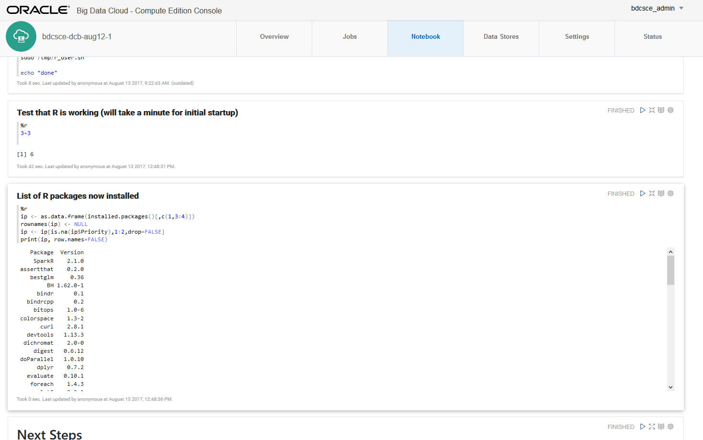

  
Updated: August 13, 2017 for BDCSCE Version 17.3.1-20

## Introduction

This lab will walk you through configuring the R environment for **Oracle Big Data Cloud Service - Compute Edition (BDCS-CE)**.  

In particular, this lab will focus on installing **R**, **SparkR**, **RStudio Server**, and a variety of R packages and dependencies.

Please direct comments to: David Bayard (david.bayard@oracle.com)

## Objectives

- Configure R, SparkR, and RStudio Server to run on BDCS-CE

## Required Artifacts

- A running BDCS-CE instance and Storage Cloud Object Store instance, created as per the instructions in the New Data Lake Journey Lab 100.  These instructions included the use of a special "bootstrap.sh" script which setup the BDCS-CE environment for this workshop.
- You completed the tutorials in the New Data Lake Journey Lab 200 Getting to know BDCS-CE

## Connect to the BDCS-CE Console

### **STEP 1**: Navigate/login to the Oracle Cloud My Services Dashboard  

 

### **STEP 2**: Navigate to the My Services page for your BDCS-CE cluster

  

### **STEP 3**: Launch the Big Data Cluster Console

  

# Learn how to setup R, SparkR, and RStudio Server

## Open and run the "DataSci Tutorial 1 Setup for R SparkR RStudio" note in the notebook

### **STEP 1**: Click on the Notebook tab.  Then click on the "DataSci Tutorial 1 Setup for R SparkR RStudio" tutorial to open it. 

 

### **STEP 2**: Read and follow the instructions in the Tutorial

The commands in the tutorial will install R as well as numerious R packages.  This particular paragraph that installs R will take 20 minutes or so to run, so be patient for that step.

# What you Learned

- Learned how to setup R, SparkR, and RStudio Server with BDCS-CE

# Next Steps

- Proceed to the next Lab to see R in action with BDCS-CE's Zeppelin and Spark components

# Want to Learn More?

- [R project](https://www.r-project.org/)

- [SparkR (R on Spark)](http://spark.apache.org/docs/latest/sparkr.html)