# Install and Run Base R in BDCS-CE

# Before You Begin

## Purpose

In this tutorial, you learn to create an Oracle Big Data Cloud Service – Compute Editon (BDCS-CE) cluster
and install R in the cluster. You also learn to move data across your local and cloud storage.

There are three sections in this tutorial:-

1. Create an Oracle Big Data Cloud Service – Compute Editon (BDCS-CE) cluster
2. Move data across your local and cloud storage
3. Install and run base R in the BDCS-CE cluster

## Time to Complete

30 minutes

## What Do You Need?

Before starting this tutorial, you should have:
- Oracle Storage Cloud Service account and login credentials
- A computer with Windows OS
- Download and install [CloudBerry Explorer for OpenStack freeware](https://www.cloudberrylab.com/explorer/openstack.aspx)
- Download and install [PuTTY](http://www.putty.org/)

# Create an Oracle Big Data Cloud Service – Compute Editon (BDCS-CE) cluster
 

Sign in to the Oracle Cloud My Services application. The My Services Dashboard is displayed. It lists the
services that are assigned to your account.

Look for and click **Big Data – Compute Edition**.

 

Click **Open Service Console**.

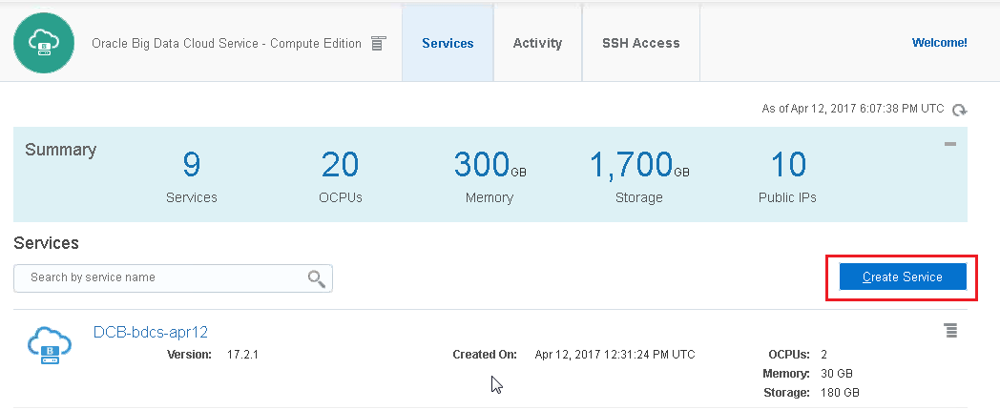 

In the Services tab of the Oracle Big Data Cloud Service - Compute Edition Console, click **Create Service**.

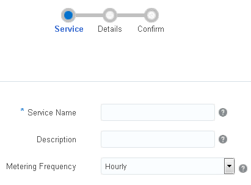 

The Oracle Big Data Cloud Service - Compute Edition Create Service wizard starts and the Service page is
displayed.

On the Service page, provide a **name** and description for the new cluster, click **Next** to advance to the
Service Details page.

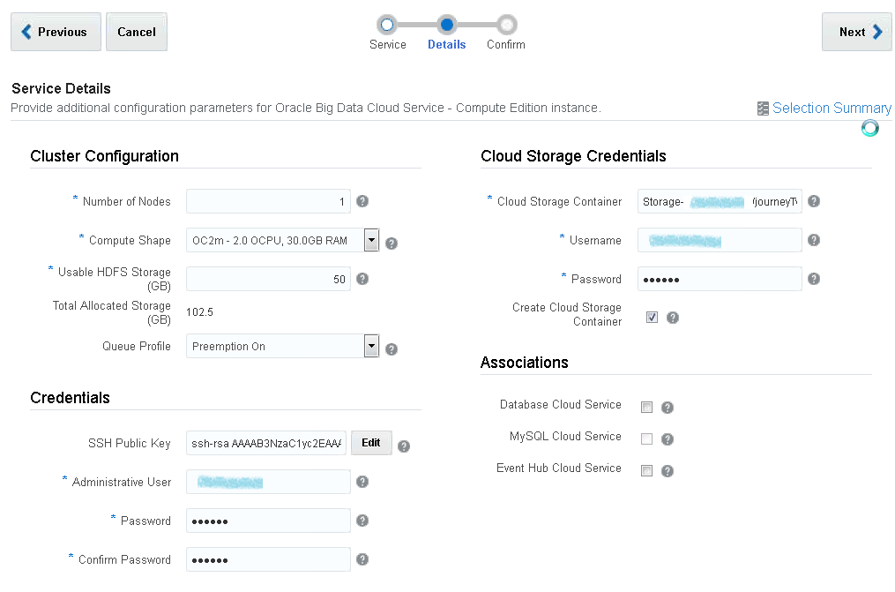

The Service Details page is displayed.

Complete the **Cluster Configuration** section:-
- **Number of Nodes** – Number of nodes to be allocated to the cluster. For this tutorial, you can start
with **1** node; more nodes can be added later.
- **Compute Shape** – From the drop down list, specify the compute shape for each node in terms of OCPU and memory. For this tutorial, we recommend you start with **2 OCPU**.
- **Usable HDFS Storage** – Amount of HDFS storage to be allocated to the cluster. For this tutorial, we
recommend you start with **50GB**.
- **Queue Profile** – YARN capacity scheduler queue profile. Defines how queues and workloads are
managed. Select **Preemption On**.

Complete the **Credentials** section:-
- **SSH Public Key** – The SSH public key to be used for authentication when using an SSH client to
connect to a node associated with your cluster. Click **Edit** to specify the public key. You can upload a
file containing the public key value, paste in the value of a public key, or have the wizard generate a
key pair for you. If you paste in the value, make sure the value does not contain line breaks or end
with a line break. If you have the wizard generate a key pair for you, make sure you download the zip
file containing the keys that the wizard generated. **Note** that you will need the private key when you
connect to the node in the cluster via SSH in the steps later.
- **Administrative User** – User name used to log in to the cluster console and REST APIs for job
submission.
- **Password** – Password of the user specified above.

Keep the user name and password in mind for later steps in this tutorial.

Complete the **Cloud Storage Credentials** section:-
- **Cloud Storage Container** – Name of an existing Oracle Storage Cloud Service container to be
associated with the cluster, or a new one to be created. The format is
Storage-<identity_domain>/<container>, where <identity_domain> is the ID of the identity domain,
and <container> is the name of the container, for example, _Storage-abc 05202 /journeyTwo_.
- **Username** – User name of the user who has access to the specified Oracle Storage Cloud
Service container.
- **Password** – The password of the above user.
- **Create Cloud Storage Container** – select this to create a new Oracle Storage Cloud Service container
as part of cluster creation if you want. We select to create a new container in this demo.

Click **Next** to advance to the Confirmation page.

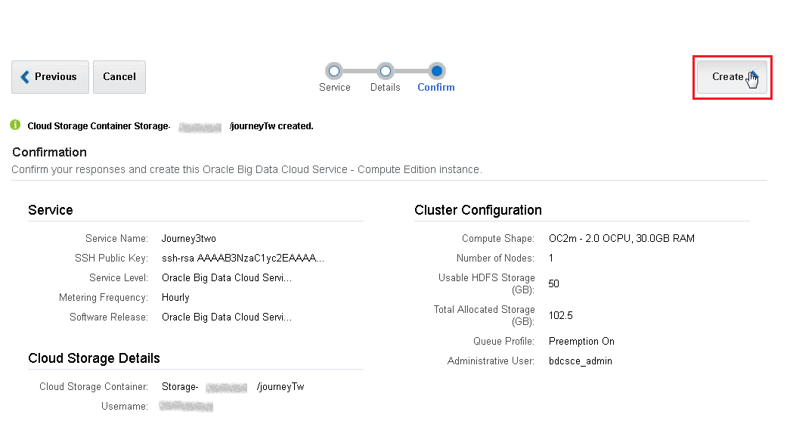

On the Confirmation page, review the information listed. If you're satisfied with what you see, click **Create**
to create the cluster.

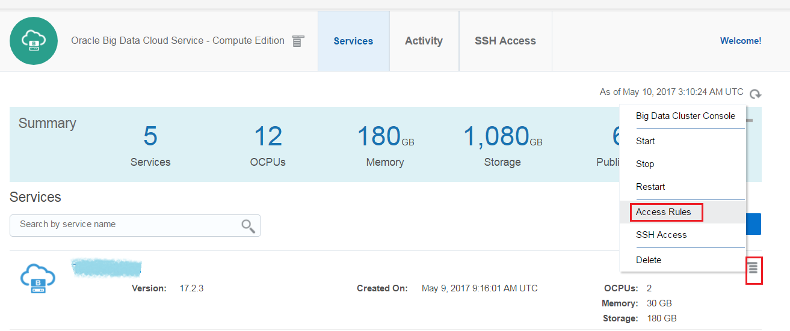

When the BDCS-CE cluster instance is ready, you need to enable the network access to the BDCS-CE
server via the SSH protocol.

From the BDCS-CE Services page, navigate to **Access Rules** for the BDCS-CE instance. The Access Rules are
accessible from the clickable menu icon as shown above.

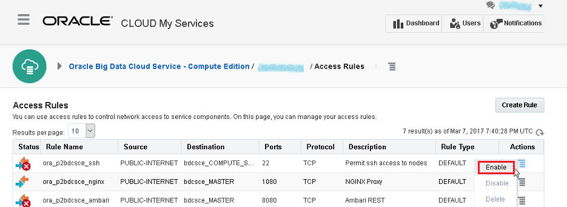 

Then, on the Access Rules page, enable the **ssh (port 22)** access rule by choosing **Enable** from the
clickable menu under the Actions column as shown below.

# Move data across your local and cloud storage

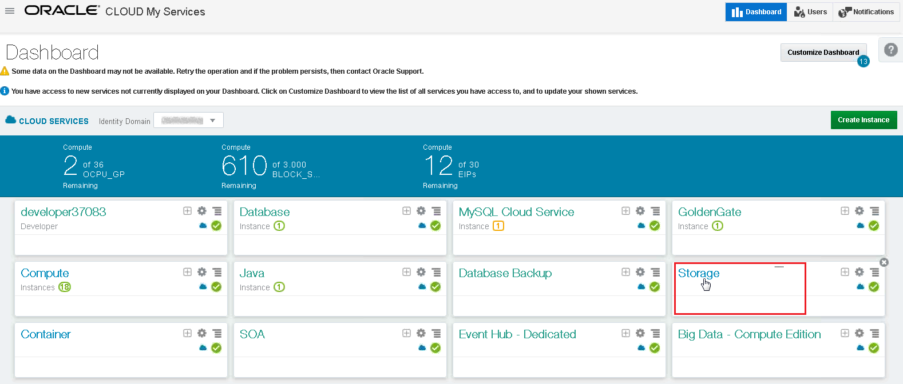 

Go back to the My Services Dashboard page. It lists the services that are assigned to your account.

Look for and click **Storage**.

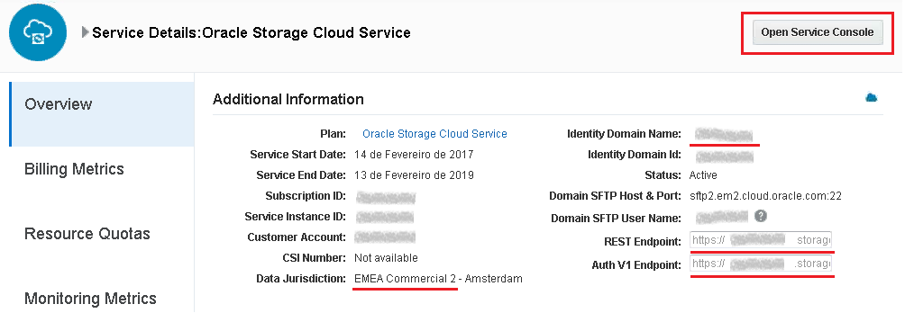 

The Service Details page is displayed.

Look at the identity domain name, data jurisdiction, and URLs displayed in the REST Endpoint and Auth V
Endpoint fields under Additional Information.

You will need to refer back to the information in this page when you setup CloudBerry for Oracle Storage
Cloud Service in the following steps.

 

CloudBerry Explorer for OpenStack provides a user interface to cloud storage accounts allowing managing
and moving data across your local and cloud storage.

Launch CloudBerry Explorer if you have installed it, click **File** , and select **New Oracle Cloud Account** option.

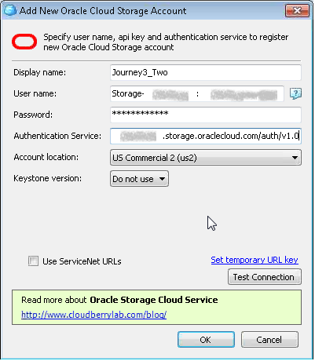

To complete the setup in the Add New Oracle Cloud Storage Account dialog, you may need to copy the
identity domain and URLs from the Service Details: Oracle Storage Cloud Service page we mentioned at
the beginning of this section.
- Insert a **display name** of your choice.
- Insert the user name, the **user name** is in the format **Storage-<identity-domain>:<username>** ,
where <username> is the username of your Oracle Public Cloud, that has the correct rights to the
Oracle Storage Cloud Service. For example, _Storage-myDomainID555:myCloudAdminName_
- Insert the **password** that matches the previous username.
- Insert the **Authentication Service URL** , it will look like this:
**https://<identity-domain>.storage.oraclecloud.com/auth/v1.**.
- In the **account location** select the Data Jurisdiction, for example, US Commercial 2(us2).

Click **Test Connection** to validate your setup. Then click **OK**.

Once you set up the Oracle Storage Cloud account successfully, you can manage and move data across
your local and cloud storage. You can drag and drop a data file from your local computer to the cloud
storage easily.

You can also move data across your local and cloud storage with [Oracle Storage Cloud Service - File Transfer Manager CLI](http://www.oracle.com/technetwork/topics/cloud/downloads/storage-cloud-upload-cli-3424297.html). It is a Java-based command line tool (CLI) that simplifies uploading to and downloading from Oracle Storage Cloud Service. Please refer [here](https://docs.oracle.com/en/cloud/iaas/storage-cloud/csclr/preparing-use-oracle-storage-cloud-file-transfer-manager-cli.html#GUID-5BB8647F-DDAD-4371-A519-1116402245FB) for more details about it.

# Install and Run Base R in the BDCS-CE cluster

Log in to the Oracle Big Data Cloud Service – Compute Edition cluster node through SSH. You can refer
[Connecting to a Cluster Node Through Secure Shell (SSH)](https://docs.oracle.com/cloud/latest/big-data-compute-cloud/CSSPC/GUID-50B2CDBF-C955-4E9B-BC41-98784BE5D378.htm#CSSPC-GUID-2AC81097-57EA-41E7-825A-BB0F6EF09D95) if you are not familiar with it.

We use PuTTY, a freely available SSH client program for Windows, in this demo. There is a section of Connecting to a Node by Using PuTTY on Windows in the above link.

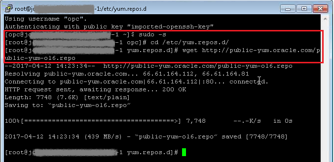 

Download the Public YUM repository related to the OS (Enterprise Linux 6) and put it on
/etc/yum.repos.d :

_sudo -s

cd /etc/yum.repos.d/

wget [http://public-yum.oracle.com/public-yum-ol6.repo](http://public-yum.oracle.com/public-yum-ol6.repo)_

 

Edit the public-yum-ol6.repo file via **vi** command:

_vi public-yum-ol6.repo_

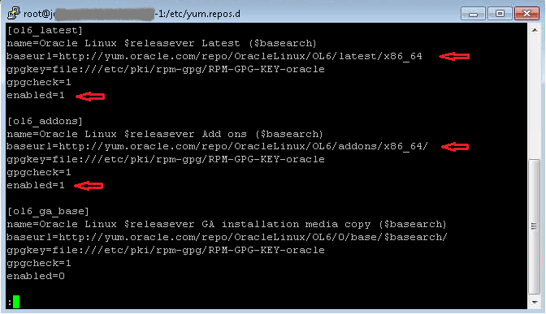

Adjust both the **ol6_latest** and **ol6_addons** sections as follows:

_[ol6_latest]

...

baseurl=http:// yum.oracle.com/repo/OracleLinux/OL6/latest/ **_x86_64/_**

_..._

**_enabled=1_**

_[ol6_addons]

...

baseurl=http:// yum.oracle.com/repo/OracleLinux/OL6/addons/ **_x86_64/_**

_..._

**_enabled=1_**

_..._

_..._

Save and quit **vi**.

Check if the file is changed and saved:

ls -la

 

Retrieving the epel-release- 6 - 8.noarch.rpm file:

_cd /

rpm -Uvh [http://download.fedoraproject.org/pub/epel/6/i386/epel-release-](http://download.fedoraproject.org/pub/epel/6/i386/epel-release-) 6 - 8.noarch.rpm_

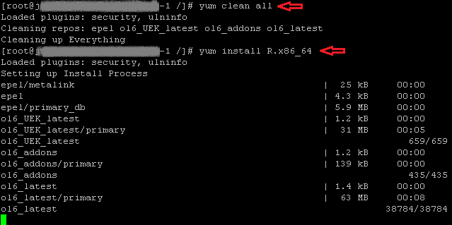

Clean the YUM cache and install R.

_yum clean all

yum install R.x86__

The installation of R is **Complete**.

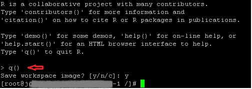 

Test loading the R session with the command “R”.

Exit with the command “ q()” then replying “y” or “n” to the question.

 

Test loading the sparkR session with the command “sparkR”.

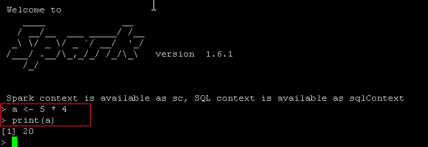 

Test it with the following two lines:

a <- 5 * 4

print(a)

You are ready to run R in the BDCS-CE cluster now!

# Want to Learn More?

- [R project](https://www.r-project.org/)

- [SparkR (R on Spark)](http://spark.apache.org/docs/latest/sparkr.html)

