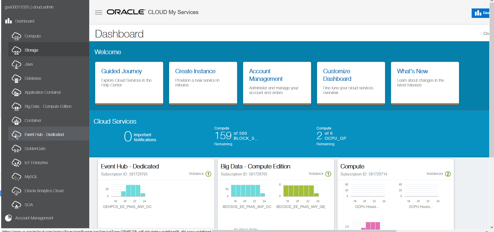
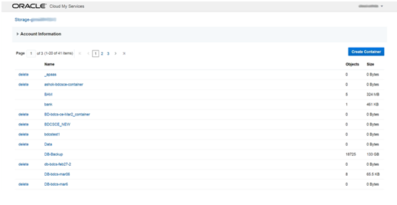
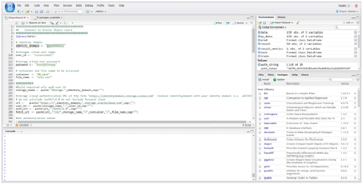
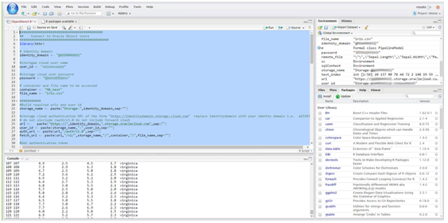

  

# Demo Introduction

## Keywords:

 Oracle Storage Cloud Service, R Studio, Spark

## Goal of Demo:

To demonstrate how to develop and debug R scripts with R Studio IDE tool.

To explain an R script that does the following jobs:

 • Load raw data from Object Store for train in R environment

 • Analyze the data with selected method and model

 • Store the pre-trained data back to Object Store

## Pre-requisites:

 Users must have subscribed for Oracle Storage Cloud Service and Oracle Big Data Cloud

## Service – Compute Edition.

 R Server has been installed in Big Data Cloud Service.

# Demo Steps

## Step 1: Load raw data file into Object Store

The data file ( iris.csv ) used in the demo is a popular R dataset. Users can find and download it from Internet. After downloaded to local desktop, the data file will then be uploaded into the Object Store in Oracle Storage Cloud. To upload data files into an Object Store, users can leverage any tool available, for example Cloudberry. In this demo, we will use built-in Storage Console of Oracle Storage Cloud. 

- Download iris.csv from [here](https://raw.githubusercontent.com/uiuc-cse/data-fa14/gh-pages/data/iris.csv) (save the content as iris.csv after you open the link), and upload to your
Oracle Storage Cloud. 

Download the R script, oraobjectstore_journey.R, from [here](https://oracle.github.io/learning-library/workshops/journey3-data-science/rFiles/Lab300script.R)


To access Storage Console, Sign in to the Oracle Cloud My Services application. Then click on Storage from the menu on the left.  




If the container for the demo does not exist,
click Create Container button in the page, and then assign a unique name for the container in the pop-up dialog.


You can also use CloudBerry to create a container and upload a file.


If the data file is not in the container, click Upload Objects button in the page, a dialog will prompt to let user select a local file. Select the downloaded data file and upload it into the Object Store.

After the data file is uploaded, user can see the file in the object list of the container.


## Step 2 : Develop and debug R Script

 In the demo, R Studio IDE in Base R Server is the tool to develop and debug R scripts. It can be accessed from any supported browser.
To install R Studion run the following commands from a terminal:

yum install openssl-devel
yum install libcurl-devel

To install RSTudio

$ wget https://download2.rstudio.org/rstudio-server-rhel-1.0.136-x86_64.rpm
$ sudo yum install --nogpgcheck rstudio-server-rhel-1.0.136-x86_64.rpm

 #########  Add User rstudio (as root user)
$ sudo useradd rstudio

$ sudo passwd rstudio 

 
##############################  From Big Data Console Create Access Rule to 8787

public internet to Master port 8787

 Then access the Rstudion from your IP:8787 using the userid and password you setup for rstudio

Following is UI of R Studio IDE:




IDE UI is divided into two panels. On the top, the panel contains a menu bar and a toolbar,which allow users to access functions of the IDE. At the bottom, the panel has components to develop and debug R scripts. On the upper left, a tabbed editor is used to develop multiple R scripts. Below that editor is a console to display execution result of R scripts. On the upper right, a watch window will display both environmental and runtime variables. Below the watch is a window that can show various help information.

In the IDE, copy and paste the script or open it in the UI.  You can run each line one at a time or section by section

### 1. Define variables

In this part, basic library need to be loaded, required variables will be initialized. Following are code snippet.

```
1: # Load library for sending HTTP request
2: library(httr)
3:
4: # Identity Domain name
5: identity_domain <- "********"
6:
7: # Storage Cloud credential
8: user_id <- "********"
9: password <- "********"
10:
11: # Storage Cloud container & object
12: container <- "HA_test"
13: input_file_name <- "iris.csv"
14: output_result_file_name <- "iris_results.csv"
15: output_fitted_model_file_name <- "fitted_model.RData"
16:
17: storage_name <- paste("Storage-", identity_domain, sep="")
18:
19: base_url <- paste("https://", identity_domain, ".storage.oraclecloud.com",
sep="")
20: auth_url <- paste(base_url, "/auth/1.0", sep="")
21: get_url <- paste(base_url, "/v1/", storage_name, "/", container, "/",
input_file_name, sep="")
22: put_result_url <- paste(base_url, "/v1/", storage_name, "/", container, "/",
output_result_file_name, sep="")
23: put_fitted_model_url <- paste(base_url, "/v1/", storage_name, "/",
container, "/", output_fitted_model_file_name, sep="")
24:
```
In line 2, the library is loaded. It will be used to send HTTP requests to REST endpoint of the Storage Cloud Service.

Line 4 to line 10, user identity variables are defined and initialized. We obscure the value of password variable for security reason.

Lines 11 to line 15, names of data objects in Object Store are declared.

Line 17 to Line 24, all service URLs used in the R script are constructed with variables  defined before.

### 2. Load data from Object Store

In this part, we will load dataset from a data file in Object Store.

```
25: # Get authentication token for storage cloud
26: storage_user <- paste(storage_name, ":", user_id, sep="")
27: auth_string <- httr::GET(url=auth_url, add_headers("X-Storage-User" =
storage_user, "X-Storage-Pass" = password), verbose())
28: auth_token <- auth_string$headers$'x-auth-token'
29:
30: # Load data object from Object Store
31: remote_file <- content(httr::GET(url=get_url, add_headers("X-Auth-Token" =
auth_token)), as = "text")
32: my_data <- read.csv(file = textConnection(remote_file))
33: my_data
34 :
```
Oracle Storage Cloud provides a REST interface that allows external programs to request services from Object Store.

Before sending any service request, clients must first authenticate to the Storage Cloud. Line 25 to line 29 shows how to authenticate and retrieve a token as the proof.

After got an authentication token, clients can get send service requests with token attached in the request. Line 31 retrieves name of remote object in Object Store. Line 32 loads data object from Object Store. Line 33 prints data in the dataset to console.

User can mark codes from line 1 to line 34 in the editor then client Run action in upper right.

R Studio will interpret and execute those codes on the fly. Output information is displayed in the console window.



### 3. Train the selected model with the dataset

This part will train the selected model with loaded data set.

```
#### 35: ###########################################
36: # This uses Spark 1.6.
37: # https://spark.apache.org/docs/1.6.1/sparkr.html
38: #
39:
40: # Regression model performance metrics function definition
41: mape <- function(y, yhat) {mean(abs((y - yhat)/y))}
42: rmse <- function(error) {sqrt(mean(error^2))}
43:
44: # Load SparkR
45: library("SparkR", lib.loc="/u01/bdcsce/use/hdp/2.4.2.0-258/spark/R/lib")
46: Sys.setenv(SPARK_HOME="/u01/bdcsce/usr/hdp/2.4.2.0-258/spark")
47:
48: # Initialize Spark Context
49: sc <- sparkR.init()
50: sqlContext <- sparkRSQL.init(sc)
51:
52: # Drop column
53: data = my_data[-c(1)]
54:
55: # Rename columns
56: names(data) = c('sep_len', 'sep_w', 'pet_len', 'pet_w', 'class')
57:
58: # Randomly split data into 70% train and 30% test
59: test_index = base::sample((l:nrow(data)), trunc(length(l:nrow(data))/3))
60:
61: # Convert train and test dataframes into Spark Dataframes
62: train = createDataFrame(sqlContext, data[-test_index,])
63: test = createDataFrame(sqlContext, data[test_index,])
64:
65: # Build regression model
66: m <- glm(pet_len ~ ., data = train, family = "gaussian")
67:
68: # Summarize model
69: summary(m)
70:
71: # Deploy model against out of sample test data and generate predictions
72: pred = predict(m, test)
73:
74: # Using collect, convert the Spark dataframe bck into an R dataframe
75: result = collect(select(pred,"label","prediction"))
76:
```

```
77: # Calculate out of sample model performance metrics: RMSE (Root Mean Square
Error) and MAPE (Mean Absolute Percentage Error)
78: result_metrics = data.frame(rmse = rmse(result$prediction - result$label),
mape = mape(result$label, result$prediction)
79:
80: # Show out of sample model performance metrics
81: result_metrics
82:
```
Data analytic process leverages SparkR. From line 44 to line 51, we will first load and initialize SparkR environment.

Spark can only process data in special data structure. So next, we need to construct required data structure for Spark. Line 52 to line 64 will demonstrate how to create data frames the data structure for Spark SQL.

Next, we will train the model with loaded dataset. Results are two data frames: a 
pre-training model (variable m ) and metrics of the result.

### 4. Save pre-trained data back to Object Store

This part will save both pre-trained model and result script in to Object Store.

```
83: # Regression model performance metrics function definition
84: # Save performance metrics and fitted model
85: write.csv(result_metrics, "/home/rstudio/result_metrics.csv")
86: save(m, file="/home/rstudio/fitted_model.RData")
87:
88: # Write results and model back to object store
89: httr::PUT(url = put_result_url, add_headers("X-Auth-Token" = auth_token),
body = upload_file("/home/rstudio/result_metrics.csv"))
90:
91: httr::PUT(url = put_fitted_model_url, add_headers("X-Auth-Token" =
auth_token), body = upload_file("/home/rstudio/fitted_model.RData"))
92:
93: # Stop Spark Context
94: sparkR.stop()
```
Data frames will first save to local files in the user’s desktop respectively. Then request services to upload those files to Object Store. Finally, clear SparkR environment to release resources.

When all codes are executed, additional files will be created in the Object Store. User can monitor changes in the Container from Storage Console.


