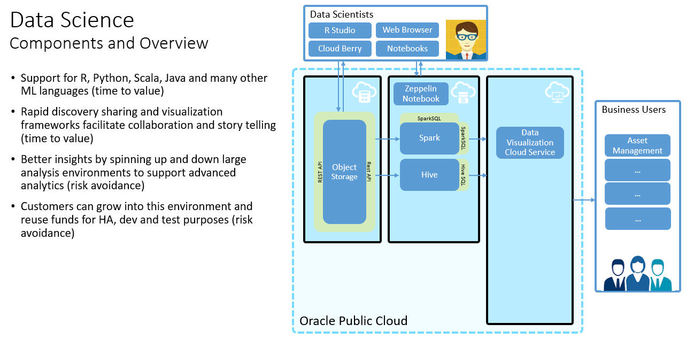
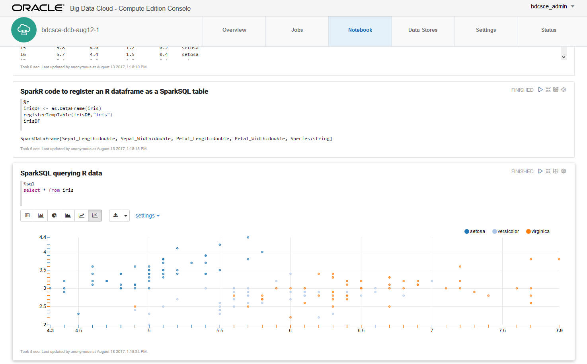

# Big Data Journey: Data Science Acceleration Workshop
Oracle offers a set of Big Data Journeys to help users get started using Oracle Cloud services with a purpose. This particular journey is designed to show you techniques you can use to easily embrace modern data science tools and techniques.

 

In the new data driven world, math is becoming more and more integral to business process improvements. You will learn how Oracle can make data scientists more effective and deliver insights to market faster with BDCS-CE and Oracle’s optimized R for Spark using the most popular Notebook technologies.

 

## Goals

 - Get comfortable with Oracle's public cloud services
 - Learn a repeatable way to integrate cloud data sources and build reports
 - See techniques and patterns other organizations are using to enable their business users
 - Learn how to use R and SparkR with both Zeppelin Notebooks and RStudio Server

## To learn more
 - [Big Data Cloud Service - Compute Edition (BDCS-CE)](https://cloud.oracle.com/big-data-compute-edition)
 - [Storage Cloud Service Object Store](https://cloud.oracle.com/en_US/storage)

      
## How to View the Lab Guides

- The Labguides are best viewed using the Workshop's [GitHub Pages Website URL](https://oracle.github.io/learning-library/workshops/journey3-data-science/) 

- Once you are viewing the Workshop's GitHub Pages website, you can see a list of Lab Guides at any time by clicking on the **Menu Icon**

      

- To log issues and view the Lab Guide source, go to the [github oracle](https://github.com/oracle/learning-library/tree/master/workshops/journey3-data-science) repository.

## Workshop Details

**Reference the following Lab Guides by opening their Documentation Files:**

## Lab 100: START HERE

**Documenation**: [LabGuide100StartHere.md](LabGuide100StartHere.md)

**Objectives**:

- Provision a Big Data Cloud Service - Compute Edition (BDCS-CE) environment for use with this Journey

## Lab 200: Setup R and BDCS-CE

**Documenation**: [LabGuide200.md](LabGuide200.md)

**Objectives**:

- Install R on BDCS-CE
- Install RStudio Server on BDCS-CE
- Configure SparkR on BDCS-CE

## Lab 300: Analyzing Data with R and Zeppelin

**Documenation**: [LabGuide300.md](LabGuide300.md)

**Objectives**:

Use the Zeppelin notebook to

- Query hive tables from R
- Access Object Store datasets from R
- Analyze data with R
- Query R data with SparkSQL
- Store R results in Object Store

## Lab 400: Analyzing Data with R and RStudio Server

**Documenation**: [LabGuide400.md](LabGuide400.md)

**Objectives**:

Use the popular RStudio Server to

- Query hive tables from R
- Access Object Store datasets from R
- Analyze data with R
- Query R data with SparkSQL
- Store R results in Object Store

## Lab 500:  Tools to work with R and Object Store

**Documenation**: [LabGuide500.md](LabGuide500.md)

**Objectives**:

- Install R Package to simplify working with Object Store
- Demonstrate the use of R Package

# Want to Learn More?

- [R project](https://www.r-project.org/)

- [SparkR (R on Spark)](http://spark.apache.org/docs/latest/sparkr.html)

