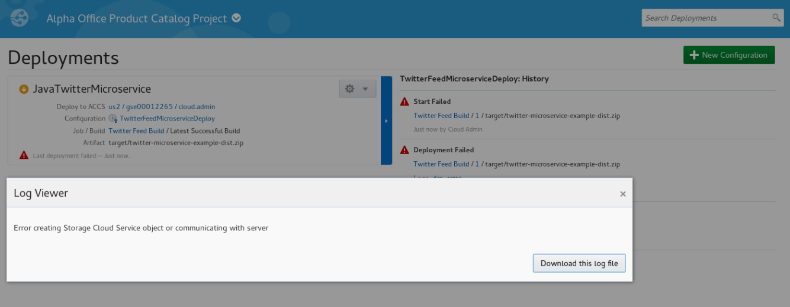
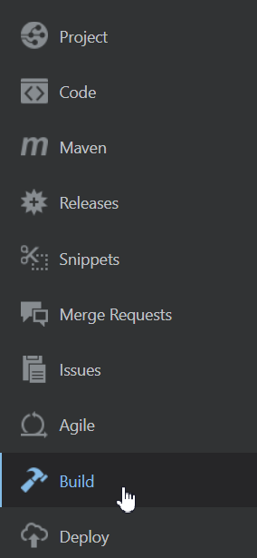
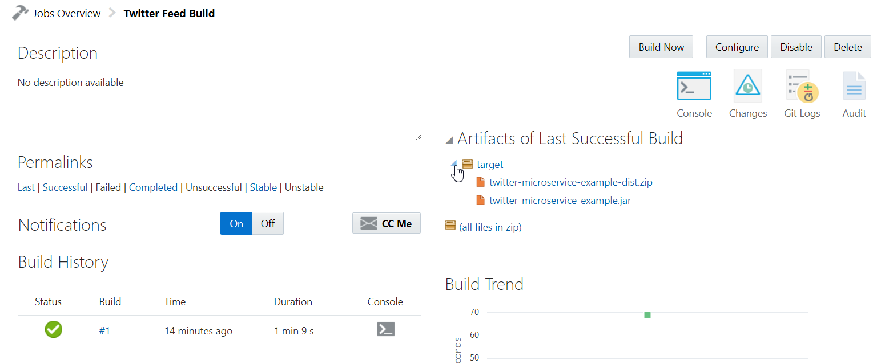
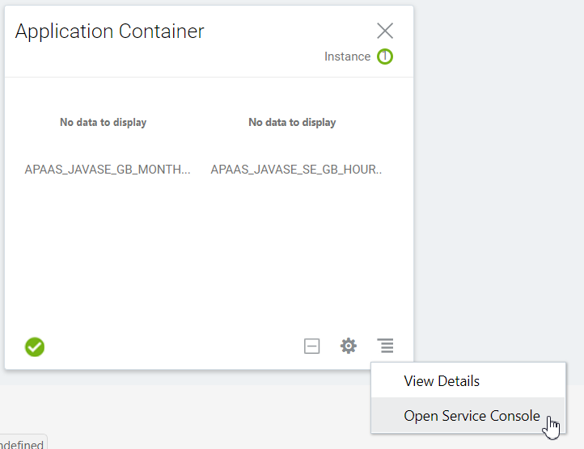
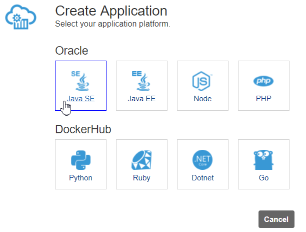
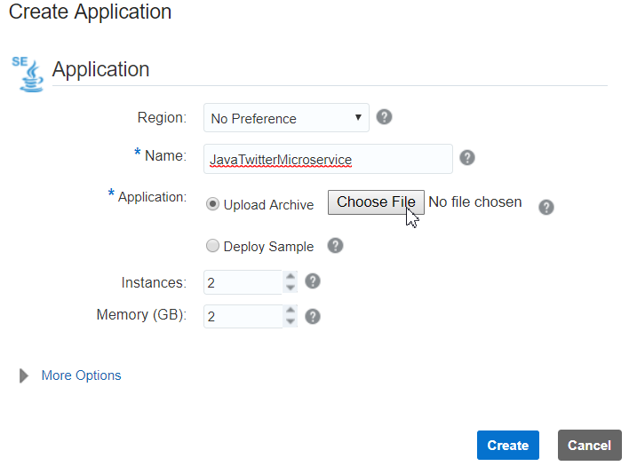
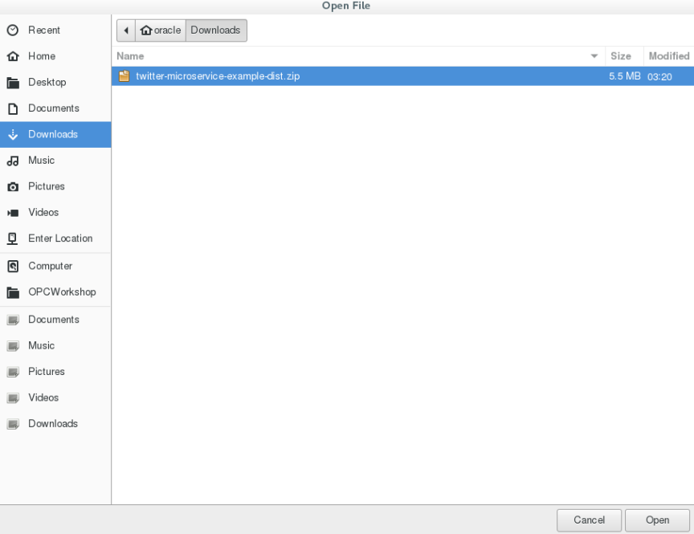
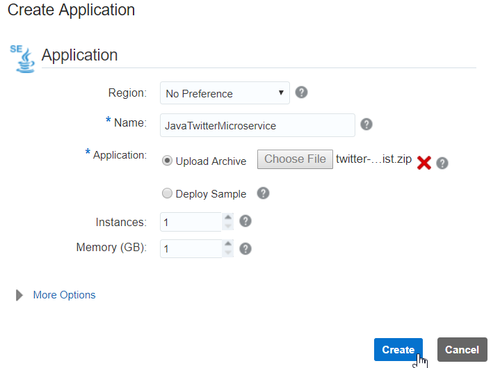

# Workaround for Deployment Error

Update: January 30, 2018

## Twitter Feed Deplyment Error

### **Step 1:** Deployment Error

- If you get the error on deployment **Error creating Storage Cloud Service object or communicating with server** follow these steps to do a manual deployment to Application Container Cloud Server (ACCS)

    

### **Step 2:** Download Build Artifact

- On the left side navigation panel, click **Build** to access the build page.

    

- Click Twitter Feed Build to view build job details

    

- Expand **targets** to expose build artifacts.

    

- Click on **twitter-microserver-example-dist.zip** to download build artifact.

### **Step 3:** Deploy from ACCS Service Console

- Return to the tab where your **Main Cloud Dashboard** window is loaded. If your dashboard Window is not available, simply open a tab and go to cloud.oracle.com, and re-login as previously instructed. **Note:** for those using a Trial account, this is will be your Standard Identity Cloud Service based account/dashboard.

- Click on the  menu for Application Container and select **Open Service Console**. If Application Conatiner is not displayed use **Customize Dashboard** to display.

    

- On the Application Container Cloud Service (ACCS) Service Console you can view all the deployed applications. Click **Create Application**

    

- For application platform click **Java SE**.

    

- Enter **JavaTwitterMicroservice** for Name and click **Choose File**

    

- Click **Downloads**. Verify that the **twitter-microservice-example-dist.zip** is selected and click **Open**

    

- Change **Instances** and **Memory** to 1 and click **Create**

    

- You should see the **JavaTwitterMicroservice** being created.  Once done return to lab 200 and continue.

    
