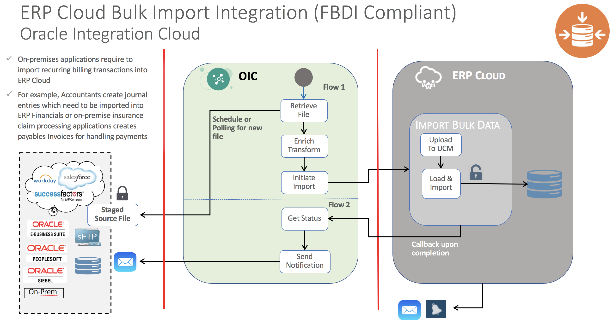

## Oracle Integration Cloud Workshop

Welcome to the Oracle Integration Cloud workshop. 
Oracle Integration Cloud (OIC) Service provides native connectivity to Oracle and non-Oracle Software as a Service (SaaS) and On-premises  applications, such as Oracle ERP Cloud, Oracle Service Cloud, HCM Cloud, Salesforce, Workday, EBS,SAP, NetSuite and so on. 

OIC adapters simplify connectivity by handling the underlying complexities of connecting to applications using industry-wide best practices. You only need to create a connection that provides minimal connectivity information for each system.

## STORYLINE AND PERSONAS
This use case explores the use of OIC with ERP Cloud Import Bulk Data services with File-based Data Integration (FBDI) compliant files in order to import ERP data such as Journal Entries,Billing Transactions etc. to the respective ERP pillar using processes in ERP Cloud.

***To log issues***, click here to go to the [github oracle](https://github.com/oracle/learning-library/issues/new) repository issue submission form.

## Acquire an Oracle Cloud Free Tier Account or Workshop Account

If you already have an account or an active trial, you may skip this section.  If not, you will be creating all required infrastructure components within your Oracle Cloud Free Tier account.

- Bookmark this page for future reference.

## Sign Up for a Free Tier Account

- Open up a browser and navigate to www.oracle.com. Click the **Oracle Cloud Free Tier** button in the upper right hand corner.

    

- Click on the **Start for Free** button

    

- Follow the instructions to create your account.  Be sure to enter an email you can access.  

  

- Once you complete the signup, you will receive the **Your Cloud Account is fully provisioned** Email, make note of your **Username and Cloud Account Name**.   *Note: `Usernames are usually your email address.`*  You can login by clicking the Sign In button or access it from any browser.

    

## Login to Oracle Cloud Account

- From any browser go to oracle.com to access the Oracle Cloud.

    [https://www.oracle.com/](https://www.oracle.com/)

    

- Click the icon in the upper right corner.  Click on **Sign in to Cloud** at the bottom of the drop down.  *NOTE:  Do NOT click the Sign-In button, this will take you to Single Sign-On, not the Oracle Cloud*

        

- Enter your **Cloud Account Name** in the input field and click the **My Services** button. If you have a Free Tier account provisioned, this can be found in your welcome email. Otherwise, this will be supplied by your workshop instructor.

      

- Enter your **Username** and **Password** in the input fields and click **Sign In**.

     

  **NOTE**: You will likely be prompted to change the temporary password listed in the welcome email. In that case, enter the new password in the password field.

- Proceed to Lab 100.

 
