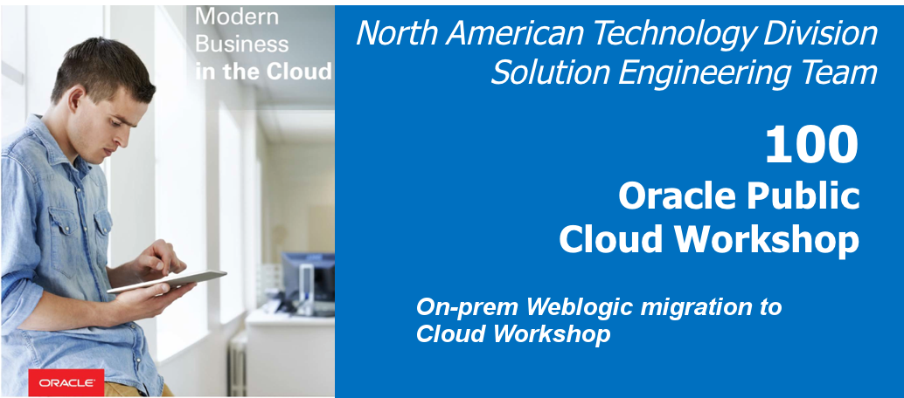  
Updated: August 22, 2018

## Introduction

This is the first of several labs that are part of the **Oracle Public Cloud WLS On-Prem to Cloud Workshop.** This workshop will walk you through the movement on a Java EE application from your on-prem WLS environment to Oracle's Cloud.

You will take on 2 Personas during the workshop. The **Lead DevOps Engineer Persona** Chip, who manages a team of developers writing and maintaining production applications and Richard **Infrastructure engineer** persona who's current challenge is providing the resources to host current applications on-premises.

**_To log issues_**, click here to go to the [github oracle](https://github.com/oracle/learning-library/issues/new) repository issue submission form.

### **STEP 1**: Acquire an Oracle Cloud Trial or Workshop Account

- Bookmark this page for future reference.

- Please click on the following link to create your Free Account, and complete all the required steps to get your free Oracle Cloud Trial Account. When you complete the registration process you'll receive a $300 credit that will enable you to complete the lab for free. Additionally, you'll have 1000s of hours left over to continue to explore the Oracle Cloud.

    - Soon after requesting your trial you will receive the following email. You may begin working on Lab 100 before you receive this email, but you will not be able to start Lab 200 until you have received it.

    

    ***setup a password***

### **STEP 2**: Login to your Oracle Cloud Account
- From any browser, go to the URL:
    `https://cloud.oracle.com`

- click **Sign In** in the upper right hand corner of the browser

    

- Enter your identity domain and click **My Serices**

    **NOTE:** The **Identity Domain** should come from your Trial confirmation email.

    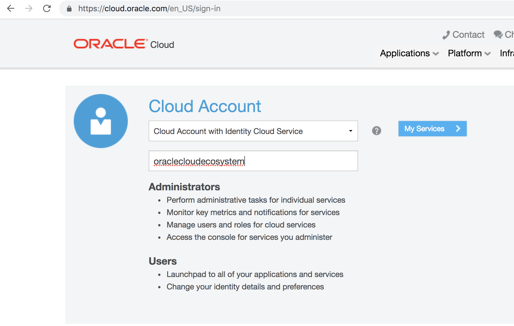

- Once your Identity Domain is set, enter your User Name and the Password you set after your confirmation e-mail and click **Sign In**

    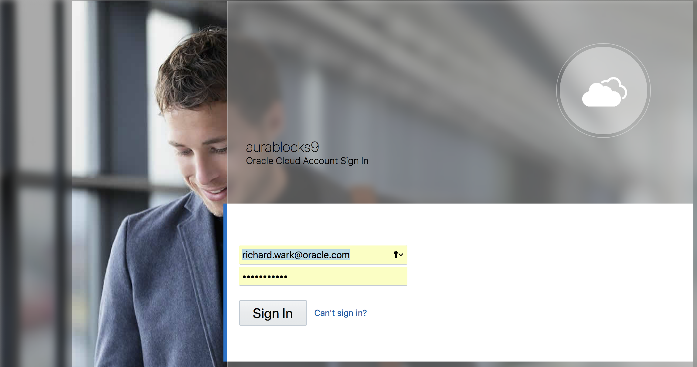

    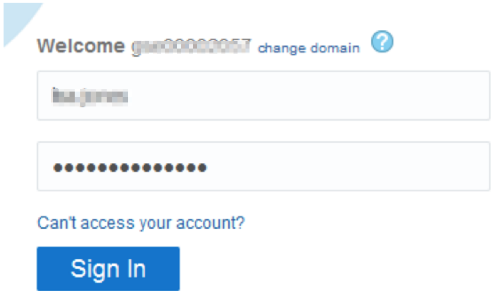

- You will be presented with a Dashboard displaying the various cloud services available to this account.

    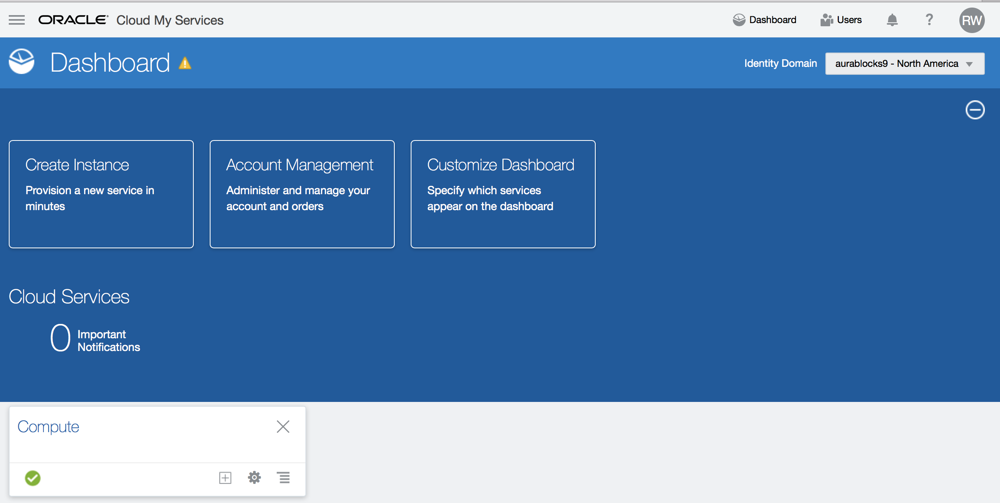

- If all your services are not visible, **click** on the **Customize Dashboard**, you can add services to the dashboard by clicking **Show.** For this workshop, you will want to ensure that you are showing at least the **Java, Application Container, Database and Storage Classic** cloud services. If you do not want to see a specific service, click **Hide**

    

    

    

In order to complete the remaining migration labs, we will first create our on-prem application.  We have a pre-created image with an embeded Weblogic Server which will be used for this process.  To import this image, we must first create a network (VNC) that will allow you access into your image and a compartment which will contain your instances.

### **STEP 3**: Create Network and Compartment on OCI

  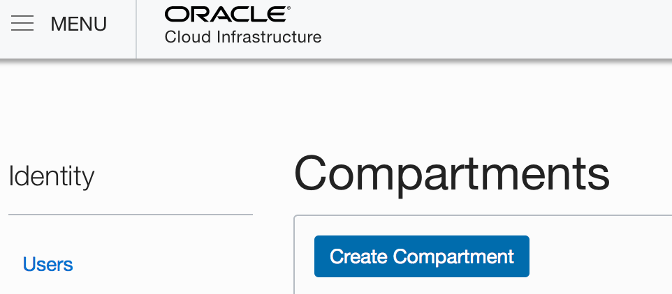

  

  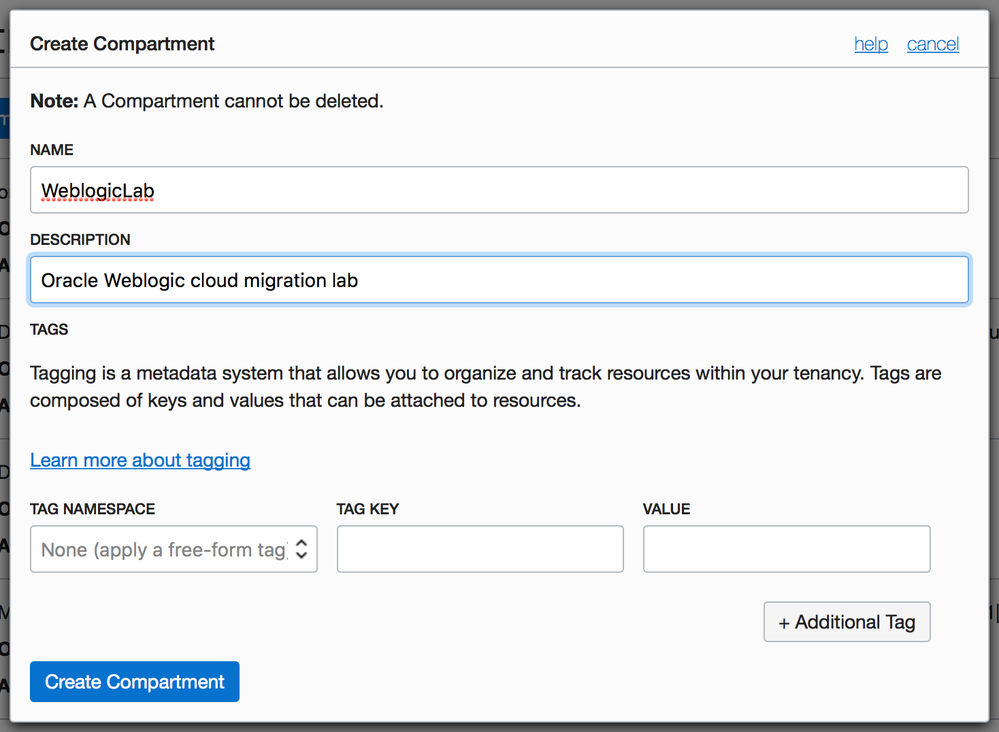

  

  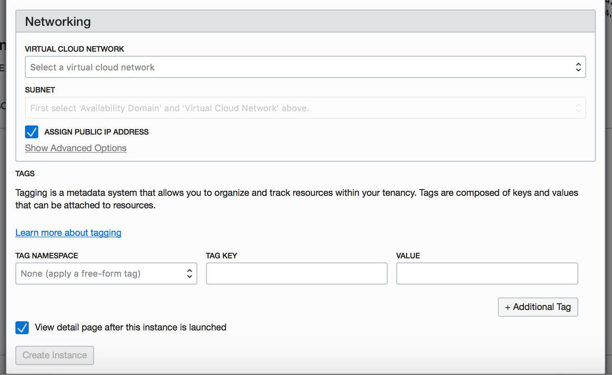

  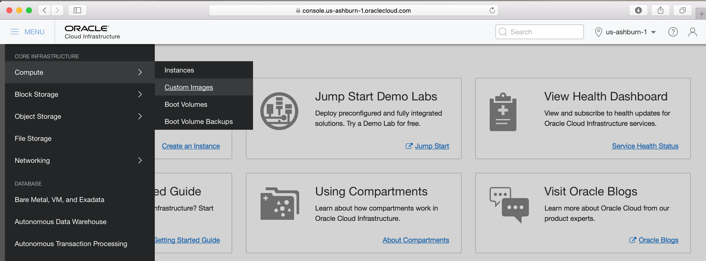

  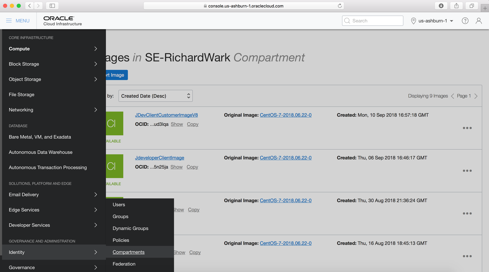

### **STEP 4**: Import Custom Image

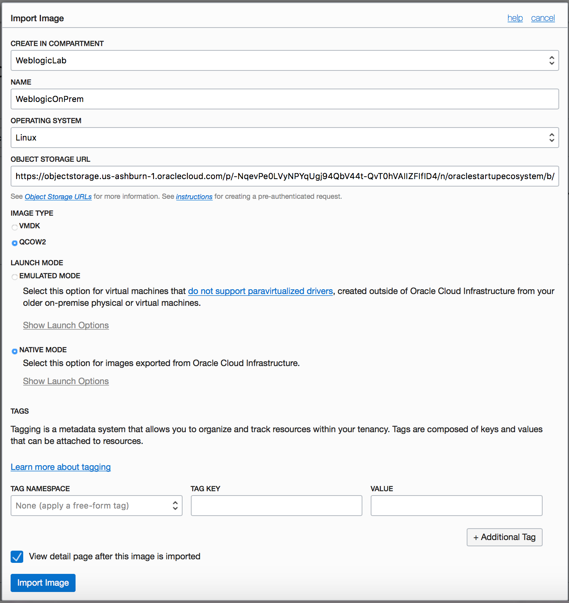

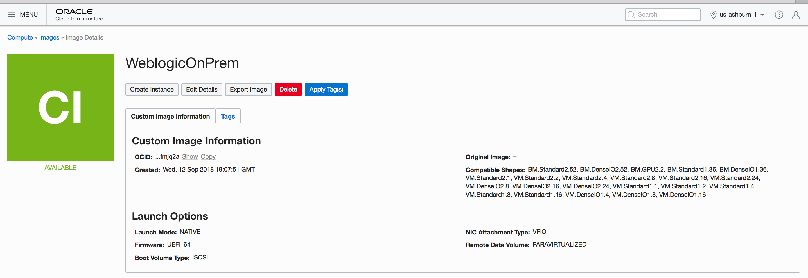

### **STEP 5**: Create Instance

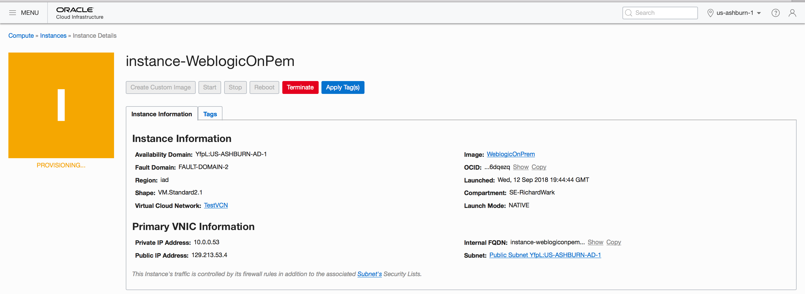
