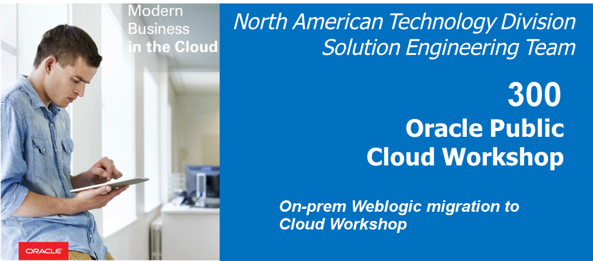  
Updated: 07/24/2018

## Introduction

This lab focus on moving the on-premise WebLogic Server app to Java Cloud Service. Java Cloud Service is ideal for development, testing, user acceptance testing, staging and production. Also, it allows to instantly create dedicated and isolated WebLogic Server environments (11g or 12c version) to run your entire cluster at scale.

## Objectives

- Move on premise WebLogic Server to Oracle Java Cloud Service.
  - Create database instance
  - Create Java Cloud Service instance
  - Move application to Java Cloud Service

## Required Artifacts

For this lab you will need Github and Oracle Cloud account Hub Accounts. Use the following links to set up:

- [GitHub account](GitHub account - https://github.com/join)
- [Oracle JDeveloper](Oracle JDeveloper - https://www.oracle.com/technetwork/developer-tools/jdev/overview/index.html)
- [Oracle cloud account](https://myservices.us.oraclecloud.com/mycloud/signup?language=en&sourceType=:ow:lp:2t::RC_PDMK180124P00080:ContainerNativeHOLLP&intcmp=:ow:lp:2t::RC_PDMK180124P00080:ContainerNativeHOLLP)

# On premise WebLogic Server to Java Cloud Service

## Deploying the Application to the Oracle Java Cloud Service

### **STEP 1**: Create Database Instance in Cloud

- Sign in to Oracle Cloud My Services.
- Click  Dashboard menu near the upper left corner of the page, and select Database.
  
- Click on create instance

 

- Fill out the details and remember the region.

  

- Fill out the details and upload the ssh key if you don't have one then create new key.

  

  

- Click on create and in few minutes new database instance will be running.

  

### **STEP 2**: Create Java Cloud Service instance

- In Java Cloud Service home page click on create instance

  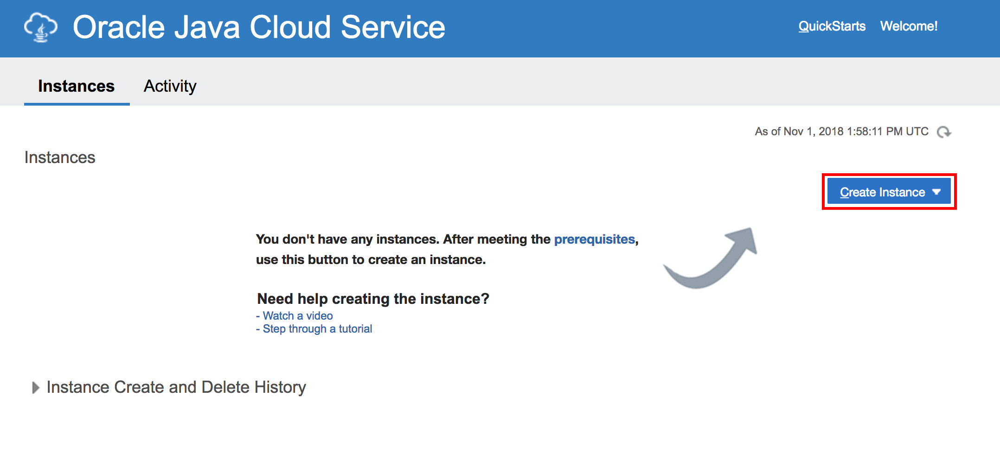

- Click on Java

  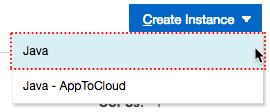

- Make sure to have same region as of Database

  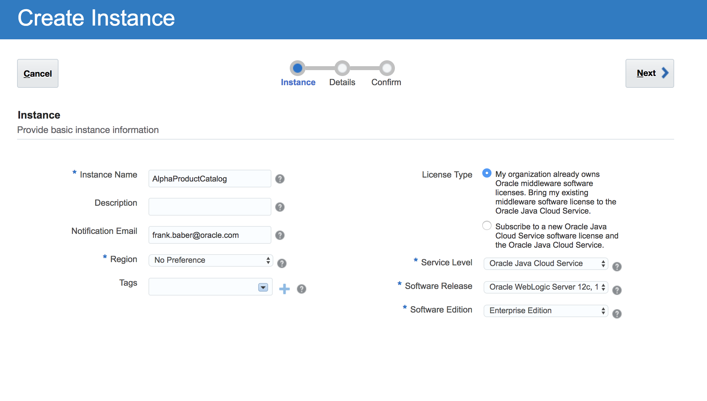

- Create new SSH key or upload the existing public key and select the DB created earlier.

  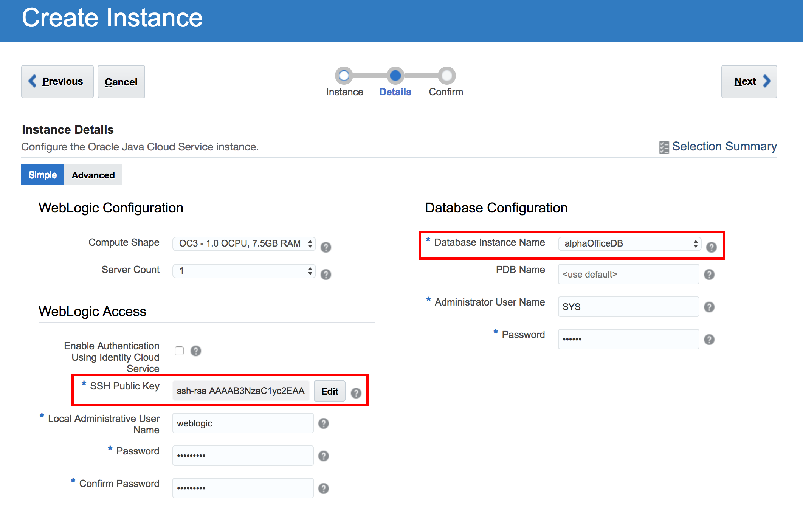

- If everything goes right, confirmation page will load up. Download the payload.

  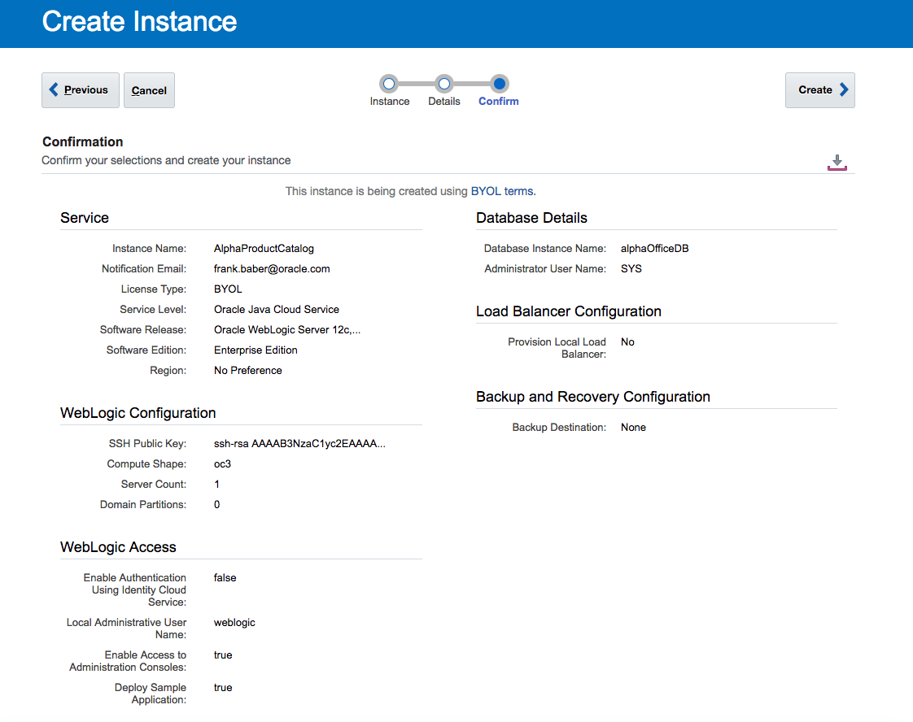

- Click Create.

  

### **STEP 3**: Upload project in Java Cloud Service

- From the menu that's displayed, select Open WebLogic Server Console.

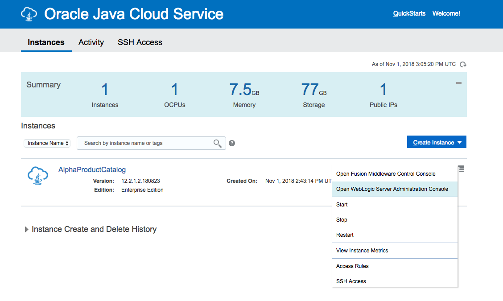

The sign-in page of the WebLogic Server Administration Console is displayed. 
If you see the untrusted security certificate warning, add the certificate to your browser, as an exception, and continue. The text of this warning and the steps to proceed depend on your browser. In Firefox, for example, you can proceed by clicking Advanced and then Add Exception.

 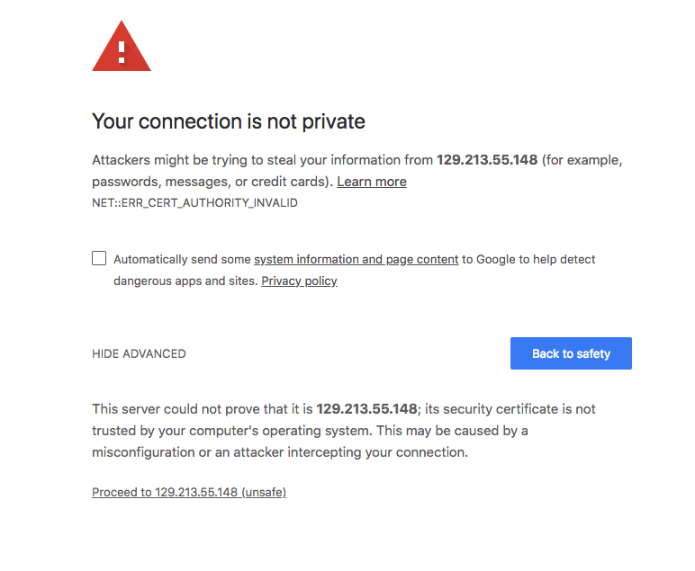

- Enter your administrator credentials. 
Note: These are the credentials that you had specified while creating the instance. In the case of a quickstart instance, you can find the credentials in the credentials zip bundle that you downloaded while creating the instance. 
The WebLogic Server Administration Console is displayed.

- Click Lock & Edit.

    

- Under Domain Structure, click Deployments.

    

- On the Deployments page, click Install.

    

- On the Install page, click upload your file(s).

    

- On the Install Application Assistant page, click Browse near the Deployment Archive field, and select the alphaOffice.war application that you downloaded earlier.

    

- The name of the selected deployment archive file appears next to the Browse button. Click Next.

    

- Make sure that the deployment archive file is selected, near the bottom of the page, and then click Next.

    

- You can install the deployment as either an application or a library. For this tutorial, we'll install it as an application. Click Next

    

- Select the servers or clusters to which you want to deploy the application. For this tutorial, we'll deploy the application to all the servers in the cluster. So click All servers in the cluster, and then click Next. 
Note that the the cluster name (WebLogic Server003jc_cluster in this example) would be the first eight characters of your service instance's name followed by _cluster.

    

- On the Optional Settings page, click Next. The default settings are adequate for this tutorial.

    

- Review the configuration settings. You can choose to fine-tune your configuration; but for this tutorial, select No, I will review the configuration later, and then click Finish.

    

- A message is displayed that the application was deployed successfully.

    

- In the Change Center, click Activate Changes.

       

- The application is in the Prepared state and ready to be started.

       

- In the WebLogic Server Administration Console, on the Summary of Deployments page, go to the Control tab.

 

- In the Deployments table, select the check box near the application that you just deployed. Click Start, and then select Servicing all requests.

    

- Click Yes to confirm the deployment.

    

- The application is now in the Active state and is ready to accept requests.

    

    ## Test access to the application

- Sign in to the Oracle Java Cloud Service Console.

- Click on the alphaOffice instance.

- On the details page of the alphaOffice instance, do one of the following:
  - If a Load Balancer section exists, then expand it, and note the public IP Address of the load balancer node. In this example, it is 129.213.145.149
  - If you don't see a Load Balancer section, then expand the Resources section, and note the public IP Address of one of the nodes shown there.

  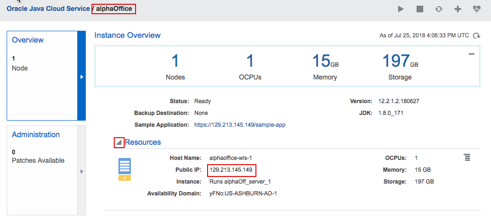

- Enter the URL that you identified in the previous step in a browser. 
If you see the untrusted security certificate warning, add the certificate to your browser, as an exception, and continue. The text of this warning and the steps to proceed depend on your browser. In Firefox, for example, you can proceed by clicking Advanced and then Add Exception. 
  - The URL for the application would be in the format **https://managedServer_publicIP/contextRoot** 
   Example: https://129.213.145.149/products.jsp

- Once the app is running it will appear something like this

 

### **STEP 4**: Scale instance in Java Cloud Service

- Click Hamburger menu icon and select Scale Up/Down option.

 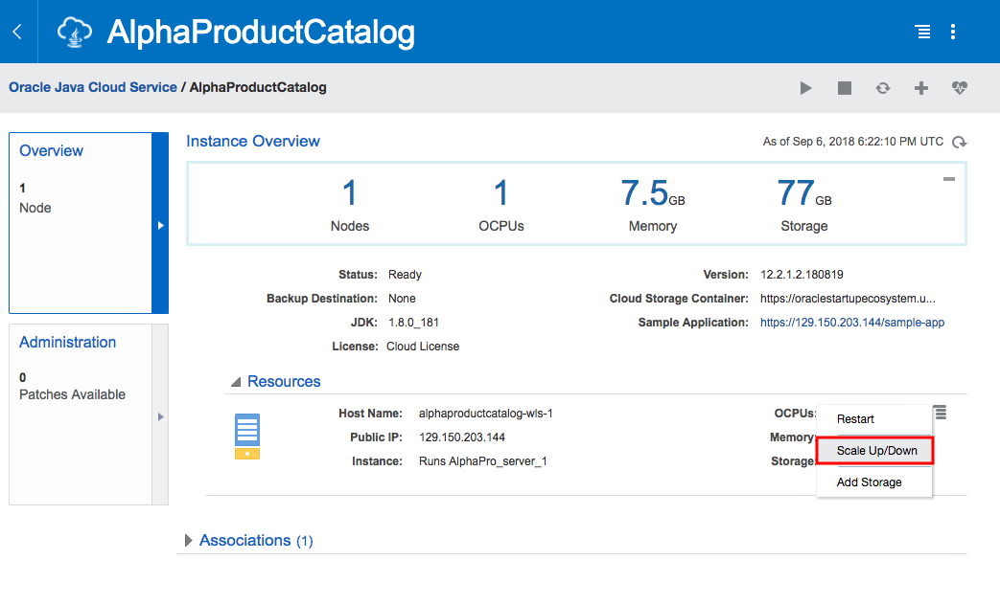

- Select Compute Shape from the dropdown list according to your requirement. Note that the instance will be unavailable during scale up/down operation.
  
 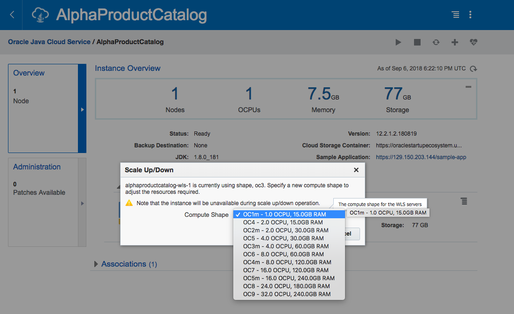

- Click Yes, Scale Up/Down VM to proceed.
  
 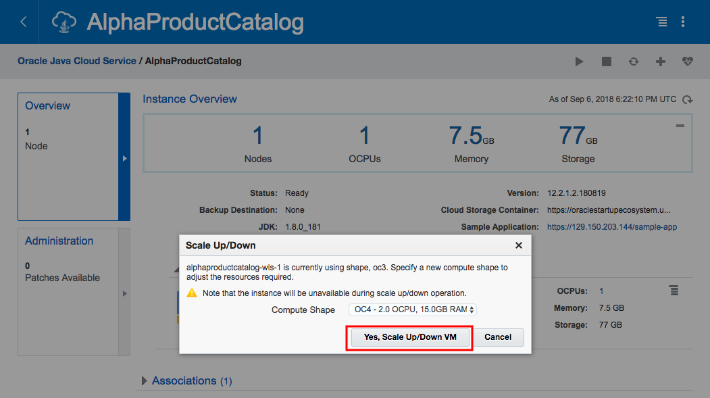

 - The scale request is successfully accepted and scheduled.
  
 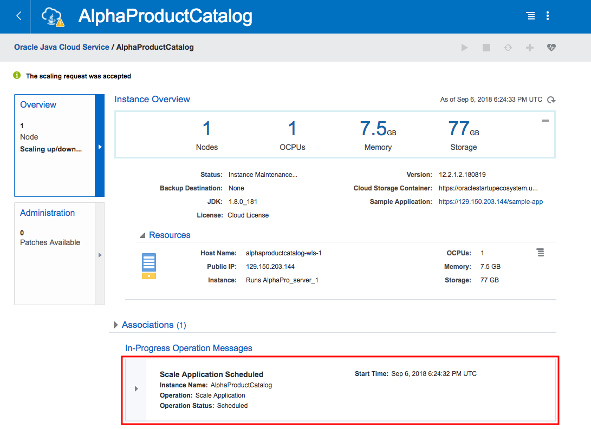

- Refresh page again in few minutes to confirm the scale request is successfully completed.
  
 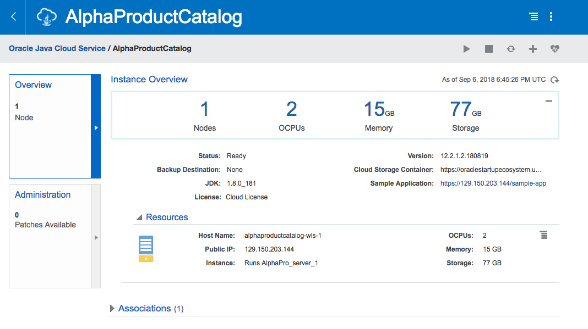

