# Packer Workshop - Cloud Infrastructure Configuration


## Introduction

This is the first of several labs which are part of **Oracle Public Cloud Build OCI images with packer workshop.** This workshop will walk you through the process of creating custom OCI images in you own Oracle Cloud Trial account.

You will take on the persona of **Infrastructure Engineer** during this workshop. As such, you've been asked to recommend a solution for deploying software currently packaged as VMWare Images running on-site at AlphaOffice.  You will do an evaluation based on development environments, build for and given to developers to build and test applications deployed in Docker.  It's a straightforward example of a Unix System, running a Desktop (gnome), with git installed, firewall configured to allow VNC access and local services.  It's configuration also been reviewed by the security team.

***To log issues***, click here to go to the [github oracle](https://github.com/oracle/learning-library/issues/new) repository issue submission form.

## Objectives

- Login to your Oracle Cloud Trial or Workshop Account
- Create the baseline infrastructure to support a Compute image
- Create and use an SSH key pair
- Use/practice git & Github

## Required Artifacts

- The following lab requires:
  - Laptop (Windows, Mac or Linux)
    - If running  Windows: [Putty and PuttyGen](https://www.chiark.greenend.org.uk/~sgtatham/putty/latest.html)
  - an Oracle Cloud Trial account
  - a Github account (https://github.com/join)

**Note:** This workshop runs from a Cloud Compute Client instance to minimize changes/additions to the students laptop.  You will install packer on a Compute instance in the cloud.  If you would like to install (packer & git) locally on your windows or mac laptop, the same instructions will work with little/no modification.

# Log into your Trial Account and Create Infrastructure

You will create all required infrastructure components within your Trial account.

## Your Cloud Trial Account

### **STEP 1**: Obtain your Oracle Cloud Trial Account

- If you haven't already, please request your Oracle Cloud Trial Account. <a class="trial-link" href="https://myservices.us.oraclecloud.com/mycloud/signup?language=en&sourceType=:ow:lp:2t::RC_NAMK190212P00041:PackerOCI_HOL&intcmp=:ow:lp:2t::RC_NAMK190212P00041:PackerOCI_HOL" target="trial">Get a free trial account.</a>

### **STEP 2**: Log in to your OCI dashboard

- Once you receive the **Get Started with Oracle Cloud** Email, make note of your **Username, Password and Cloud Account Name**.

  

- From any browser go to. :

    [https://cloud.oracle.com/en_US/sign-in](https://cloud.oracle.com/en_US/sign-in)

- Enter your **Cloud Account Name** in the input field and click the **Next** button.

  

- Enter your **Username** and **Password** in the input fields and click **Sign In**.

  

- You are presented with the Oracle Cloud Infrastructure (OCI) Dashboard/Portal.

  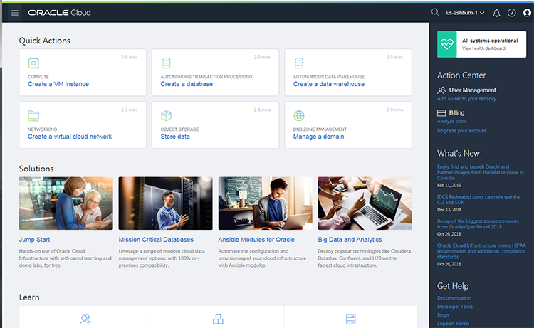

### **STEP 3**: Fork Repository github.com/packer-workshop/packer-oci from GitHub

Using git is very common for cloud development, it provides source control and management of software, configuration and documentation files.  For the purposes of this workshop, you make use of GitHub for its ability to store, view and edit important files used in image creation - details allowing packer to build in your OCI environment

By forking our workshop's github repository to YOUR github account, you have a working copy of this lab, allowing you to edit files (add your cloud identifiers to a json file) using the web interface of github. You can also keep any assets you create, even when your trial expires.

- From a **new window** any browser, go to [github.com/packer-workshop/packer-oci](github.com/packer-workshop/packer-oci)

- Click **Fork** in the upper right hand corner of the browser. **Sign in** if prompted.

  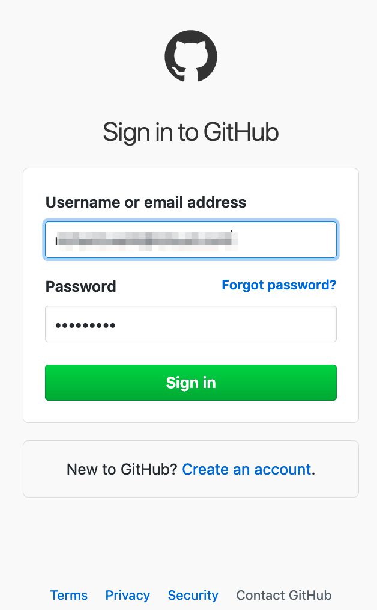

  **NOTE:** If prompted, choose to fork the repository to your account (this may occur if your account is also a member of an organization on GitHub).

  
  you might catch:

  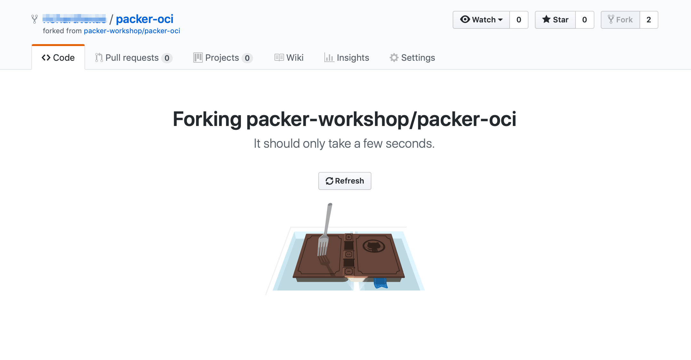

-  You will see that a copy of the _packer-oci_ repository is now in your Github account.  This will allow you to make changes to items tied to your Cloud Account.

  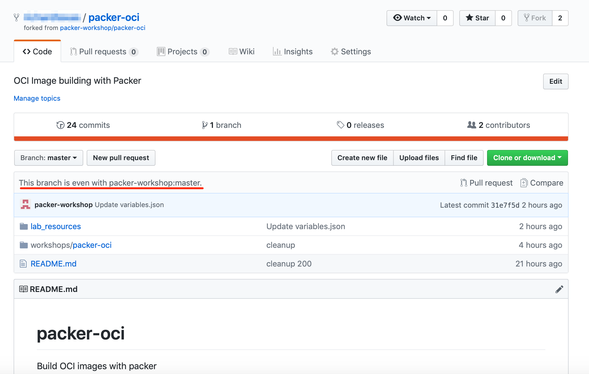

### **STEP 4**: Create a Copy of variables.json

-  Using your browser, **navigate** in your Github repository to:  

    -  **workshops -> packer-oci ->packer_scripts**

- There, you should see:

  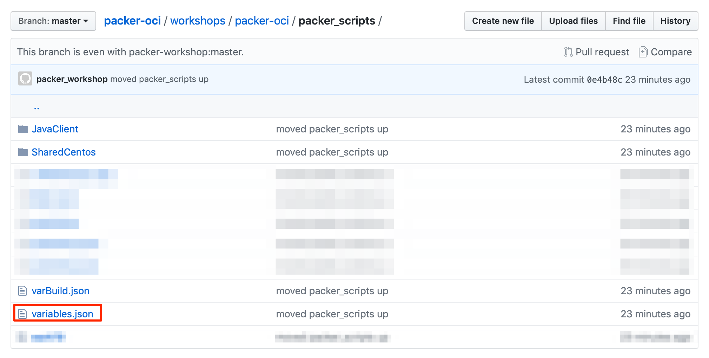

-  **Open** variables.json using the browser interface.

- Click the filename **variables.json**, bringing up the files, Highlight the template variables, and copy them to your clipboard (cntrl-C or &#8984;-C)

  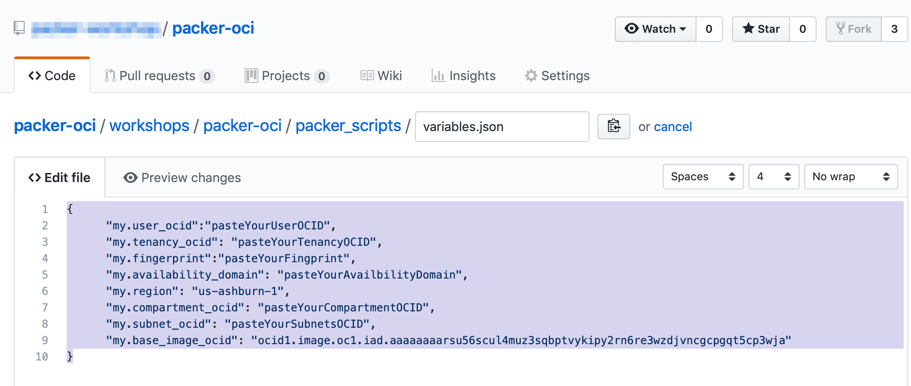

- **Return to packer_scripts directory** - click on *packer_scripts*:

  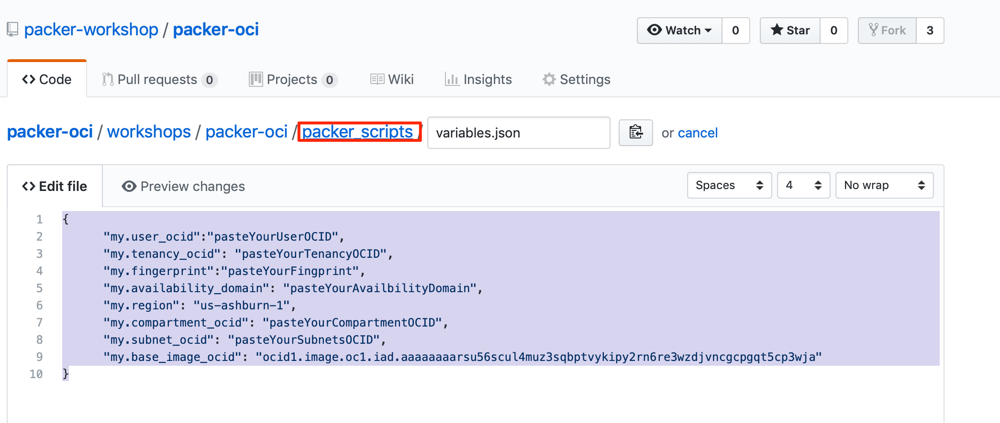

- **Create a new file** - using the create new file button.

-  **Paste** the contents of *variables.json* from your clipboard

  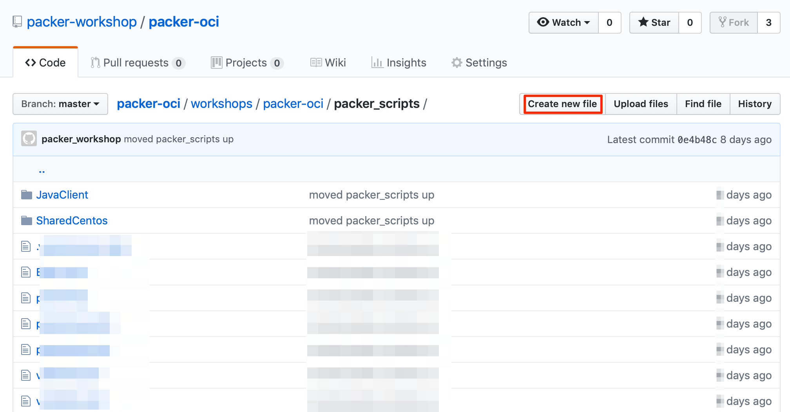

- Call it **DevDesktop.json** (since it will be a docker developer's desktop image). This file will store the variables (OCID, region and base image) specific to your Cloud tenancy.

   


- **Commit** the file, with a comment, using the button below the Editor

   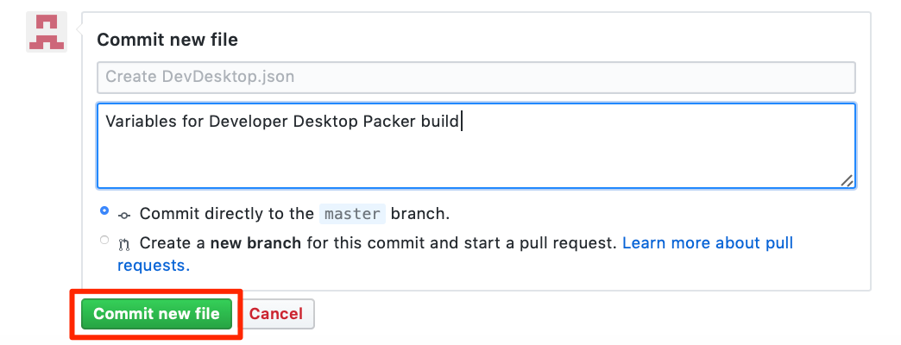

As you navigate around Oracle Cloud Infrastructure, you will want to keep your _DevDesktop.json_ file open to collect the required identifiers.  As you create compartments and networks, you will be asked to paste identifiers into this file.  

### **STEP 5**: Create a Compartment

Compartments are used to isolate resources within your OCI tenant. User & Group-based access policies can be applied to manage access to compute instances and other resources within a Compartment.

- In the top left corner of the dashboard, click the **hamburger menu**

  
  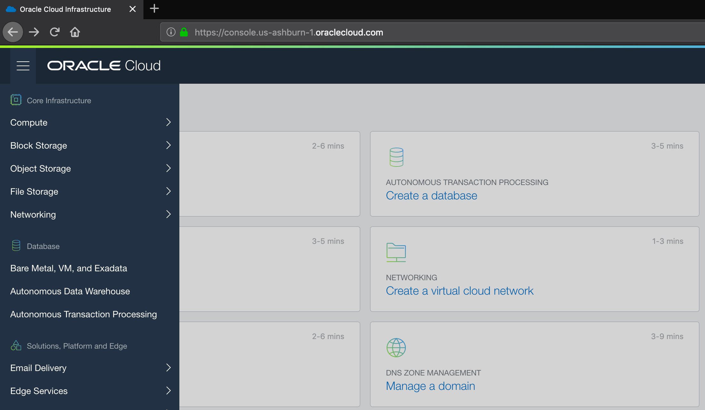

- Select to expand the **Identity** submenu, then click **Compartments**

  

- Click **Create Compartment**

  

- In the **Name** field, enter any name you want. For this example you will use the name `Packer`. Enter a **Description** of your choice. Click **Create Compartment**.

  

- In a moment, your new Compartment will show up in the list.

  

### **STEP 6**: Collect Packer Compartment's OCID

- Now, you can copy the new compartments OCID to the DevDesktop.json file from step 3 by using the *copy* link

  

- **Copy** This value and **Paste** into your _DevDesktop.json_ file's, compartment:

  

### **STEP 7**: Create a Virtual Cloud Network

You need a VCN to define the network you'll use in the `Packer` compartment (_Or the name you used for your compartment_). This Virtual Cloud Network is where things like Subnets and Security Lists get defined for each Availability Domain in your Tenancy. Oracle Cloud Infrastructure is hosted in regions and availability domains. A region is a localized geographic area (e.g. PHX or IAD), and an availability domain is one or more data centers located within a region (e.g. IAD - AD1). A region is composed of several availability domains. Availability domains are isolated from each other, fault tolerant, and very unlikely to fail simultaneously. Because availability domains do not share infrastructure such as power or cooling, or the internal availability domain network, a failure at one availability domain is unlikely to impact the availability of the others.

All the availability domains in a region are connected to each other by a low latency, high bandwidth network, which makes it possible for you to provide high-availability connectivity to the Internet and customer premises, and to build replicated systems in multiple availability domains for both high-availability and disaster recovery.

- Click the **hamburger icon** in the upper left corner to open the navigation menu. Under the **Networking** section of the menu, click **Virtual Cloud Networks**

    

  - Select your **compartment** from the LOV.

    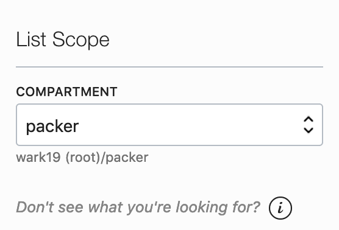

  - Click **Create Virtual Cloud Network**

    

  - Enter **packer-build** for the Name and select the **Create Virtual Cloud Network Plus Related Resources** option as highlighted below:

    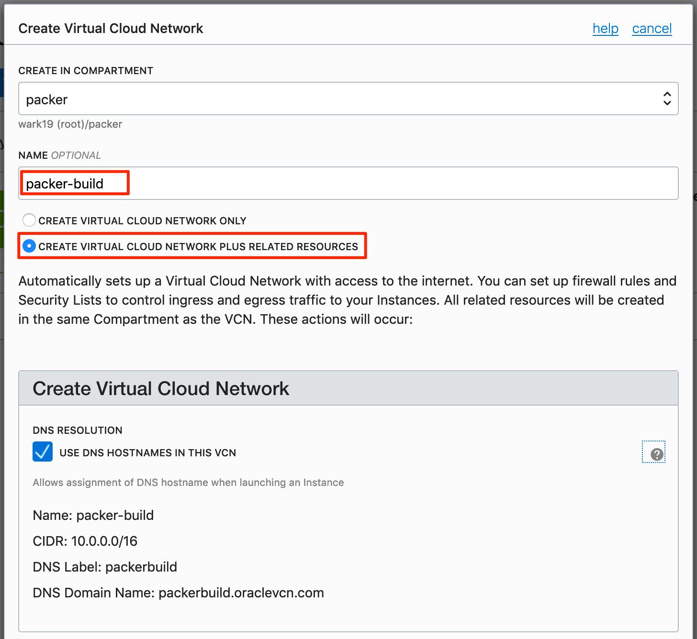

- Click **Create Virtual Cloud Network**

    

- Click **Close** on the details page after noticing the VNC and Subnets created.:

    

This means that you have a network, "packer-build" defined to have 3 subnets, each one in an isolated availability domain.

- **Click** on the Packer-build VCN to get OCID of the subnets.

    

### **STEP 8**: Collect Packer-build subnet OCID

- Now you can **copy** one of the subnet's OCID to the _DevDesktop.json_ file from step 3 by using the *copy* link.  

  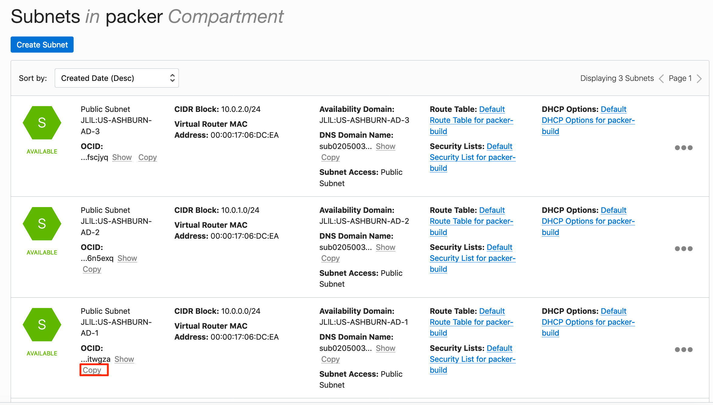

- For consistency, use AD-1 (at the bottom) as your subnet.  You won't run into problems as long as you pick the matching subnet & AD (e.g AD2 with Subnet2, AD1 with Subnet1, etc.)

  

- Back in your browser window, update your _DevDesktop.json_ file. Highlight `pasteYourSubnetsOCID`, **pasting** the OCID value after:

      

Now you have your compartment and subnet defined in your variables file.

### **STEP 9**: Add a Security List entry

A security list provides a virtual firewall for an instance. The Security List contains ingress and egress rules that specify the types of traffic allowed in and out. Each security list is enforced at the instance level, however, you configure your security lists at the subnet level. This applies the same set of rules to each instances in a given subnet. The security lists apply to a given instance whether it's interacting with another instance in the VCN or a host outside the VCN.

- Select **Security Lists** from the left hand menu.

    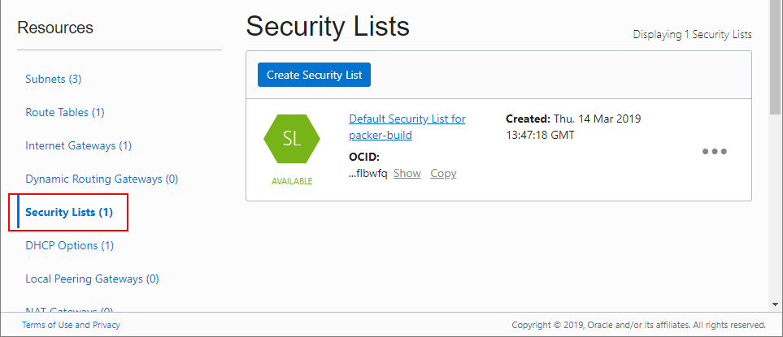

- Next select "Default Security List for packer-build" under **Security Lists**

  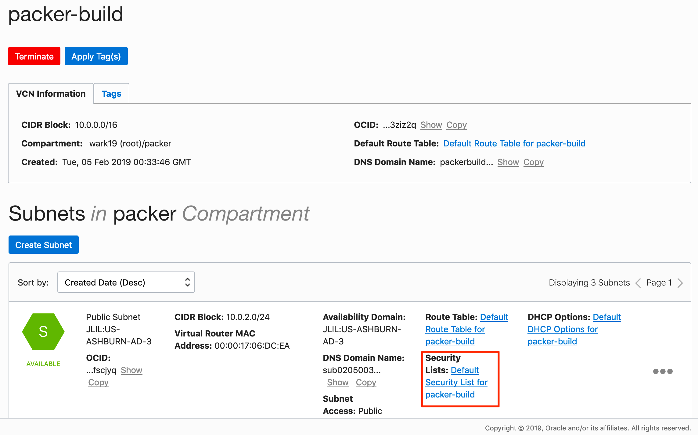

For the purposes of the upcoming Packer-built image deployments, you need to add a couple of Ingress Rules that allow VNC access from the Internet to ports 5910 and 5911.

- Click **Edit All Rules** and then select **+ Another Ingress Rule**

  **`NOTE: Our goal is to add new rule, not change existing ones...`**

  

  

- **Enter the following as Rule 4 (or the next in your tenant)**

**NOTE:** Leave all other values at default

```
Source CIDR: 0.0.0.0/0
Destination Port Range: 5910-5911
```

- Click the **Save Security List Rules** button at the bottom of the page

  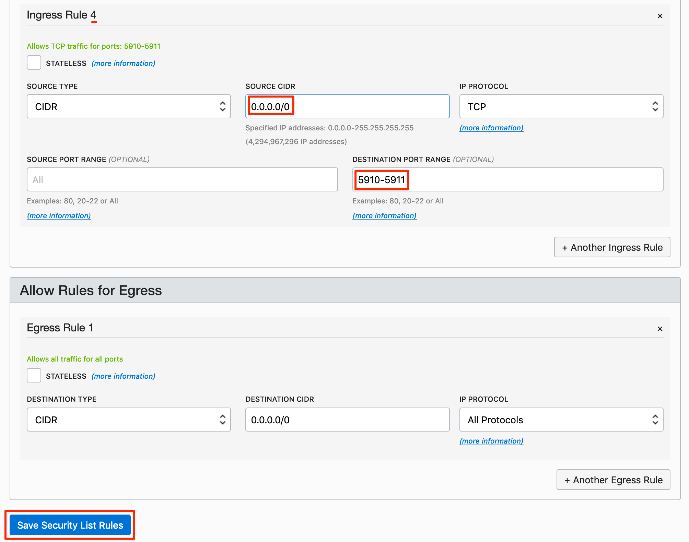

- Your Ingress Rules should look like:

  

 This opens port 5910 & 5911 to the public internet! for the purposes of this lab, you should be fine.  If you do this in any other account (e.g. not your 30-day trial), pay close attention to the ports your open.  You can enter very narrow port ranges to lock port access down to a single corporate network, or corporate networks + hosted servers specifically designed to access and audit administrative access to cloud instances.  

### **STEP 10 Mac/Linux**: Create SSH Key Pair (Linux or Mac client)

Before you create the Compute instance that will host the packer install, you need to create an ssh key pair, allowing you to securely connect to the instance.

**NOTE:** `This step focuses on key pair generation for Linux or Mac based terminal sessions. If your going to run your terminal sessions from a Windows client then skip to STEP 11`

- In a `Linux/Mac` client terminal window **Type** the following (**You don't have to worry about any passphrases unless you want to enter one**)

  - **type**  mkdir Keys

  - **type** cd Keys (taking your into your directory)

  - **type** ssh-keygen -b 2048 -t rsa -f packerkey

```
mkdir Keys
cd Keys
ssh-keygen -b 2048 -t rsa -f packerkey
```

- Your key pair is now in the current directory.  You will have two files (the pair) which make up the symmetric key.  The private key should remain only in secure locations to protect from misuse.  

  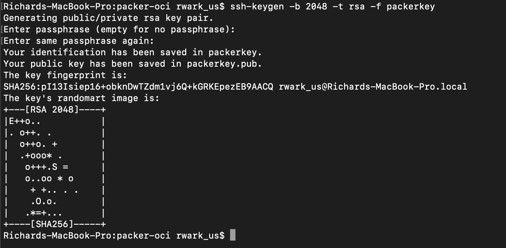

- **NOTE for Linux and Mac Clients:** Just open up the pubic key file in an editor (vi) and select / copy the entire contents to be used in Step 1 of the next lab (200).

```
vi packerkey.pub
```

  

### **STEP 11 Windows**: Create SSH Key Pair (Windows client)

For Windows clients this example will show the use of PuttyGen to generate the keypair. [Putty and PuttyGen](https://www.chiark.greenend.org.uk/~sgtatham/putty/latest.html) are available for download.

- Run **PuttyGen** and click **Generate**

    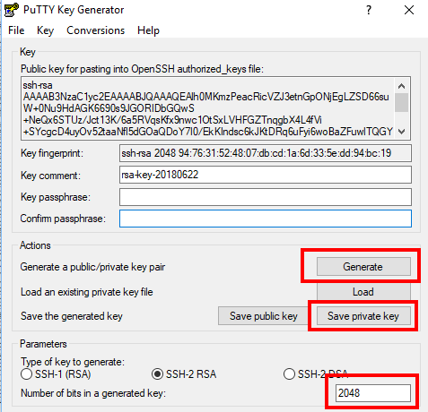

- Once the generation process completes click the **Save Private Key** button and save to a directory of your choice.

- If prompted to save without a passphrase click yes.

  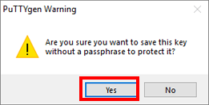

**NOTE:** `Do not save the public key as the format is not compatible with Linux openSSH.

- Instead, **Select the entire Public Key in the display and right-click copy**. `This content will be pasted into the Create Instance dialog in Step 1 of Lab 200.`

  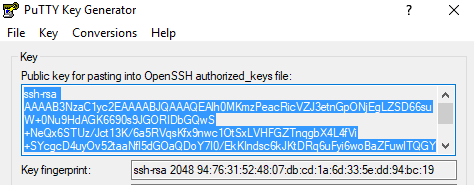

The result of this is creation of the SSH keypair:

- packerkey.pub (your public SSH key)
- packerkey (your private SSH key)

Ideally, your private key should be kept on your laptop with security measures in place which match the systems they can be used with.  Since the trial account can be converted to a production account, if you wish, it's a best-practice to think about security practices from the very first assets created.

**This completes this Lab!**

**You are ready to proceed to [Lab 200](Lab200.md)**
