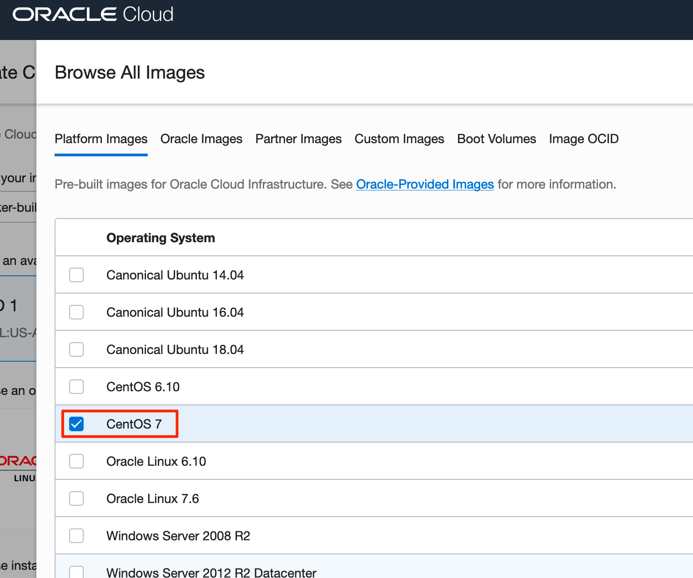
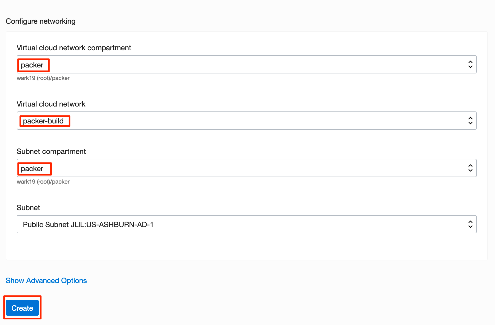
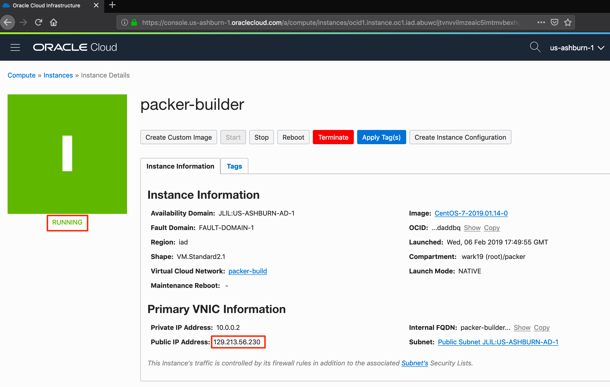
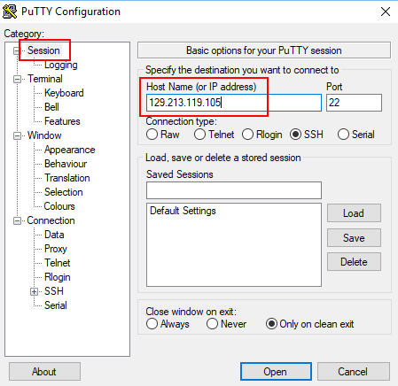
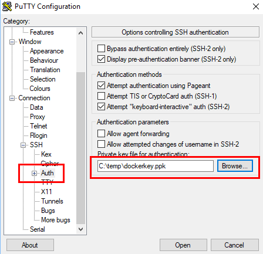
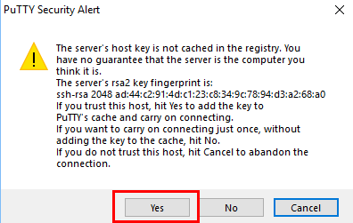
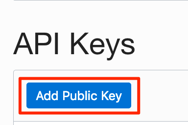
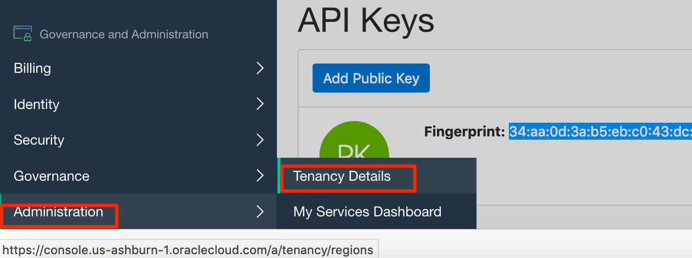
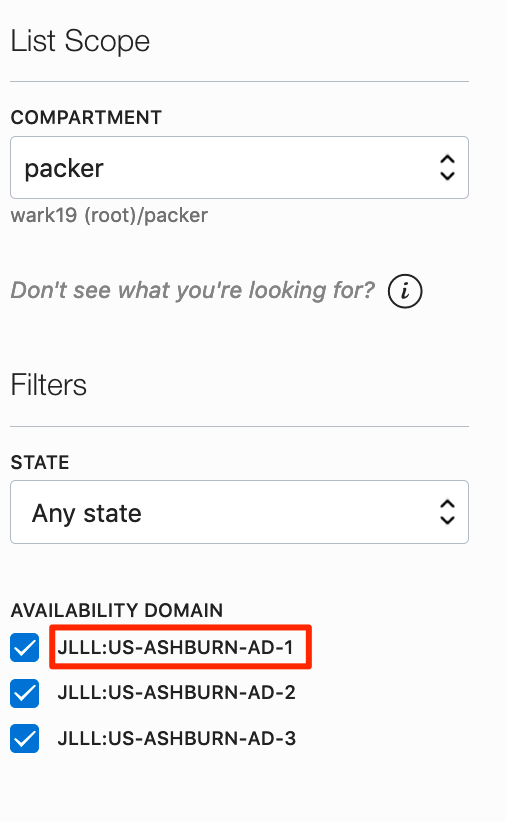

# Packer Workshop - Exploring OCI


## Introduction

In this lab we will launch a compute instance to work from, installing packer and building your first, basic, image of CentOS7.  You will learn to securely connect to this images and moves files using scp using keys.

***To log issues***, click here to go to the [ oracleGithub](https://github.com/oracle/learning-library/issues/new) repository issue submission form. We look forward to your questions and suggestions for improvement.

## Objectives

- Launch Compute Image
- Install Packer
- Gather remaining OCIDs for Cloud objects

## Required Artifacts

- Oracle Cloud Account - (configured in Lab100)
- Your copied public key from lab 100
- Variables.json file open

### **STEP 1**: Create an OCI Compute Instance

You will now create a CentOS-based Compute instance using the public key half of the key-pair you just generated.  We'll call this the Client Image in future labs.  It's a stand-in for your laptop or developement workstation since some attendee's might have issues installing on their laptop due to administrative controls.

**`NOTE: feel free to install packer and git on your laptop if you feel comfortable doing so...  If you've done so, skip directly to `** (Lab300.md)

- Go back to your OCI console and from the hamburger menu in the upper left hand corner 
select **Compute-->Instances**

    

- Click **Create Instance**

   

- **You will (Select / Leave Default) or Type** the following in the `Create Compute Instance` section of the dialog:

```
Name: packer-builder
Availability Domain: AD 1 (Use default AD 1)
Boot Volume: Oracle-Provided OS Image
Image Operating System: CentOS7  <change to>
Shape Type: Virtual Machine (Default)
Shape: VM.Standard2.1 (Default)
SSH Keys: Choose SSH Key Files
```

- After entering the _packer-builder_ instance name click the **Change Image Source**.

   

- Select **CentsOS 7** and click **Select Image**.  This selection will now be shown on the page:
 
   

- Scroll down furthur on the page and select your PUBLIC SSH Key

**NOTE:** You will paste the public key you copied in Step 7 of lab 100 into the SSH KEY field by selecting the "Paste SSH Keys" radio button. `The public key should be pasted as a single line`

   

- In the Configure networking Section you will take ALL of the defaults as shown:

   

- Click **Create**

In less than one minute, you should see your instance provisioning and the IP Address.  While it's spinning up, you'll notice the OCID has been generated.  This can be used to refer to this image using the REST API should you want to.

  

- `Make a note of the IP Address as we will be using this in the next step.`

In about 2 1/2 minutes, you should see your instance in the running state, available to be reached via ssh.

   

### **STEP 2**: Connect via SSH into the Instance

The last set up piece will be to SSH into the Compute image and install packer and git.

#### **Windows:**
- For a Windows client launch Putty, select the **Session** section and type in the IP address:

   

- Select the **Data** section and enter the following as the username:

```
opc
```

- Yours should look like:

  

- Select **SSH-->Auth** and browse to the Private Key you created back in Step 7:

   

- Click the **Open** button. You will presented the first time with am alert message. Click **Yes**

   

- You will logged into the Compute image:

   

- **NOTE:** For Linux and Mac client sessions "cd" into the directory where your key pair is. Your packerkey file has the permissions of "600" or "rw---------".  The private key allows you to ssh into the compute instance `substituting your IP address`, which already has the public key we specified in the instance create...deployed to the opc user.

#### **Macs:**

Launch a terminal window and ssh to the packer-builder image
Example:

```
ssh -i ./packerkey opc@129.213.56.230
```

- Linux / Mac screenshot:

  

### **STEP 3**: Install and configure Packer and GIT

Packer and GIT are required for the subsuquent labs. You will install the Docker engine, enable it to start on re-boot, grant docker privledges to the `opc` user and finally install GIT.

- **Cut and Paste** the following in a terminal window:

```
sudo -s
mkdir packer
yum -y install git
cd packer
wget https://releases.hashicorp.com/packer/1.3.4/packer_1.3.4_linux_amd64.zip
unzip packer_1.3.4_linux_amd64.zip /usr/local/bin
alias packer=/usr/local/bin/packer
```

- **Type** the following to verify good installations:

```
which packer
git status
```


### **STEP 4**: Gather remaining OCIDs
Collect your User's OCID and add the public key.
-  Navigate using the **hamburger menu** to Identity--> Users


- Copy the OCID from the non-federated User entry (the one without the oracleidentitycloudservice prefix)

- Paste this into your open variables.json file:


### **STEP 5**: Create public key in .pem format

On the machine where you created your public keypair, convert your public key to a .pem format by running:            
```
openssl rsa -in packerkey -outform pem -pubout -out packerkey.pem
```

- Confirm the format with:

```
      more packerkey.pem 

-----BEGIN PUBLIC KEY-----
MIIBIjANBgkqhkiG9w0BAQEFAAOCAQ8AMIIBCgKCAQEAs7w56+8uK7fDjjfn4OEk
9SvBYrCxasaMPNt3YK0BPVckyo0OOxOspRzZqFm6StvIeQu1owOK2hBfxdfciJjA
QdqlK/TM9lloXBqLVvazuLL2wrtWXiPWric4fpMyB2kX0Prfp0P0UCvA5Bo27N/V
2yv9/yCyfpNu/S1XrZsYeFkn/OfFGtZK1UqSRv/xy/CC2StM2MiUWcFFqXM4Ce9Q
blWJ9gw0Aa1x8+LAw1A02gPF0qFVgQRytxrPqjRMhVmMbyhdj/x8FgrayZuds9ve
fkKP7ytaf07jpAFYa/MH2S0GOKKQnTi/5kB7XD9yD0EPKlP+8MN4mi2aNh8sAyyy
RwIDAQAB
-----END PUBLIC KEY-----
richards-mbp:packer_scripts rwark_us$
Richards-MacBook-Pro:packer-oci rwark_us$ 
```

- Now, add the public key to the user you just grabbed the OCID for, pasting the created fingerprint to variables.json  

  - Select the User:

  
  
  - Add the API key by pasting ALL LINES from packerkey.pem

  

  - You should see the fingerprint appear after hitting "add"

  

  - copy the string after "Fingerprint:" into variables.json

  
 
-  It should now look similar to: 

    

-  We now just need the OCID of the Tenancy and the Availability Domain

   - For The tenancy's OCID, navigate using the **hamburger menu** to Administration--> My Tenancy Details  

   

   -  Copy the OCID to variables.json

   

   -  Finally, copy the Name of your Availability Domain from the instances page (**hamburger menu** to "Compute")

    

  

You should now have a completed variables file:

  

and should now commit your work to your repository.

  


**You are ready to proceed to [Lab 300](Lab300.md)**
