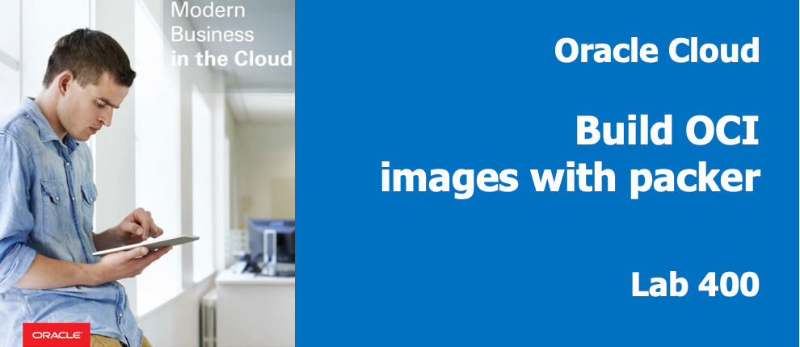
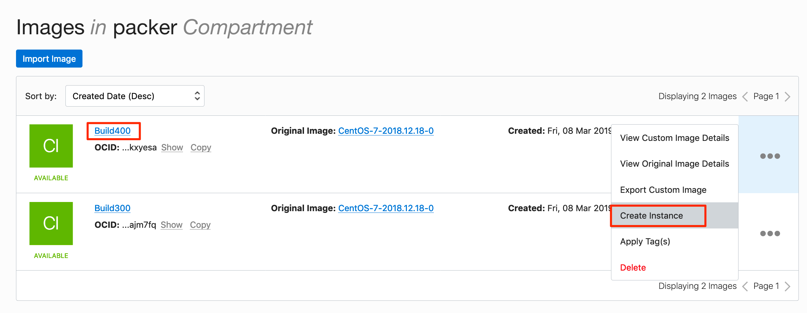
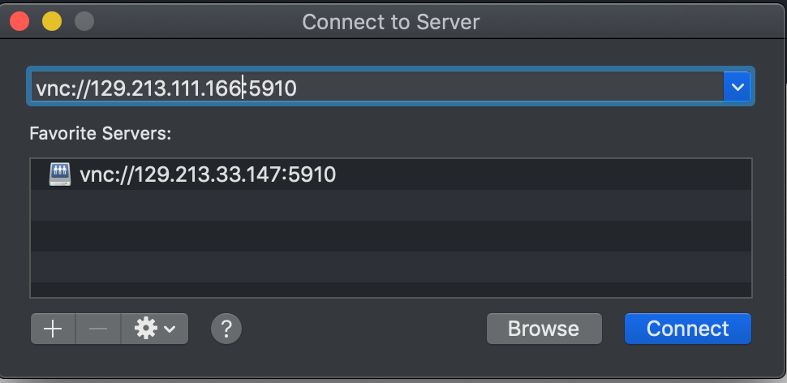
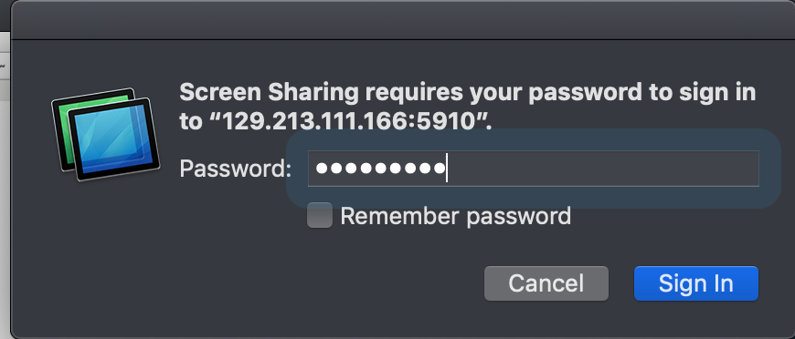

# Packer Workshop - Using Packer:  Doing more 



## Introduction

In this lab we grow our use of packer, install some packages, upload a configuration file and move it.  It is only incrementatally more than our previous lab, but introduces some simple concepts.

**NOTE:** `If you are pressed for time, feel free to look at the varBuild400.json, if you understand the logic, you can jump to Lab 500 as the builds are cummulative and all the Lab300 "pieces" are in 400, all 400 in 500, etc.` 

***To log issues***, click here to go to the [ oracle github](https://github.com/oracle/learning-library/issues/new) repository issue submission form. We look forward to your questions and suggestions for improvement.

## Objectives

- Create an image with software installed
- Learn to upload configuration file from a local machine packer target

## Required Artifacts

- Oracle Cloud Account - (configured in Lab100)
- Your Client Image (from lab 200) or packer & git installed locally on your laptop.
- Your git repository with "tenancyName".json and key file committed.

### **STEP 1**: Inspect varBuild400.json


We are doing the minimum to get the point across, while being respectful of your time.  When installing software, the download the installation process can be a bit much for a classroom setting.  Let's look at the 3 main pieces of the provisioners section:

```
more varBuild400.json 
```
- In your ssh session, you should already be in the packer_scripts directory of the cloned repository


 

above we are simply writing a label (.ImageID) to our image while will allow us to verify that an image we see is associated with a particular build - "varBuild400".  We also are using yum to install the tools you see (git, tigervnc, docker, etc.) in the same manner you would at the command-line as opc (a non-root, but sudo enabled OS user)

- Next, we will upload a file that will disable Security Enhanced (SELinux). This would obviously not be appropriate in all environments, but since we're building a Developer Client Desktop, we need to facilitate their 
productivity.

    

We can see that the files source is selinux_config from our "packer_scripts/SharedCentOS/ directory.  By breaking files into subdirectories, it seems easier to share and re-use configuration pieces as you start building multiple images.

- Last, we will move the uploaded file, /tmp/selinux_config our packer target, to the /etc/selinux/config.  

    


### **STEP 2**: Run Packer validate

- Run packer validate to make sure our file is valid
```
packer validate -var-file=<yourTenantName>.json  varBuild400.json
```

  

### **STEP 3**: Run Packer Build

This is where it starts to get good, you've got the setup all done and can now build.

Build with the validated packerfile, packer build -var-file=varfilename packerfile 

```
packer build -var-file=<yourTenant>.json  varBuild400.json
```
  

You will also see the file upload process take place.

  
 
### **STEP 4**: Launch an Instance of your Custom Image

- Navigate to back to your browser's OCI Console to see your custom image.

- Using the elisipse to the right of the image creation time, select "Create Instance" 
 

- Select a name for the image and place it in Availability Domain 2 
  

- Paste or choose your public key file, perhaps choosing it if you pasted it last time.

  

- Double check the compartment, VCN and subnet  

  

- Select Create

  

You will see in the "Provisioning", state for a couple of mins as we create the boot volume and instantiate the image.  

- Note the public IP address of your instance, you will connect to this in the next step.

  

### **STEP 5**: Connect to Custom Instance

- Using the IP address, ssh to your image in a terminal window (Mac/Linux) or with Putty(Windows)
```
ssh -i packerkey opc@129.213.100.199
```
- accept the addition of your machine to the instance's "known_hosts" by typing "yes"


- Start by checking the ImageID we created to track versions.  We should see varBuild400 :

```
more .ImageID
```


Good, so let's review some of our handywork

```
git status
docker version
```


We can see that docker is NOT enabled (our build file didn't enable it).  Let's see what it takes to enable in this image and we'll make certain to add that in the next build file for Lab 500

Since Docker is a service that can best be started by the operating system, we want to add that to the system's startup.  Since this is CentOS 7 (vs versions <6 with used init.d), it makes use of systemd controled by "systemctl" commands.

```
sudo systemctl enable docker
```


That will enable it NEXT time it runs, but doesnt start it.

```
sudo systemctl start docker
sudo docker version
```


We can see that docker is starting normally, so our enabled service should work in the completed image.

**You are ready to proceed to [Lab 500](Lab500.md)**
