# Packer Workshop - Using Packer:  Full Docker Developer Image Build


## Introduction

In this lab you build on the concepts of the previous labs, but will add commentary and discussion around more advanced topics.  
 
## Objectives

- Create an image with a desktop (gnome) and software installed (git, docker)
- Learn considerations for ordering of services and dependencies

## Required Artifacts

- Oracle Cloud Account - (configured in Lab100)
- Your Client Image (from lab 200) or packer & git installed locally on your laptop.
- Your git repository with _variables_.json and key file committed.

### **STEP 1**: Inspect the Packer build template: varBuild400.json

In the file varBuild400.json, you will see the components of an example real-world installation:

- In the terminal window, examine varBuild400.json by typing:

```
more varBuild400.json 
```
You will notice there are more commands here:

  - Setting of Firewall rule for port 5910
  - Copy Service file for VNC on port 5910 to host
  - Copy Script to change the password for set for VNCServer to host

  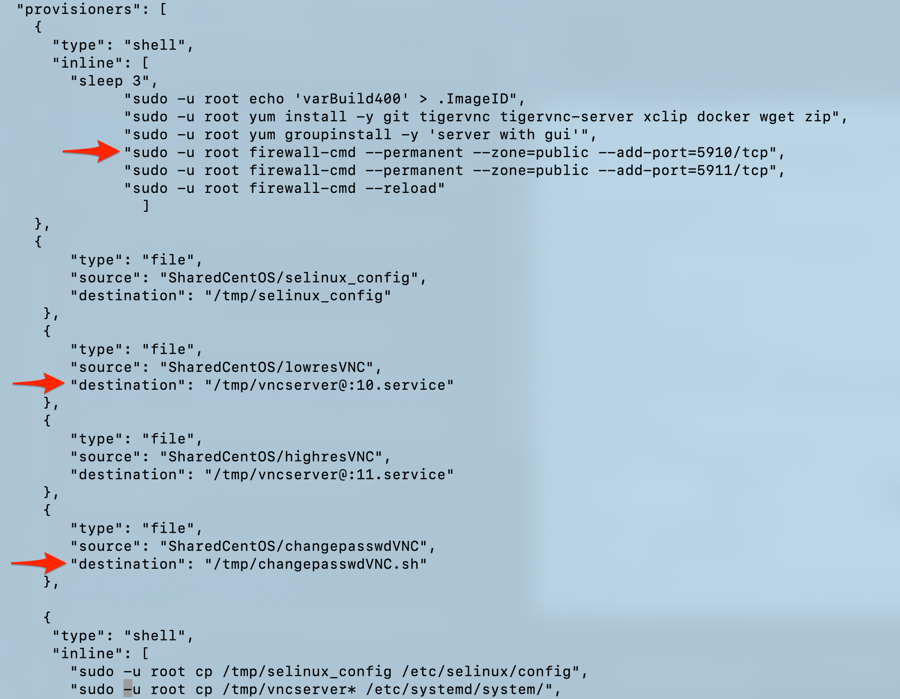

- Later in the same build script, you see the use of the files moved above:

  - Enabling the Service VNCServer on port 5910 
  - Enable execute permission on Script to change the password for set for VNCServer to host

  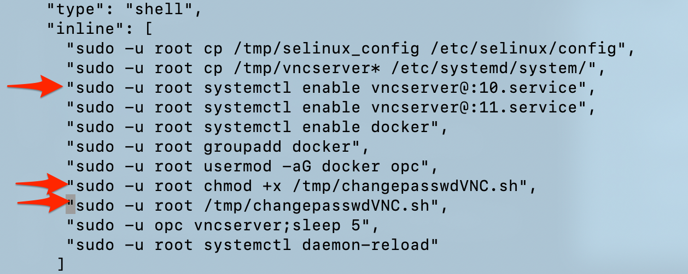

### **STEP 2**: Validate the Packer build template 

- Run packer validate to make sure your file is valid, again using your _Variables.json_ file

```
packer validate -var-file=_Variables.json_  varBuild400.json
```
  

### **STEP 3**: Run Packer Build

Using your variables file, run a packer build in the terminal window:

```
packer build -var-file=_Variables.json_  varBuild400.json
```

- You can see the build process start running:

   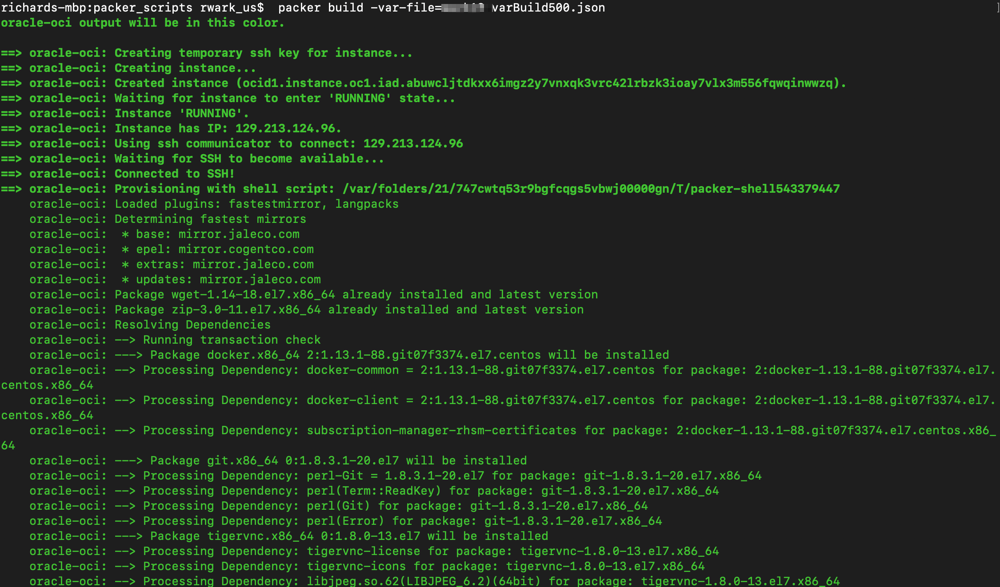

- You will also see the file upload process take place.
  
   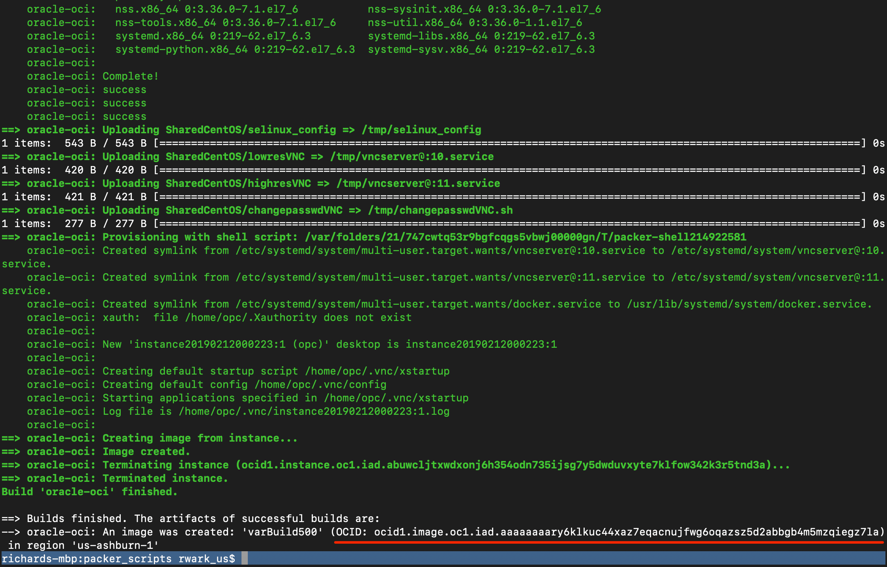
 
### **STEP 4**: Launch an Instance of your Custom Image

- Navigate to back to your browser's OCI Console to see your custom image - Lab400.

- Using the elisipse to the right of the image creation time, **select** "Create Instance"

  

- **Select** a name for the image (Lab400) and place it in  Availability Domain 3

  

- **Paste** or choose your public key file.

  

- Double check the compartment, VCN and subnet  

  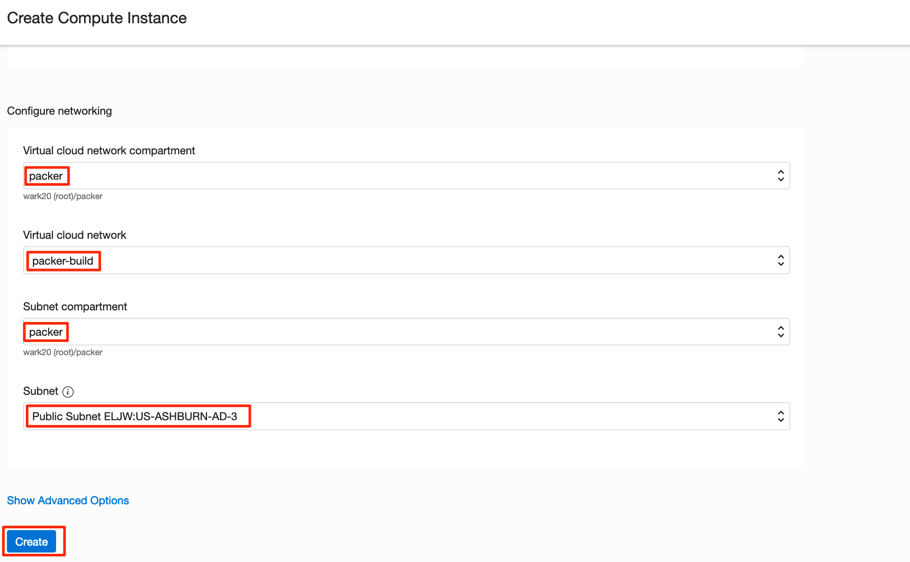

- Select **Create**
  
You will see in the "Provisioning", state for a couple of mins as you create the boot volume and instantiate the image.  

- Note the public IP address of your instance, you will connect to this in the next step.

  

### **STEP 5**: Connect to Custom Instance

- Using the IP address, you could connect via ssh with your private key as you did in Lab 300, but since you installed VNCServer, Connect using VNC to the server running on port 5910.  While you can use the finder built-in (Mac), you are better using a VNC Client which allows cut-and-paste (the built-in doesn't) like Real VNC Viewer.  Real VNC Viewer is also a good choice for Windows users.

  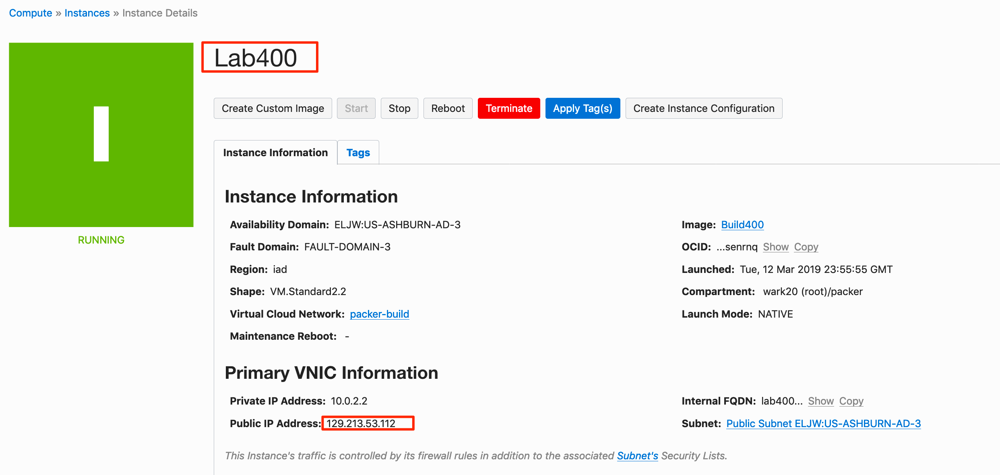

- You will see the VNC Login Window, enter the VNC password you configured in Lab 200:

  

- A warning message appears since your connection is not encrypted.

  

- **Click** next to complete the welcome dialog

  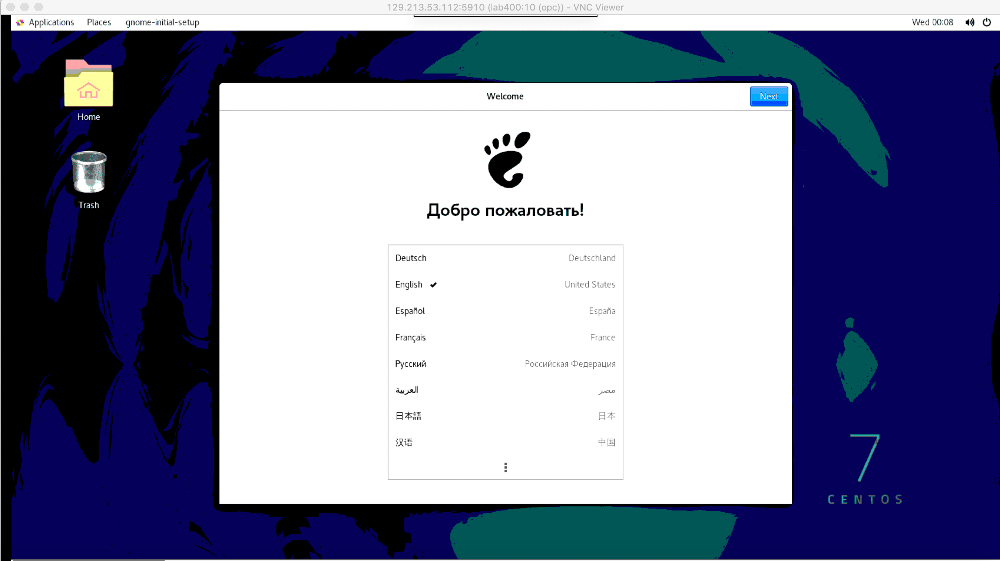

  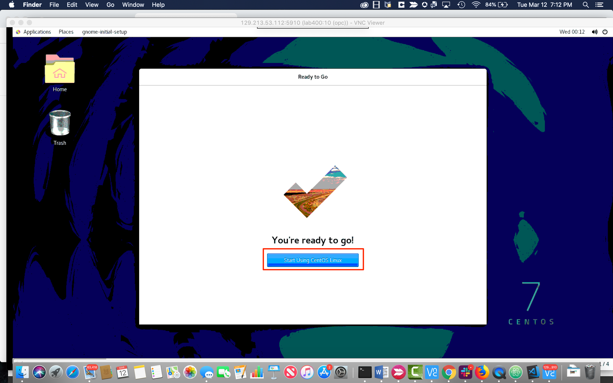

- Again, you will start by checking the ImageID you created to track versions.  You should see "varBuild400":

  - **Launch** a terminal window:

  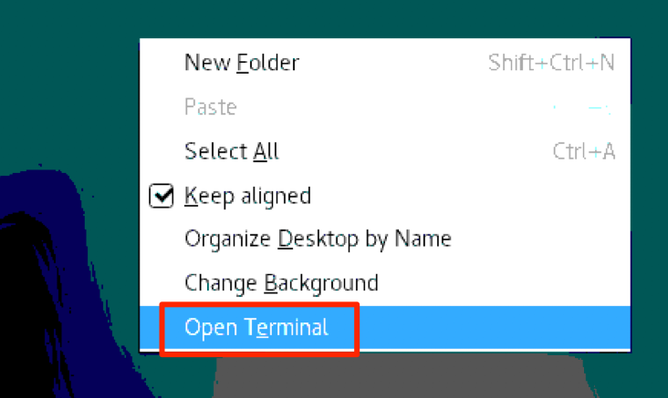


```
more .ImageID
```

  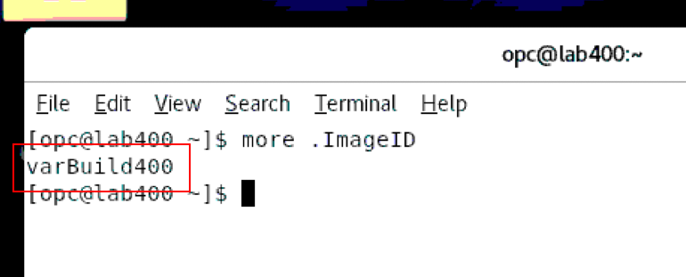

  - **Launch** Terminal

  

You can see that VNCServwer is starting normally, so our enabled service is work in the completed image.

### **STEP 5**: Remove API key from your user

To make certain that your environment is secure, you can easily remove the API key you added to your user by **navigating** to Identity --> Users

- Select your user and then the ellipses on the right, and **Delete**  

### **STEP 6**: (Optional) Remove instances

- If you'd like, navigate to the Compute-->Instances Screen and remove any images running in the packer compartment you no longer need. 

  

You can decide to keep or remove the Instances and custom images created (packer-builder, lab300 & lab400) as you see fit.

The are WAY more topics than can be covered in a single lab. Here are some pointers to resources than can help you learn more.

 Hints:

  - Always protect your keys and OCIDs as they can be used, if stolen by bad-actors, to access resources or attempt to steal data.

  - create variables.json for specific environments (tenants, compartments or subnets) files which can be shared between & across build projects.
  
  - Start small and build up in complexity.

  - Use a JSON lint-like format checker. like: https://jsonlint.com/ or an IDE editor plug-in.

  - Consider services startup and timing. VNC, for instance, won't run as a service until it has been started once in an interactive shell/session.  This is why you see:

   "sudo -u opc vncserver;sleep 5"

   in the startup for varBuild400.  This allows the Xauthority file to be created as the user OPC that is then used by the Services: (vncserver@:10.service & vncserver@:11.service).

   - Software that cannot be downloaded by a process (perhaps it requires a login, is behind a firewall or has a  check box to agree to a EULA), can be installed by copying the files downloaded interactively by a human (capable of accepting the License) and then copying the downloaded install files (often an rpm or zip) to an object storage bucket.
  


  Using a PAR (pre-authorized request), simply download using "wget" and the PAR's URL, unzip and install as normal.


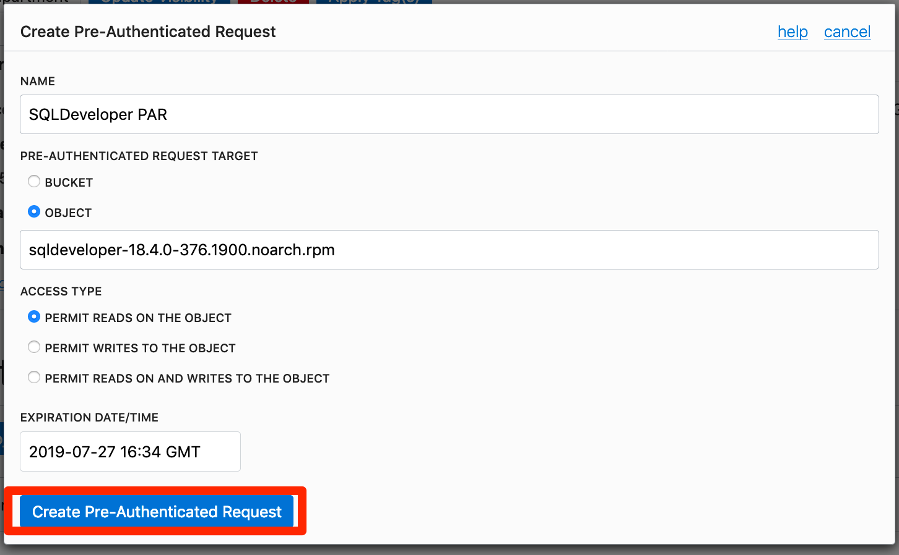

**Copy** the PAR URL with the "copy" link:


Your PAR request URL should have the format:
https://objectstorage.us-ashburn-1.oraclecloud.com/p/gQ-Bb73gPBCGbsA8BwS3Q_DQfXInQ2WN9NA7DcodlQs/n/wark20/b/Software/o/sqldeveloper-18.4.0-376.1900.noarch.rpm


**You are done with the Workshop**