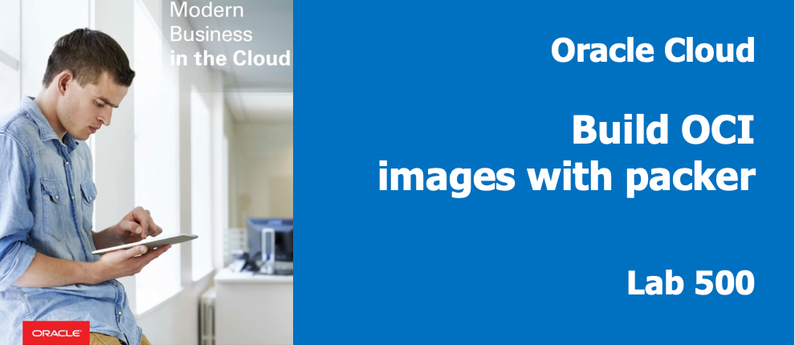
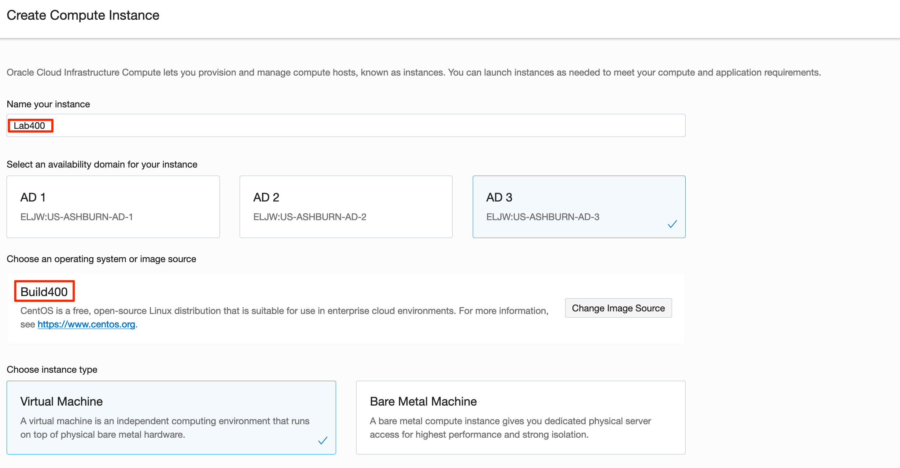
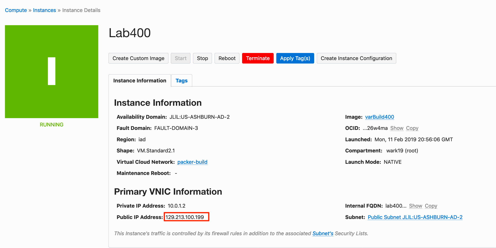
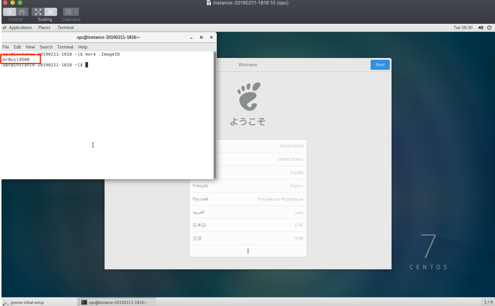

# Packer Workshop - Using Packer:  Full Docker Developer Image 



## Introduction

In this lab we grow our use of packer, install some packages, upload a configuration file and move it.  It is only incrementatally more than our previous lab, but introduces some simple concepts.
 

***To log issues***, click here to go to the [ oracle github](https://github.com/oracle/learning-library/issues/new) repository issue submission form. We look forward to your questions and suggestions for improvement.

## Objectives

- Create an image with a desktop (gnome) and software installed (git, docker)
- Learn considerations for ordering of services and dependencies

## Required Artifacts

- Oracle Cloud Account - (configured in Lab100)
- Your Client Image (from lab 200) or packer & git installed locally on your laptop.
- Your git repository with "tenancyName".json and key file committed.

### **STEP 1**: Inspect varBuild500.json

We are doing the some real-world installation:

```
more varBuild500.json 
```
### **STEP 2**: Run Packer validate

- Run packer validate to make sure our file is valid
```
packer validate -var-file=<yourTenantName>.json  varBuild500.json
```

  

### **STEP 3**: Run Packer Build


```
packer build -var-file=<yourTenant>.json  varBuild500.json
```
  

You will also see the file upload process take place.

  
 
### **STEP 4**: Launch an Instance of your Custom Image

- Navigate to back to your browser's OCI Console to see your custom image.

- Using the elisipse to the right of the image creation time, select "Create Instance" 
 

- Select a name for the image and place it in Availability Domain 2 
  

- Paste or choose your public key file, perhaps choosing it if you pasted it last time.

  

- Double check the compartment, VCN and subnet  

  

- Select Create

  

You will see in the "Provisioning", state for a couple of mins as we create the boot volume and instantiate the image.  

- Note the public IP address of your instance, you will connect to this in the next step.

  

### **STEP 5**: Connect to Custom Instance

- Using the IP address, ssh to your image in a terminal window (Mac/Linux) or with Putty(Windows)
```
ssh -i packerkey opc@129.213.100.199
```
- accept the addition of your machine to the instance's "known_hosts" by typing "yes"


- Start my checking the ImageID we wrote to track versions.  We should see varBuild400 :

```
more .ImageID
```



Good, so let's review some of our handywork

```
git status
docker version
```


We can see that docker is NOT enabled (our build file didn't enable it).  Let's see what it takes to enable in this image and we'll make certain to add that in the next build file for Lab 500

Since Docker is a service that can best be started by the operating system, we want to add that to the system's startup.  Since this is CentOS 7 (vs versions <6 with used init.d), it makes use of systemd controled by "systemctl" commands.

```
sudo systemctl enable docker
```


That will enable it NEXT time it runs, but doesnt start it.

```
sudo systemctl start docker
sudo docker version
```


We can see that docker is starting normally, so our enabled service should work in the completed image.

**You are ready to proceed to [Lab 500](Lab500.md)**