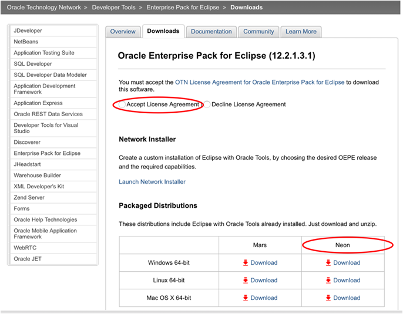
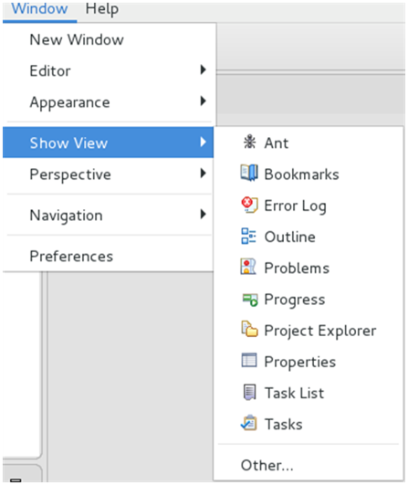

<center></center> 
> Updated: April 19, 2017

## Introduction

In this supplemental guide we will cover extra features that can be applied to this workshop.

Please direct comments to: Cam Crockett (cam.crockett@oracle.com)

## Objectives

- Connect Eclipse to Developer Cloud Service
- Build Automation for adding Bindings in Applciaiton Cotnainer Cloud Service
- Add Build automation for Container Cloud Service

## Required Artifacts

- Eclipse with Oracle's OEPE plugin: [Download Here](google.ca)

# Supplimental Guide

## Connect Eclipse to Developer Cloud Serivce
Connecting via a local IDE to Oracle Developer Cloud Service will be covered in a supplimenal guide

### Verify your version of the Java JDK

Eclipse requires that you have the **JDK 8** installed.

#### JDK Verification on a MAC

**Note**: Eclipse requires that you have the a Java JDK 8 installed. Even if you have a JRE version 8, you still need to verify that you have a JDK 8 installed. 

- Open Terminal window and execute the following command: 

```
ls /Library/java/JavaVirtualMachines/
```

- If you do not have a JDK 1.8 folder, you will need to download the [JDK 8](http://www.oracle.com/technetwork/java/javase/downloads/jdk8-downloads-2133151.html) from the Oracle Technology Network website, and install.

#### JDK Verification on Windows

- On Windows, open a **cmd** window and enter `java -version` 

```
C:\Users\usr>java -version
java version "1.8.0_121"
Java(TM) SE Runtime Environment (build 1.8.0_121-b13)
Java HotSpot(TM) Client VM (build 25.121-b13, mixed mode, sharing)
```

- If JDK/**Java version 1.8** is not installed,  you will need to download a [JDK](http://www.oracle.com/technetwork/java/javase/downloads/jdk8-downloads-2133151.html) from the Oracle Technology Network website, and install.

### Download and Install Eclipse

#### Download Eclipse

***Note***: If you already have Eclipse installed, you will still want to install and use the version documented below, for this version of Eclipse contains the **Oracle Enterprise Pack for Eclipse**, which will be used during the workshop.

- Got to the [Eclipse](http://www.oracle.com/technetwork/developer-tools/eclipse/downloads/index.html) installation website

- Accept the **licensing agreement**, and then select the **Neon** version of Eclipse required for your operating system.

    

- Once you’ve downloaded eclipse, extract the zip file and install.


#### Optionally Configure Proxies (if behind a firewall)

If you are running Eclipse behind a firewall and need to configure the proxy setting, there are several updates to be made. First, you need to ensure that Eclipse’s proxy is set, next you need to update the maven proxy setting, and then finally, you need to ensure that the Oracle Plugin will work with your proxy settings.

- To set configure Eclipse’s proxy, open Eclipse and navigate to the Properties menu. Depending on the operating system, this drop down is found either from the **Eclipse > Preferences, or Window > Preferences**

    

- From the preferences panel, enter “**proxy**” into the search window, and click on **Network Connections**. Select **Native** for the Active Provider. This setting works well, but it requires that you have the proxy setting configured correctly on the system running Eclipse – e.g. Windows, MAC OS or Linux. Selecting Manual should also work, but some of the plugins require the underlying operating system’s proxy to be configured.

    

- To test that your connection works, select the menu option **Window > Show View > Other**

    

- Type “**web**” in the search field, select **Internal Web Browser** and click on **OK**

    

- Enter a **URL** into the browser and press **enter** to test your proxy settings.

    

#### Optionally Update the Eclipse / Maven proxy (if behind a firewall)

- From the **Eclipse > Preference or Window > Preferences** panel, enter **Maven** into the search box. Click on the Maven User Settings. Make note of the directory where the settings.xml file is to be located. In the example below, the Maven User Settings are to be located in the **/home/oracle/.m2** directory

    

- Close Eclipse    

- If the directory does not exist where the settings.xml file is to be located, **create the directory**. In this example, we will create the **.m2** directory. 

- Also, create the **settings.xml** file, if it does not exist. Add the following to the settings.xml file (NOTE: you will need to use your correct **Host, Port, nonProxyHosts, username and Password settings**):

```
<?xml version="1.0" encoding="UTF-8"?>
<settings xmlns="http://maven.apache.org/SETTINGS/1.1.0" xmlns:xsi="http://www.w3.org/2001/XMLSchema-instance"
          xsi:schemaLocation="http://maven.apache.org/SETTINGS/1.1.0 http://maven.apache.org/xsd/settings-1.1.0.xsd">
  <proxies>
    <proxy>
      <active>true</active>
      <protocol>http</protocol>
      <username>proxyuser</username>
      <password>proxypass</password>
      <host>www-proxy.us.oracle.com</host>
      <port>80</port>
      <nonProxyHosts>local.net|some.host.com</nonProxyHosts>
    </proxy>
    <proxy>
      <active>true</active>
      <protocol>https</protocol>
      <username>proxyuser</username>
      <password>proxypass</password>
      <host>www-proxy.us.oracle.com</host>
      <port>80</port>
      <nonProxyHosts>local.net|some.host.com</nonProxyHosts>
    </proxy>
    </proxies>
</settings>
```

- Reload Eclipse to use the new maven settings

### Connect to your cloud via Oracle Cloud Plugin

- Open Eclipse OEPE
- Open the Oracle Cloud view
- Add a new connection
- Enter your cloud service details and credentials
- Traverse the Developer serivces

### Import Project from Developer Cloud Service

- Open Developer Cloud Service
- Open Code
- Right click on the git repository your want to edit and select Activate
- Right click on activated code and import project

> Note: Only the MySQLMicroservice is an Eclipse project, the rest should be loaded as general projects

## Create an Automated build for Adding serivce bindings
*coming soon*

## Create an Automated docker build for your CurrencyMicroservice from Developer CloudService
*coming soon*

## Automate MySQL Provisioning
*coming soon*

## Automate MySQL Schema Migrations using FlywayDB
*coming soon*

## Add in APM Tooling with Oracle Management Cloud
*coming soon*
