# Provision Kubernetes Using the OCI Console

  
Updated: 01/14/2019

## Introduction

Oracle Cloud Infrastructure Container Engine for Kubernetes is a fully-managed, scalable, and highly available service that you can use to deploy your containerized applications to the cloud. Use Container Engine for Kubernetes (sometimes abbreviated to just OKE) when your development team wants to reliably build, deploy, and manage cloud-native applications. You specify the compute resources that your applications require, and Container Engine for Kubernetes provisions them on Oracle Cloud Infrastructure in an existing OCI tenancy.

**_To log issues_**, click here to go to the [GitHub oracle](https://github.com/oracle/learning-library/issues/new) repository issue submission form.

## Objectives

**Automate Deployment to Kubernetes**

- Create and Deploy to a Kubernetes Cluster
  - Set Up Oracle Cloud infrastructure
  - Provision Kubernetes Using the OCI Console

## Required Artifacts

- The following lab requires:
  - an Oracle Cloud Trial Account

# Provision Kubernetes Using the OCI Console

## Set Up Oracle Cloud infrastructure

### **STEP 1**: Log in to your OCI dashboard

- From any browser go to:

    [https://cloud.oracle.com/en_US/sign-in](https://cloud.oracle.com/en_US/sign-in)

- Enter your **Cloud Account Name** in the input field and click the **My Services** button. If you have a trial account, this can be found in your welcome email. Otherwise, this will be supplied by your workshop instructor.

  

- Enter your **Username** and **Password** in the input fields and click **Sign In**. If you have a trial account, these can be found in your welcome email. Otherwise, these will be supplied by your workshop instructor.

  

- You are presented with the Oracle Cloud Infrastructure (OCI) Dashboard/Portal

  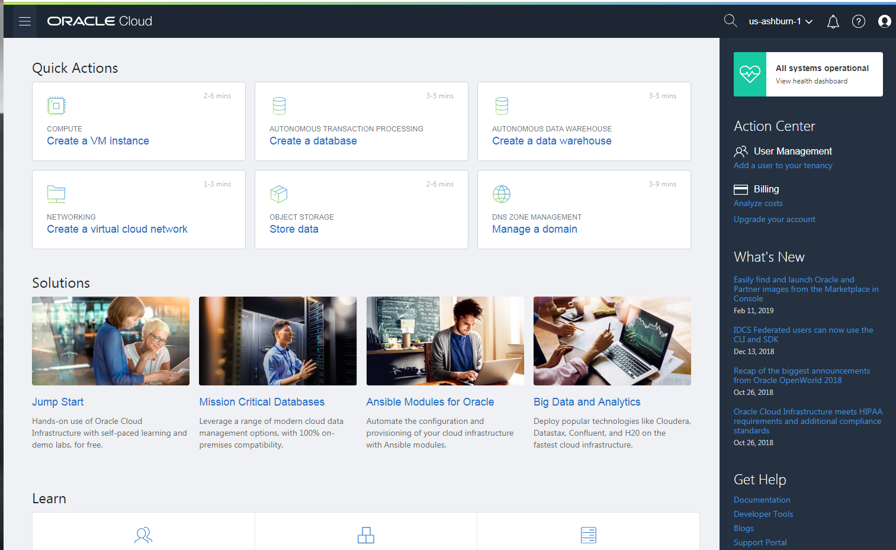

### **STEP 2**: Create a Compartment for your Kubernetes nodes

Compartments are used to isolate resources within your OCI tenant. Role-based access policies can be applied to manage access to compute instances and other resources within a Compartment.

- Click the **hamburger icon** in the upper left corner to open the navigation menu. Under the **Identity** section of the menu, click **Compartments**

  

  - If you have a **Demo** compartment already, _**SKIP THIS STEP**_. Otherwise, Click **Create Compartment**

    

  - In the **Name** field, enter `Demo`. Enter a description of your choice. In the **Parent Compartment** field, ensure that the `root` compartment is selected (it will have the same name as your Oracle Cloud Account). Click **Create Compartment**.

    

### **STEP 3**: Add a Policy Statement for OKE

  - Before the Oracle managed Kubernetes service can create compute instances in your OCI tenancy, we must explicitly give it permission to do so using a policy statement. From the OCI Console navigation menu, choose **Identity->Policies**.

    

  - In the Compartment drop down menu on the left side, choose the **root compartment**. It will have the same name as your OCI tenancy (Cloud Account Name).

    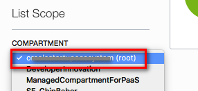

  - Click **PSM-root-policy**

    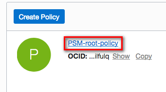

  - Click the **Add Policy Statement** button

    

  - In the Statement box, enter: `allow service OKE to manage all-resources in tenancy` and click **Add Statement**

    

### **STEP 4**: Provision Kubernetes Using the OCI Console

  - Now we're ready to create our Kubernetes cluster. From the OCI Console navigation menu, select **Developer Services->Container Clusters (OKE)**.

    

  - In the Compartments drop down, select the **Demo** compartment.

    

  - Click **Create Cluster**

    

  - We don't need to make any changes to the default values on this form, but let's look at what will be created when we submit it.

    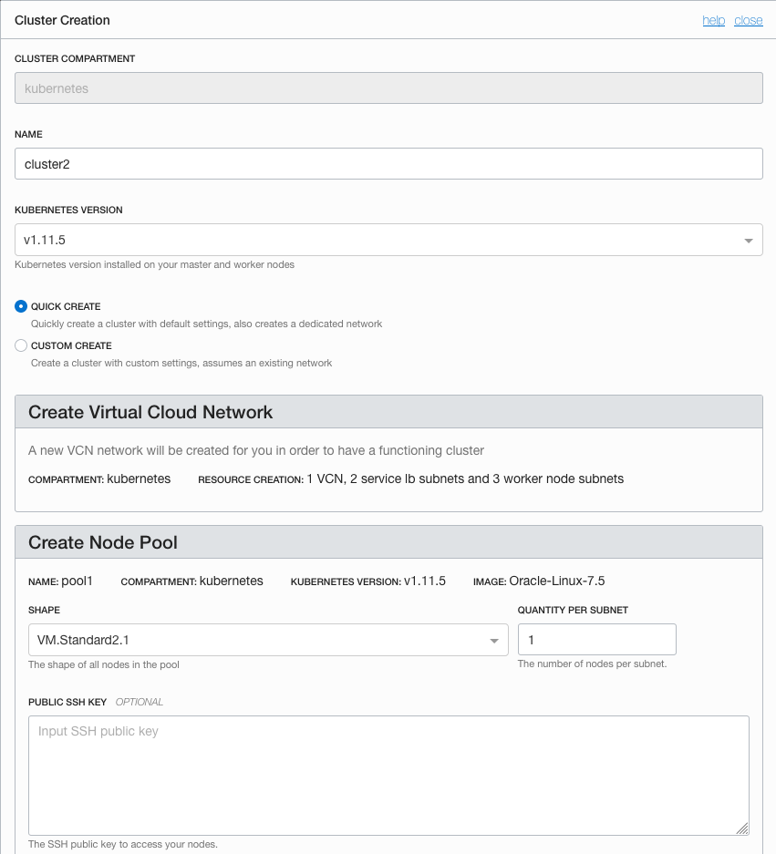
    

    - Starting at the top you'll notice that the cluster will be created in our **Demo** compartment.
    - We can customize the name of this cluster if we want
    - Multiple versions of Kubernetes are available, with the newest version selected by default
    - The default cluster creation mode will automatically create a Virtual Cloud Network for our cluster, including 2 load balancer subnets and 3 subnets for our worker VMs
    - We can customize the size and quantity of worker VMs in the node pool; by default we will get 3x 1 OCPU VMs, one in each Availability Domain.
    - We can also add more node pools to the cluster after creation.
    - The dashboard and Tiller will be installed by default.

  - Click **Create**. You will be brought to the cluster detail page. Your cluster will take a while to provision, so let's use this time to create a cloud VM that we can use to manage our cluster using the command line.

### **STEP 5**: Launch a Cloud Compute Instance for Cluster Management

  - Before we can launch a compute instance, we need two things: a Virtual Cloud Network to connect it to, and an SSH key pair to use for authentication. We could create a new VCN, but since the cluster wizard is already going to create one, we will just make use of that. So let's work on creating an SSH key pair for our instance. The method of generating an SSH key pair will depend on your operating system.

    **NOTE**: There are several files that will be downloaded or created on your local machine during this workshop. We recommend creating a directory to store them in for ease of locating and cleaning up. In this step, you will create a directory inside your home/user directory called `container-workshop`. You are free to change the location and name of this directory, but the lab guide will assume it is located at `~/container-workshop/`. **You will need to modify the given terminal commands throughout this lab** if you change the location or name of the directory.

    **Mac/Linux**:

      - Open a terminal or shell window and run the following commands:

        ```bash
        cd ~
        mkdir container-workshop && cd container-workshop && mkdir ssh-keys && cd ssh-keys
        ssh-keygen -f ./ssh-key -N ""
        ```
        

    **Windows**:

      - If you don't already have them, download PuTTY and PuTTYgen from [http://www.putty.org/](http://www.putty.org/)

        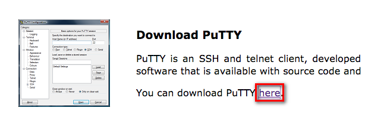
        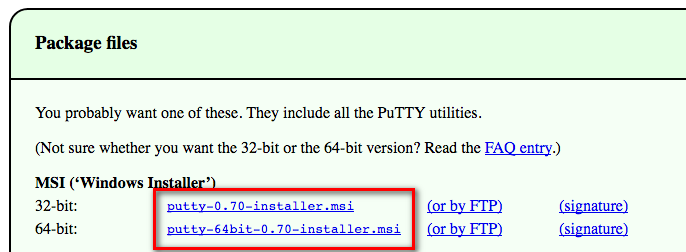

      - Locate and run **puttygen.exe** in the PuTTY install folder.

      - Ensure that **RSA** or **SSH-2 RSA** is selected in the `Type of key to generate` field (which one you see is dependent on your version of PuTTY)

      

      

      - Click **Generate**

        

      - **Move your mouse around the blank area** as instructed to genereate random data.

        

      - Click **Save private key** and then click **Yes** to continue saving without a passphrase.

        

        - In the save dialog box:
          - Navigate to your home directory/user folder (usually **C:\Users\\<username\>**).
          - Click **New Folder** and name the folder `container-workshop`.

            
          - **Double-click** the `container-workshop` folder to enter it.
          - Click **New Folder** again. This time name the folder `ssh-keys`.

            
          - **Double click** on `ssh-keys` to enter that folder.
          - Finally, name the key **ssh-key.ppk** and click **Save**.

            

      - Select and copy the **public key** using Control-C, which is displayed in the `Public key for pasting into OpenSSH authorized_keys file` region. Paste it into a **new text file** using **notepad** and save the file in the `C:\Users\username\container-workshop\ssh-keys` folder.

        **NOTE**: Do not use the Save public key button, as it uses an incompatible key format.

        
        

      - When you SSH to your instance in a later step, use PuTTY to connect instead of a command-line ssh session.

  - With the keys generated, we are ready to launch an instance. From the OCI Console navigation menu, select **Compute->Instances**. Ensure you are still working in the **Demo** compartment using the drop down list in the left pane.

    

  - Click the **Create Instance** button.

    

  - Leave the Availability Domain, Image Source, and Instance Type settings at the defaults.

    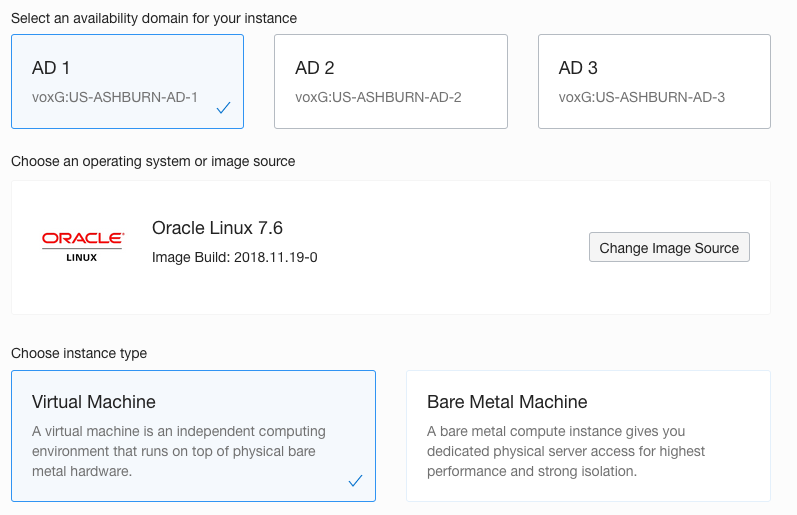

  - In the Instance Shape field, click **Change Shape**. We will use a 2-OCPU VM, since we are using all of our available 1-OCPU VMs for Kubernetes worker nodes.

    

  - In the Browse All Shapes pane, check the box next to **VM.Standard2.2** and click **Select Shape**.

    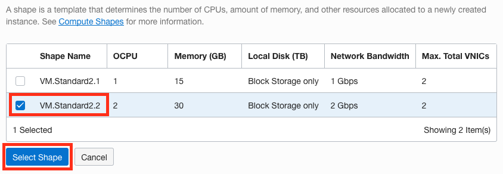

  - In the Add SSH Key area, click **Choose Files** and select the **ssh public key** you generated at the beginning of this step (e.g. `~/container-workshop/ssh-keys/ssh-key.pub`).

    

  - Make the following selections in the **Configure Networking** form:
    - In the VCN Compartment field, ensure **Demo** is selected.
    - In the VCN field, ensure **oke-vcn-quick-cluster1** is selected (if you changed the name of your cluster, the `cluster1` portion of these name will differ).
    - In the Subnet Compartment field, ensure **Demo** is selected.
    - In the Subnet field, select the subnet that begins with **oke-subnet-quick-cluster1**. Take care __not__ to select the subnet that begins with oke-svclbsubnet, as this one has a wide open security list (it is meant only for load balancers).  

    

  - Click **Create**

    

  - You will be brought to the instance details page. Wait for your instance to transition from the Provisioning state to the **Running** state before proceeding.

    

### **STEP 6**: Prepare OCI CLI for Cluster Access and Download kubeconfig

  - Your instance should now be in the **Running** state. Let's SSH into the instance and install the command line utility that will let us interact with our cluster. Still on the instance details page, find the **Public IP Address** and copy it to the clipboard.
    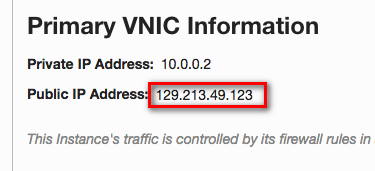

  - Open an SSH connection to the instance using the following OS-specific method:

    **Mac/Linux**
      - Open a terminal or shell window
      - Run the following commands, pasting in the **Public IP Address** from your clipboard in place of <Public IP Address>

        ```
        cd ~/container-workshop/ssh-keys/
        ssh -i ssh-key opc@<Public IP Address>
        ```
      - Type **yes** and **press enter** when asked if you want to continue connecting

        

    **Windows**
      - Open PuTTY
      - In the Category pane, select Session and enter the following:
        - Host Name (or IP address): **opc@[Public IP Address you copied to the clipboard]**
        - Connection type: SSH
        - Port: 22
      - In the Category pane, expand Connection, expand SSH, and then click **Auth**. Click **Browse** and select your private key (for example, **C:\Users\\<username\>\container-workshop\ssh-keys\ssh-key.ppk**).
      - Click **Open** to start the session.

  - From _inside the SSH session_, run the following command to install the OCI CLI, which will allow you to interact with your cluster:

    `bash -c "$(curl -L https://raw.githubusercontent.com/oracle/oci-cli/master/scripts/install/install.sh)"`

    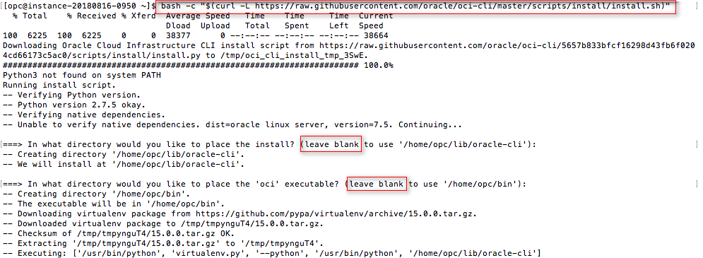

  - For each of the prompts, accept the default by **pressing enter**

    

  - When the install is finished, configure the OCI CLI by running `oci setup config` in your SSH session. In a web browser on your local machine, open your **User Settings** page: use the navigation menu to go to Identity->Users and select **View User Details** from the three-dots menu for your user. You will need some details from this page to complete the setup.

    

  - After initiating `oci setup config`, respond to the prompts as follows:
    - Enter a location for your config: **accept default by pressing enter**
    - Enter a user OCID: copy your OCID by clicking **Copy** in the **User Information** box in OCI Console
    - Enter a tenancy OCID: copy the **Tenancy OCID** from the tenancy details page (found under the administration section of the OCI navigation menu)

      

      

    - Enter a region: type the **region shown in the upper right** corner of OCI Console
    - Do you want to generate a new RSA key pair?: **Y**
    - Enter a directory for your keys to be created: **accept default by pressing enter**
    - Enter a name for your key: **accept default by pressing enter**
    - Enter a passphrase for your private key: **accept default by pressing enter**

    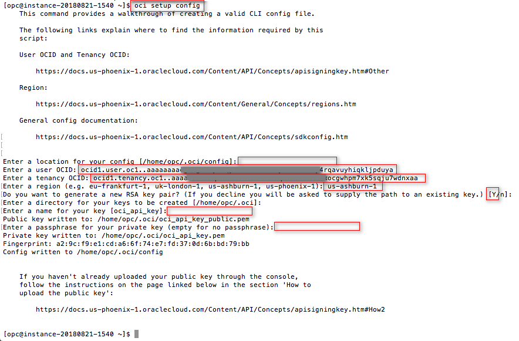

  - You've just generated an RSA key pair that we will use to authenticate you to the OCI API. Click **back** to get back to the User Settings page in your browser, click **Add Public Key**

    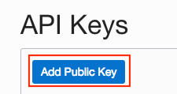

  - We need to copy and paste the public key into this box. In your _SSH session_, run the following command to output the public key:

    `cat /home/opc/.oci/oci_api_key_public.pem`

    

  - Select the entire key, beginning with: `-----BEGIN PUBLIC KEY-----` and ending with `-----END PUBLIC KEY-----`. **Copy it** and **paste it** into the Public Key text area in the OCI Console Add Public Key dialog. Then click **Add**.

    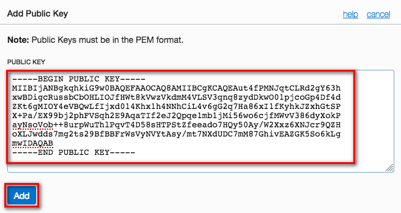

  - You are now ready to download the `kubeconfig` file using the OCI CLI that you just installed. From the OCI Console navigation menu, select **Developer Services->Container Clusters (OKE)**, then click the name of your cluster, **cluster1**

    

    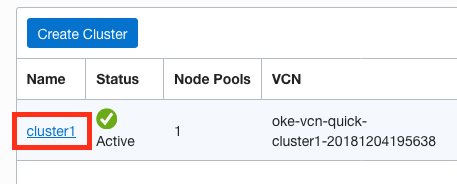

  - Click **Access Kubeconfig**.

    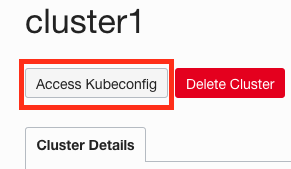

  - Two commands are displayed in the dialog box. **Copy and paste** each command (one at a time) into your _SSH session_ and run them. The first creates a directory to store the `kubeconfig` file, and the second invokes the OCI CLI to download and store the `kubeconfig` file on your client virtual machine. Then click **Close**.

    

    

    

    **NOTE**: Copy and paste the commands from the OCI Console window -- the second command below is personalized with your cluster OCID. They are listed here for reference only.

    >mkdir -p $HOME/.kube

    >oci ce cluster create-kubeconfig --cluster-id <your-kubernetes-cluster-ocid\> --file $HOME/.kube/config

  - Your `kubeconfig` file was downloaded from OCI and stored in ~/.kube/config. In your _SSH session_, **run** `cat ~/.kube/config` to output the contents of the file. **Copy** the contents and **paste** them into a new text file on your local machine. Name the file `kubeconfig` and **Save** the file to your **container-workshop directory** (e.g. `~/container-workshop/` or `C:\Users\<username>\container-workshop\`)

    **NOTE**: Save the `kubeconfig` file as a plain text file, not as a .docx, .rtf, .html, etc.

    

  - In order to interact with your cluster and view the dashboard, you will need to install the Kubernetes command line interface, `kubectl`. We will do that next.

### **STEP 7**: Install and Test kubectl on Your Local Machine

- The method you choose to install `kubectl` will depend on your operating system and any package managers that you may already use. The generic method of installation, downloading the binary file using `curl`, is given below (**run the appropriate command in a terminal or command prompt**). If you prefer to use a package manager such as apt-get, yum, homebrew, chocolatey, etc, please find the specific command in the [Kubernetes Documentation](https://kubernetes.io/docs/tasks/tools/install-kubectl/).


  **Windows**
    ```bash
    cd %USERPROFILE%\container-workshop
    curl -LO https://storage.googleapis.com/kubernetes-release/release/v1.11.2/bin/windows/amd64/kubectl.exe
    ```

  **Mac**
    ```bash
    cd ~/container-workshop
    curl -LO https://storage.googleapis.com/kubernetes-release/release/$(curl -s https://storage.googleapis.com/kubernetes-release/release/stable.txt)/bin/darwin/amd64/kubectl
    chmod +x ./kubectl
    ```

  **Linux**
    ```bash
    cd ~/container-workshop
    curl -LO https://storage.googleapis.com/kubernetes-release/release/$(curl -s https://storage.googleapis.com/kubernetes-release/release/stable.txt)/bin/linux/amd64/kubectl
    chmod +x ./kubectl
    ```

- In your terminal window or command prompt, run the following commands to verify that `kubectl` is able to communicate with your cluster. You should see `cluster-info` print out the URL of the Kubernetes Master node and `get nodes` print out the IP address and status of each of the worker nodes.

  **Windows**
    ```bash
    set KUBECONFIG=%USERPROFILE%\container-workshop\kubeconfig
    kubectl.exe cluster-info
    kubectl.exe get nodes
    ```

  **Mac/Linux**
    ```bash
    export KUBECONFIG=~/container-workshop/kubeconfig
    ./kubectl cluster-info
    ./kubectl get nodes
    ```

    

    

    **NOTE**: You should see in the `cluster-info` that the Kubernetes master has an `oraclecloud.com` URL. If it instead has a `localhost` URL, your `KUBECONFIG` environment variable may not be set correctly. Double check the environment variable against the path and filename of your `kubeconfig` file.

- Now that we have verified that `kubectl` is connected to our cluster, let's increase the default auto-logout time so that we don't have to keep re-authenticating during the workshop. Note that the default logout time of 15 minutes is set for security reasons. The `--token-ttl=43200"` argument in the following command is the only change that we are making to the dashboard.

  **NOTE**: The following commands are **optional**.

  **Windows**
  ```bash
  kubectl.exe patch deployment kubernetes-dashboard -n kube-system -p "{\"spec\": {\"template\": {\"spec\": {\"containers\": [{\"name\": \"kubernetes-dashboard\", \"args\": [\"--token-ttl=43200\", \"--auto-generate-certificates\"]}]}}}}"
  ```

  **Mac/Linux**
  ```bash
  ./kubectl patch deployment kubernetes-dashboard -n kube-system -p '{"spec": {"template": {"spec": {"containers": [{"name": "kubernetes-dashboard", "args": ["--token-ttl=43200", "--auto-generate-certificates"]}]}}}}'
  ```

  

- Now that we've increased the session timeout, we can use `kubectl` to start a proxy that will give us access to the Kubernetes Dashboard through a web browser at a localhost URL. Run the following command in the same terminal window:

  **Windows**
    ```bash
    kubectl.exe proxy
    ```

  **Mac/Linux**
    ```bash
    ./kubectl proxy
    ```

  

  **NOTE**: If you receive an error stating `bind: address already in use`, you may have another application running on port 8001. You can specify a different port for the proxy by passing the `--port=` parameter, for example `kubectl proxy --port=8002`. Note that you  will have to modify the URL for the dashboard in the next step to match this port.

- Leave the proxy server running and navigate to the [Kubernetes Dashboard by Right Clicking on this link](http://localhost:8001/api/v1/namespaces/kube-system/services/https:kubernetes-dashboard:/proxy/), and choosing **open in a new browser tab**.

- You are asked to authenticate to view the dashboard. Click **Choose kubeconfig file** and select your `kubeconfig` file from the folder `~/container-workshop/kubeconfig`. Click **Open**, then click **Sign In**.

  

- After authenticating, you are presented with the Kubernetes dashboard.

  

- Great! We've got Kubernetes installed and accessible.

**You are now ready to move to the next lab: [Lab 300](LabGuide300.md)**
