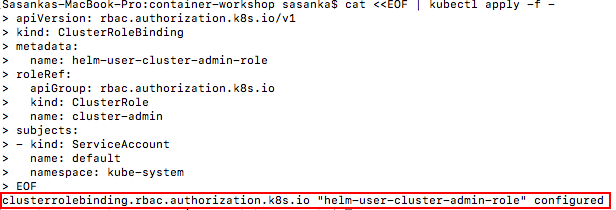
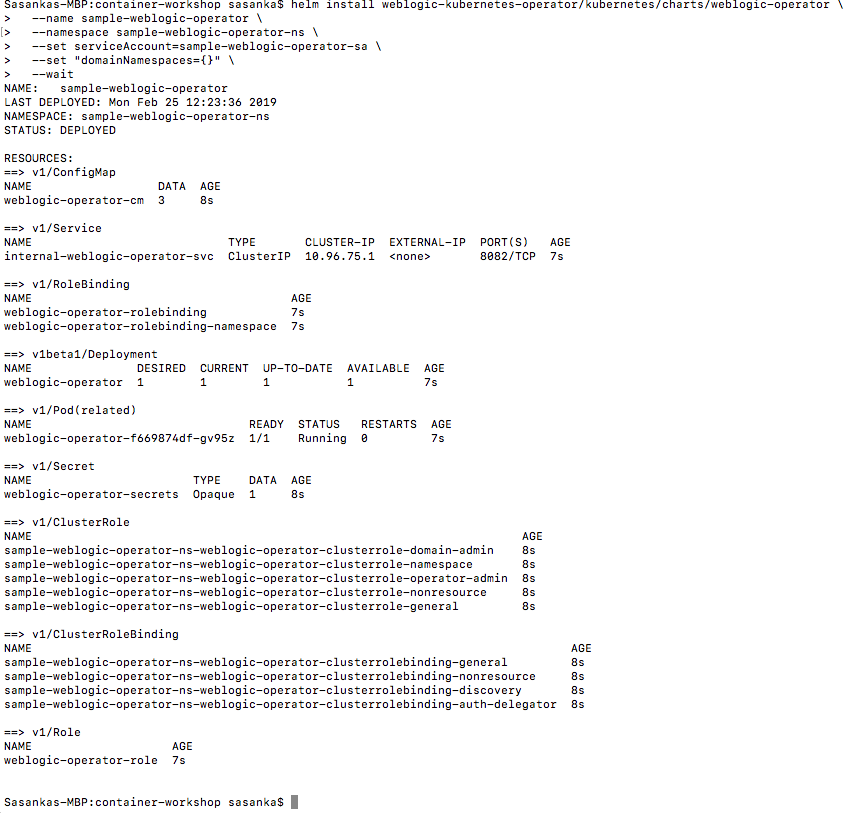
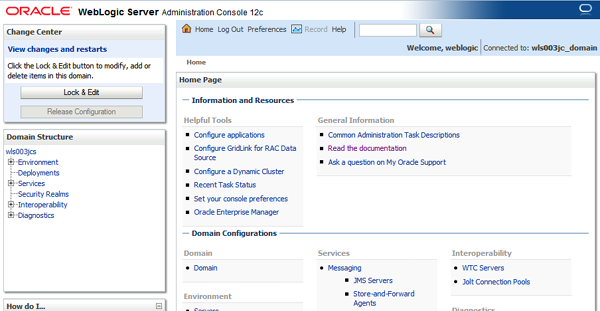
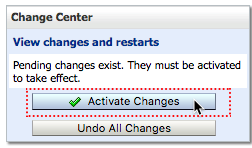
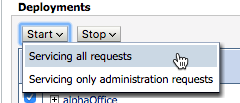

# WebLogic deployment in a Kubernetes cluster with the Oracle WebLogic Kubernetes Operator 2.0

  
Updated: 01/18/2019

## Introduction

Use this Lab guide to create a WebLogic deployment in a Kubernetes cluster with the Oracle WebLogic Kubernetes Operator

**_To log issues_**, click here to go to the [github oracle](https://github.com/oracle/learning-library/issues/new) repository issue submission form.

## Objectives

- Deployment in a Kubernetes cluster with the Oracle WebLogic Kubernetes Operator 2.0
- Test Alpha Office Product Catalog with this new environment

## Required Artifacts

- Kubernetes cluster
- Helm installation (https://github.com/helm/helm/blob/master/docs/install.md)
- Clone latest weblogic-kubernetes-operator repository
  ```bash
  $ git clone -b "v2.0" https://github.com/oracle/weblogic-kubernetes-operator.git
  ```

# WebLogic deployment in a Kubernetes cluster with the Oracle WebLogic Kubernetes Operator 2.0

## Oracle WebLogic Kubernetes Operator 2.0 Installation and Deployment

### **STEP 1**: Get following images and put them into your local registry

- If you don't already have one, obtain a Docker Store account, log in to the Docker Store
    and accept the license agreement for the [WebLogic Server image](https://hub.docker.com/_/oracle-weblogic-server-12c).

- Log in to the Docker Store from your Docker client:
  ```bash
  $ docker login
  ```
- Pull the operator image:
  ```bash
  $ docker pull oracle/weblogic-kubernetes-operator:2.0
  ```
- Pull the Traefik load balancer image:
  ```bash
  $ docker pull traefik:1.7.4
  ```
- Pull the WebLogic 12.2.1.3 install image:
  ```bash
  $ docker pull store/oracle/weblogic:12.2.1.3
  ```  
- Copy the image to all the nodes in your cluster, or put it in a Docker registry that your cluster can access.

### **STEP 2**: Grant the Helm service account the `cluster-admin` role.
- if you have incompatible version of helm client and server you can upgrade it by entering following command.
```bash
helm init --upgrade
```
- Grant the Helm service account the `cluster-admin` role.  
```bash
$ cat <<EOF | kubectl apply -f -
apiVersion: rbac.authorization.k8s.io/v1
kind: ClusterRoleBinding
metadata:
  name: helm-user-cluster-admin-role
roleRef:
  apiGroup: rbac.authorization.k8s.io
  kind: ClusterRole
  name: cluster-admin
subjects:
- kind: ServiceAccount
  name: default
  namespace: kube-system
EOF
``` 
  
### **STEP 3**: Create a Traefik (Ingress-based) load balancer.
- Use helm to install the Traefik load balancer. Use the values.yaml in the sample but set kubernetes.namespaces specifically.
  ```bash
  $ helm install stable/traefik \
  --name traefik-operator \
  --namespace traefik \
  --values weblogic-kubernetes-operator/kubernetes/samples/charts/traefik/values.yaml  \
  --set "kubernetes.namespaces={traefik}" \
  --wait
  ```
  

### **STEP 4**: Install the operator.
- Create a namespace for the operator:
  ```bash
  $ kubectl create namespace sample-weblogic-operator-ns
  ``` 
- Create a service account for the operator in the operator's namespace:
  ```bash
  $ kubectl create serviceaccount -n sample-weblogic-operator-ns sample-weblogic-operator-sa
  ``` 
- Use helm to install and start the operator from the directory you just cloned:
  ```bash
  $ helm install weblogic-kubernetes-operator/kubernetes/charts/weblogic-operator \
    --name sample-weblogic-operator \
    --namespace sample-weblogic-operator-ns \
    --set serviceAccount=sample-weblogic-operator-sa \
    --set "domainNamespaces={}" \
    --wait
  ``` 
  

- Verify that the operator's pod is running, by listing the pods in the operator's namespace. You should see one for the operator.
  ```bash
  $ kubectl get pods -n sample-weblogic-operator-ns
  ```
  

- Verify that the operator is up and running by viewing the operator pod's log:
  ```bash
  $ kubectl logs -n sample-weblogic-operator-ns -c weblogic-operator deployments/weblogic-operator
  ```
    
### **STEP 5**: Prepare your environment for a domain.
Create the domain namespace:
```
kubectl create namespace sample-domain1-ns
```
Create a Kubernetes secret containing the Administration Server boot credentials:
```
kubectl -n sample-domain1-ns create secret generic sample-domain1-weblogic-credentials \
  --from-literal=username=weblogic \
  --from-literal=password=welcome1
```
Label the secret with domainUID:
```
kubectl label secret sample-domain1-weblogic-credentials \
  -n sample-domain1-ns \
  weblogic.domainUID=sample-domain1 \
  weblogic.domainName=sample-domain1
```
Create OCI image Registry secret to allow Kubernetes to pull you custome WebLogic image. Replace the registry server region code, username and auth token respectively.
WARNING!!! - be careful about username - docker-username parameter should have a value of YOUR_TENACY_NAME/YOUR_OCIR_USERNAME - don't skip YOUR_TENANCY_NAME please.
```
kubectl create secret docker-registry ocirsecret \
  -n sample-domain1-ns \
  --docker-server=YOUR_HOME_REGION_CODE.ocir.io \
  --docker-username='YOUR_TANACY_NAME/YOUR_OCIR_USERNAME' \
  --docker-password='YOUR_OCIR_AUTH_TOKEN' \
  --docker-email='YOUR_EMAIL'
```
For example:
```
$ kubectl create secret docker-registry ocirsecret \
  -n sample-domain1-ns \
  --docker-server=fra.ocir.io \
  --docker-username='johnpsmith/oracleidentitycloudservice/john.p.smith@example.com' \
  --docker-password='my_auth_token_generated_earlier' \
  --docker-email=john.p.smith@example.com
  secret "ocirsecret" created
```

Once you have your domain namespace (WebLogic domain not yet deployed) you have to update loadbalancer's and operator's configuration about where the domain will be deployed.

Make sure before execute domain `helm` install you are in the WebLogic Operator's local Git repository folder.
```
cd /u01/content/weblogic-kubernetes-operator/
```
To update operator execute the following `helm upgrade` command:
```
helm upgrade \
  --reuse-values \
  --set "domainNamespaces={sample-domain1-ns}" \
  --wait \
  sample-weblogic-operator \
  kubernetes/charts/weblogic-operator
```

To update Traefik execute the following `helm upgrade` command:
```
helm upgrade \
  --reuse-values \
  --set "kubernetes.namespaces={traefik,sample-domain1-ns}" \
  --wait \
  traefik-operator \
  stable/traefik
```
Please note the only updated parameter in both cases is the domain namespace.


To deploy WebLogic domain you need to create a domain resource definition which contains the necessary parameters for the operator to start the WebLogic domain properly.

You can modify the provided sample in the local repository or better if you make a copy first.
```
cp /u01/content/weblogic-kubernetes-operator/kubernetes/samples/scripts/create-weblogic-domain/manually-create-domain/domain.yaml \
/u01/domain.yaml
```
Use your favourite text editor to modify domain resource definition values. If necessary remove comment leading character (#) of the parameter to activate. Always enter space before the value, after the colon.

Set the following values:

| Key | Value | Example |
|-|-|-|
|name:|sample-domain1||
|namespace:|sample-domain1-ns||
|weblogic.domainUID:|sample-domain1||
|domainHome:|/u01/oracle/user_projects/domains/sample-domain1||
|image:|YOUR_OCI_REGION_CODE.ocir.io/YOUR_TENANCY_NAME/weblogic-operator-tutorial:latest|"fra.ocir.io/johnpsmith/weblogic-operator-tutorial:latest"|
|imagePullPolicy:|"Always"||
|imagePullSecrets: <br>- name:|imagePullSecrets: <br>- name: ocirsecret||
|webLogicCredentialsSecret: <br>&nbsp;name:|webLogicCredentialsSecret: <br>&nbsp;name: sample-domain1-weblogic-credentials||

Your `domain.yaml` should be almost the same what is [available in the imported tutorial repository (click the link if you want to compare and check)](https://github.com/nagypeter/weblogic-operator-tutorial/blob/master/k8s/domain.yaml).

Save the changes and create domain resource using the apply command:
```
kubectl apply -f /u01/domain.yaml
```
Check the introspector job which needs to be run first:
```
$ kubectl get pod -n sample-domain1-ns
NAME                                         READY     STATUS              RESTARTS   AGE
sample-domain1-introspect-domain-job-kcn4n   0/1       ContainerCreating   0          7s
```
Check periodically the pods in the domain namespace and soon you will see the servers are starting:
```
$ kubectl get po -n sample-domain1-ns -o wide
NAME                             READY     STATUS    RESTARTS   AGE       IP            NODE            NOMINATED NODE
sample-domain1-admin-server      1/1       Running   0          2m        10.244.2.10   130.61.84.41    <none>
sample-domain1-managed-server1   1/1       Running   0          1m        10.244.2.11   130.61.84.41    <none>
sample-domain1-managed-server2   0/1       Running   0          1m        10.244.1.4    130.61.52.240   <none>
```
You have to see three running pods similar to the result above. If you don't see all the running pods please wait and check periodically. The whole domain deployment may take up to 2-3 minutes depending on the compute shapes.

In order to access any application or admin console deployed on WebLogic you have to configure *Traefik* ingress. OCI Load balancer is already assigned during *Traefik* install in the previous step.

As a simple solution the best is to configure path routing which will route the external traffic through *Traefik* to domain cluster address or admin server's console.

Execute the following ingress resource definition:
```
cat << EOF | kubectl apply -f -
apiVersion: extensions/v1beta1
kind: Ingress
metadata:
  name: traefik-pathrouting-1
  namespace: sample-domain1-ns
  annotations:
    kubernetes.io/ingress.class: traefik
spec:
  rules:
  - host:
    http:
      paths:
      - path: /
        backend:
          serviceName: sample-domain1-cluster-cluster-1
          servicePort: 8001
      - path: /console
        backend:
          serviceName: sample-domain1-admin-server
          servicePort: 7001          
EOF          
```

---
WARNING. If the ingress creation snippet above doesn't work then download as yaml file:
```
curl https://raw.githubusercontent.com/nagypeter/weblogic-operator-tutorial/master/k8s/traefik.path.route.yaml --output ~/traefik.path.route.yaml
```
Run `kubectl apply` to create:
```
kubectl apply -f ~/traefik.path.route.yaml
```
---

Please note the two backends and the namespace, serviceName, servicePort definitions. The first backend is the domain cluster service to reach the application at the root context path. The second is for the admin console which is a different service.

Once the Ingress has been created construct the URL of the admin console based on the following pattern:

`http://EXTERNAL-IP/console`

The EXTERNAL-IP was determined during Traefik install. If you forgot to note the execute the following command to get the public IP address:
```
$ kubectl describe svc traefik-operator --namespace traefik | grep Ingress | awk '{print $3}'
129.213.172.44
```
- Let’s use one of the node’s external IP addresses to access the Administration Console. Example: http://129.213.150.77:30701/console/
    
    

### **STEP 6**: Test Alpha Office Product Catalog war file

- Log in to the WebLogic Server Administration Console using the credentials weblogic/welcome1.

    
    
- Click Lock & Edit.

   

- Under Domain Structure, click Deployments.

   

- On the Deployments page, click Install.

   

- On the Install page, click upload your file(s).

   

- On the Install Application Assistant page, click Browse near the Deployment Archive field, download the [Alpha Office Product Catalog.war](https://github.com/Sasankaa/Misc/blob/master/AlphaProductCatalog.war) application, and select .war file to upload.

   

- The name of the selected deployment archive file appears next to the Browse button. Click Next.

   

- Make sure that the deployment archive file is selected, near the bottom of the page, and then click Next.

   

- You can install the deployment as either an application or a library. For this tutorial, we'll install it as an application. Click Next button.

   

- Select the servers or clusters to which you want to deploy the application. For this tutorial, we'll deploy the application to admin-server. So click admin-server, and then click Next. 

   

- On the Optional Settings page, click Next. The default settings are adequate for this tutorial.

   

- Review the configuration settings. You can choose to fine-tune your configuration; but for this tutorial, select No, I will review the configuration later, and then click Finish.

   

- A message is displayed that the application was deployed successfully.

   

- In the Change Center, click Activate Changes.

   

- The application is in the Prepared state and ready to be started.

   

- In the WebLogic Server Administration Console, on the Summary of Deployments page, go to the Control tab.

   

- In the Deployments table, select the check box near the application that you just deployed. Click Start, and then select Servicing all requests.

   

- Click Yes to confirm the deployment.

   

- The application is now in the Active state and is ready to accept requests.

   

- Enter the URL that you identified in the previous step in a browser. 
If you see the untrusted security certificate warning, add the certificate to your browser, as an exception, and continue. The text of this warning and the steps to proceed depend on your browser. In Firefox, for example, you can proceed by clicking Advanced and then Add Exception. 
  - The URL for the application would be in the format **https://managedServer_publicIP/contextRoot** 
   Example: http://129.213.150.77/alpha-office-product-catalog/products.jsp

- Once the app is running it will appear something like this

 

- Congratulations! You've just used the Oracle WebLogic Server Kubernetes Operator to deploy Alpha Office Product Catalog war file into the WebLogic Server.
  
- **This completes Lab 300 and the Workshop**