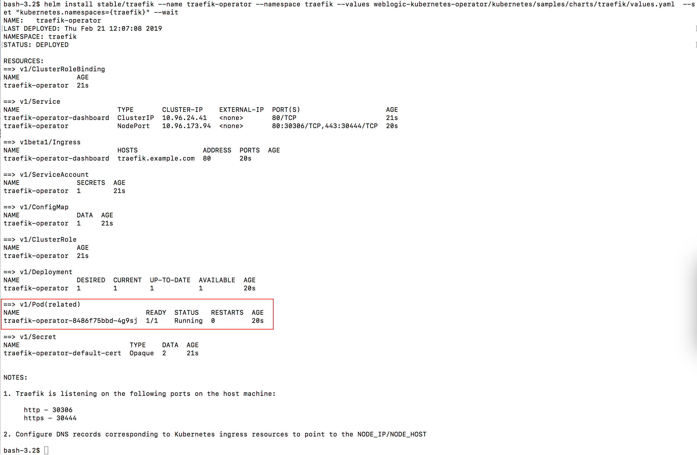
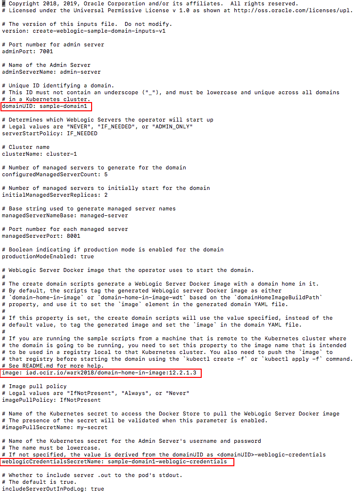
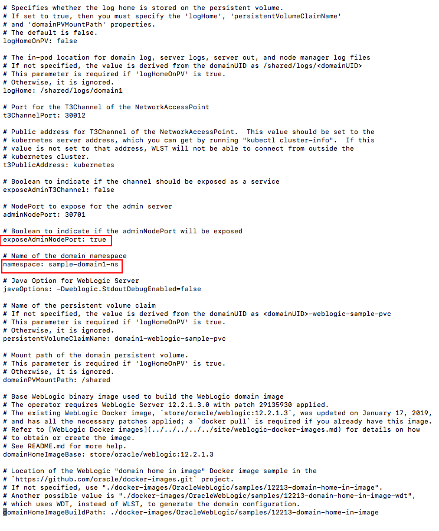
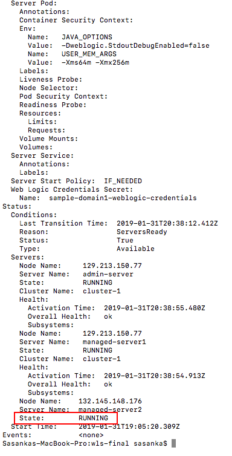
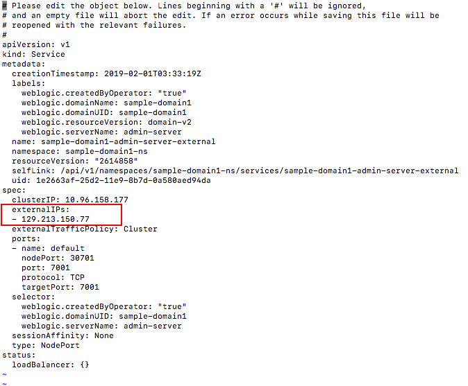
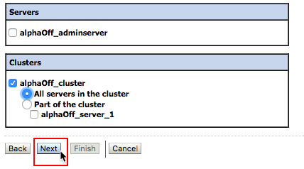
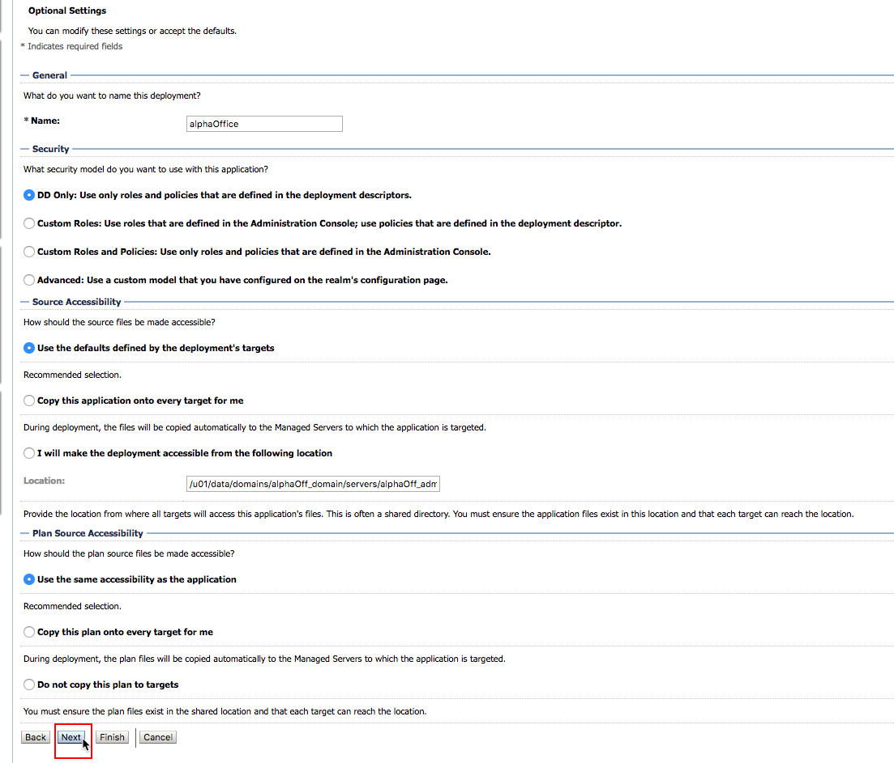

# WebLogic deployment in a Kubernetes cluster with the Oracle WebLogic Kubernetes Operator 2.0

  
Updated: 01/18/2019

## Introduction

Use this Lab guide to create a WebLogic deployment in a Kubernetes cluster with the Oracle WebLogic Kubernetes Operator

**_To log issues_**, click here to go to the [github oracle](https://github.com/oracle/learning-library/issues/new) repository issue submission form.

## Objectives

- Deployment in a Kubernetes cluster with the Oracle WebLogic Kubernetes Operator 2.0
- Test Alpha Office Product Catalog with this new environment

## Required Artifacts

- Kubernetes cluster
- Helm installation (https://github.com/helm/helm/blob/master/docs/install.md)
- Clone latest weblogic-kubernetes-operator repository
  ```bash
  $ git clone https://github.com/oracle/weblogic-kubernetes-operator
  ```

# WebLogic deployment in a Kubernetes cluster with the Oracle WebLogic Kubernetes Operator 2.0

## Oracle WebLogic Kubernetes Operator 2.0 Installation and Deployment

### **STEP 1**: Get following images and put them into your local registry

- If you don't already have one, obtain a Docker Store account, log in to the Docker Store
    and accept the license agreement for the [WebLogic Server image](https://hub.docker.com/_/oracle-weblogic-server-12c).

- Log in to the Docker Store from your Docker client:
  ```bash
  $ docker login
  ```
- Pull the operator image:
  ```bash
  $ docker pull oracle/weblogic-kubernetes-operator:2.0
  ```
- Pull the Traefik load balancer image:
  ```bash
  $ docker pull traefik:1.7.4
  ```
- Pull the WebLogic 12.2.1.3 install image:
  ```bash
  $ docker pull store/oracle/weblogic:12.2.1.3
  ```  
- Copy the image to all the nodes in your cluster, or put it in a Docker registry that your cluster can access.

### **STEP 2**: Grant the Helm service account the `cluster-admin` role.

- Grant the Helm service account the `cluster-admin` role.  
```bash
$ cat <<EOF | kubectl apply -f -
apiVersion: rbac.authorization.k8s.io/v1
kind: ClusterRoleBinding
metadata:
  name: helm-user-cluster-admin-role
roleRef:
  apiGroup: rbac.authorization.k8s.io
  kind: ClusterRole
  name: cluster-admin
subjects:
- kind: ServiceAccount
  name: default
  namespace: kube-system
EOF
``` 
  
### **STEP 3**: Create a Traefik (Ingress-based) load balancer.
- Use helm to install the Traefik load balancer. Use the values.yaml in the sample but set kubernetes.namespaces specifically.
  ```bash
  $ helm install stable/traefik \
  --name traefik-operator \
  --namespace traefik \
  --values kubernetes/samples/charts/traefik/values.yaml  \
  --set "kubernetes.namespaces={traefik}" \
  --wait
  ```

### **STEP 4**: Install the operator.
- Create a namespace for the operator:
  ```bash
  $ kubectl create namespace sample-weblogic-operator-ns
  ``` 
- Create a service account for the operator in the operator's namespace:
  ```bash
  $ kubectl create serviceaccount -n sample-weblogic-operator-ns sample-weblogic-operator-sa
  ``` 
- Use helm to install and start the operator from the directory you just cloned:
  ```bash
  $ helm install kubernetes/charts/weblogic-operator \
    --name sample-weblogic-operator \
    --namespace sample-weblogic-operator-ns \
    --set image=oracle/weblogic-kubernetes-operator:2.0-rc2 \
    --set serviceAccount=sample-weblogic-operator-sa \
    --set "domainNamespaces={}" \
    --wait
  ``` 
- Verify that the operator's pod is running, by listing the pods in the operator's namespace. You should see one for the operator.
  ```bash
  $ kubectl get pods -n sample-weblogic-operator-ns
  ```
  

- Verify that the operator is up and running by viewing the operator pod's log:
  ```bash
  $ kubectl logs -n sample-weblogic-operator-ns -c weblogic-operator deployments/weblogic-operator
  ```
    
### **STEP 5**: Prepare your environment for a domain.
- Create a namespace that can host one or more domains:
  ```bash
  $ kubectl create namespace sample-domain1-ns
  ```
- Use `helm` to configure the operator to manage domains in this namespace:
  ```bash
  $ helm upgrade \
    --reuse-values \
    --set "domainNamespaces={sample-domain1-ns}" \
    --wait \
    sample-weblogic-operator \
    weblogic-kubernetes-operator/kubernetes/charts/weblogic-operator
  ```
     
- Configure Traefik to manage Ingresses created in this namespace:
  ```bash
  $ helm upgrade \
    --reuse-values \
    --set "kubernetes.namespaces={traefik,sample-domain1-ns}" \
    --wait \
    traefik-operator \
    stable/traefik
  ```
### **STEP 6**: Create a domain in the domain namespace.
- Create a Kubernetes secret containing the `username` and `password` for the domain using the [`create-weblogic-credentials`]:
  ```bash
  $ kubernetes/samples/scripts/create-weblogic-domain-credentials/create-weblogic-credentials.sh \
    -u weblogic -p welcome1 -n sample-domain1-ns -d sample-domain1
  ```

- The sample will create a secret named `domainUID-weblogic-credentials` where the `domainUID` is replaced
with the value you provided.  
  For example, the command above would create a secret named `sample-domain1-weblogic-credentials`.


- Edit the sample `kubernetes/samples/scripts/create-weblogic-domain/domain-home-in-image/create-domain-inputs.yaml` file and update your  `domainUID` (`sample-domain1`), domain namespace (`sample-domain1-ns`), and the `domainHomeImageBase` (`store/oracle/weblogic:12.2.1.3`).

- Setting `weblogicCredentialsSecretName` to the name of the secret containing the WebLogic credentials, in this case `sample-domain1-weblogic-credentials`.

- Leaving the `image` empty unless you need to tag the new image that the script builds to a different name. Here the image name has to be `iad.ocir.io/wark2018/domain-home-in-image:12.2.1.3`

**NOTE**: If you set the `domainHomeImageBuildPath` property to `./docker-images/OracleWebLogic/samples/12213-domain-home-in-image-wdt`, make sure that your `JAVA_HOME` is set to a Java JDK version 1.8 or later.
    
    

For example:
  ```bash
  $ cd kubernetes/samples/scripts/create-weblogic-domain/domain-home-in-image
  $ ./create-domain.sh -i create-domain-inputs.yaml -o /some/output/directory -u weblogic -p welcome1 -e
  ```

You need to provide the WebLogic administration user name and password in the `-u` and `-p` options
respectively, as shown in the example.

**NOTE**: When using this sample, the WebLogic Server credentials that you specify, in three separate places, must be consistent:

1. The secret that you create for the credentials.
2. The properties files in the sample project you choose to create the Docker image from.
3. The parameters you supply to the `createDomain.sh` script.

If you specify the `-e` option, the script will generate the
Kubernetes YAML files *and* apply them to your cluster.  If you omit the `-e` option, the
script will just generate the YAML files, but will not take any action on your cluster.

If you run the sample from a machine that is remote to the Kubernetes cluster, and you need to push the new image to a registry that is local to the cluster, you need to do the following:
* Set the `image` property in the inputs file to the target image name (including the registry hostname/port, and the tag if needed).
* Run the `create-domain.sh` script without the `-e` option.
* Push the `image` to the registry - Already completed Lab 100

    
    

- Run the following command to create the domain.
   ```bash
   $ kubectl apply -f /some/output/directory/weblogic-domains/sample-domain1/domain.yaml
   ```
    

- Confirm that the operator started the servers for the domain:
- Use `kubectl` to show that the domain resource was created:
  ```bash
  $ kubectl describe domain sample-domain1 -n sample-domain1-ns
  ```
 - After a short time, you will see the Administration Server and Managed Servers running.

    

- You should also see all the Kubernetes pods for the domain up and running.
  ```
  $ kubectl get pods -n sample-domain1-ns
  ```

    

- You should also see all the Kubernetes services for the domain.
  ```
  $ kubectl get services -n sample-domain1-ns
  ```

    
    
- If you NodePort service does not have an external IP, you need to edit it and add the external IPs of at least one of your worker nodes.
  
  ```
  $ kubectl edit service sample-domain1-admin-server-external -n sample-domain1-ns
  ```

    

- Then when you do get services again, you will see it listed under the EXTERNAL-IP column, instead of none.
  
    

- Let’s use one of the node’s external IP addresses to access the Administration Console. Example: http://129.213.150.77:30701/console/
    
    

### **STEP 7**: Test Alpha Office Product Catalog war file

- Log in to the WebLogic Server Administration Console using the credentials weblogic/welcome1.

    
    
- Click Lock & Edit.

   

- Under Domain Structure, click Deployments.

   

- On the Deployments page, click Install.

   

- On the Install page, click upload your file(s).

   

- On the Install Application Assistant page, click Browse near the Deployment Archive field, and select the alphaOffice.war application that you downloaded earlier.

   

- The name of the selected deployment archive file appears next to the Browse button. Click Next.

   

- Make sure that the deployment archive file is selected, near the bottom of the page, and then click Next.

   

- You can install the deployment as either an application or a library. For this tutorial, we'll install it as an application. Click Next button.

   

- Select the servers or clusters to which you want to deploy the application. For this tutorial, we'll deploy the application to all the servers in the cluster. So click All servers in the cluster, and then click Next. 
Note that the the cluster name (WebLogic alphaOff_cluster in this example) would be the first eight characters of your service instance's name followed by _cluster.

   

- On the Optional Settings page, click Next. The default settings are adequate for this tutorial.

   

- Review the configuration settings. You can choose to fine-tune your configuration; but for this tutorial, select No, I will review the configuration later, and then click Finish.

   

- A message is displayed that the application was deployed successfully.

   

- In the Change Center, click Activate Changes.

   

- The application is in the Prepared state and ready to be started.

   

- In the WebLogic Server Administration Console, on the Summary of Deployments page, go to the Control tab.

   

- In the Deployments table, select the check box near the application that you just deployed. Click Start, and then select Servicing all requests.

   

- Click Yes to confirm the deployment.

   

- The application is now in the Active state and is ready to accept requests.

   

- Enter the URL that you identified in the previous step in a browser. 
If you see the untrusted security certificate warning, add the certificate to your browser, as an exception, and continue. The text of this warning and the steps to proceed depend on your browser. In Firefox, for example, you can proceed by clicking Advanced and then Add Exception. 
  - The URL for the application would be in the format **https://managedServer_publicIP/contextRoot** 
   Example: http://129.213.150.77/alpha-office-product-catalog/products.jsp

- Once the app is running it will appear something like this

 

- Congratulations! You've just used the Oracle WebLogic Server Kubernetes Operator to deploy Alpha Office Product Catalog war file into the WebLogic Server.
  
- **This completes Lab 300 and the Workshop**