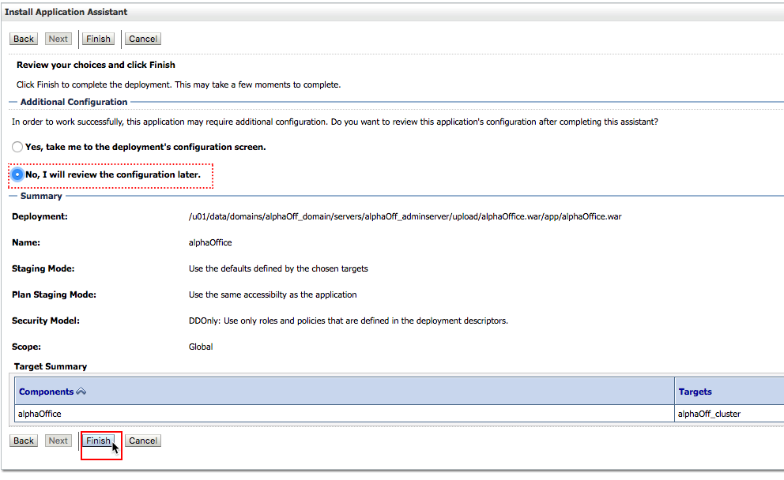
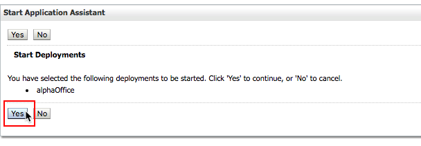

# Autonomous Transaction Processing (ATP) Database Integration


Updated: March 21, 2019

## Introduction

In this lab you will use your Oracle Cloud Trial Account to upload a Product Catalog text file to Object Storage and leverage Oracle Machine Learning SQL Query Scratchpad to import the Data file into an Autonomous Transaction Processing (ATP) Database.


**_To log issues_**, click here to go to the [github oracle](https://github.com/oracle/learning-library/issues/new) repository issue submission form.

## Objectives

- Create Object Storage Bucket and Upload Data File to the Bucket.
- Setup SQL Developer Connection to Autonomous Transaction Processing (ATP) Database.
- Create ATP Database user and DBMS_CLOUD Credential.
- Import Data into ATP Database using Oracle Machine Learning SQL Query Scratchpad.
- Deploy Modified Alpha Office Product Catalog war file to the Kubernetes Cluster.

## Required Artifacts

- [Oracle Cloud Infrastructure](https://cloud.oracle.com/en_US/cloud-infrastructure) enabled account.
- [Github](https://github.com/) account.

# Autonomous Transaction Processing (ATP) Database Integration

## Object Storage Setup

### **STEP 1**: Log in to your Oracle Cloud Infrastructure (OCI)

- From any browser go to:

    [https://cloud.oracle.com/en_US/sign-in](https://cloud.oracle.com/en_US/sign-in)

- Enter your **Cloud Account Name** in the input field and click the **My Services** button. If you have a trial account, this can be found in your welcome email. Otherwise, this will be supplied by your workshop instructor.

  

- Enter your **Username** and **Password** in the input fields and click **Sign In**. If you have a trial account, these can be found in your welcome email. Otherwise, these will be supplied by your workshop instructor.

  

- You are presented with the Oracle Cloud Infrastructure (OCI) Dashboard/Portal

  

### **STEP 2**: Create Object Storage Bucket

- Click the **Menu icon** in the upper left corner to open the navigation menu. Under the **Core Infrastructure** section, select **Object Storage** then **Object Storage** .
  

- Select the **Compartment** `Demo` and click **Create Bucket**

  

- In the **Bucket Name** field, enter `atpData` and click **Create Bucket**

  

- In a moment, your new Object Storage Bucket will show up in the list. Once it appears click on the `atpData` bucket url to view the details.
  
  

### **STEP 3**: Upload Data File into Object Storage Bucket

- Next click **Upload Object**
  
  

- **Right-Click** [products.txt](https://github.com/Sasankaa/Misc/blob/master/products.txt) and Save Link as a **text file** (products.txt).

- **Browse** or **Drag/Drop** the products.txt file and Click **Upload Object**.

  

- Click the **Close** button to close.
  
  

- In a moment, the file will be uploaded to Object Storage.
  
  

- Capture the values for **REGION, BUCKET, OBJECT_STORAGE_NAMESPACE, FILENAME** in the text editor from the same screen you uploaded the Data file.
  
  

- Your text editor should look similar to this

  
## Import Data into ATP Database using Oracle Machine Learning SQL Query Scratchpad

### **STEP 1**: Create an Autonomous Transaction Processing (ATP) Database

e require a Database to store the Alpha Office data which is accessed later in this workshop.  We will create an Autonomous Transaction Processing (ATP) Database to load data into.  Autonomous Transaction Processing is one of a family of cloud services built on the self-driving, self-securing, and self-repairing Oracle Autonomous Database.  Autonomous Transaction Processing uses machine learning and automation to eliminate human labor, human error, and manual tuning, delivering unprecedented cost saving, security, availability, and production. Autonomous Transaction Processing supports a complex mix of high-performance transactions, reporting, batch, IoT, and machine learning in a single database, allowing much simpler application development and deployment and enabling real-time analytics, personalization, and fraud detection.

- Click the **Menu icon** in the upper left corner to open the navigation menu. Under the **Database** section of the menu, click **Autonomous Transaction Processing**.

  

- Select the **Compartment** `Demo` and click **Create Autonomous Transaction Processing Database**.

  

-  Select the **Compartment** `Demo` if it is not already selected. Enter the **Display Name** `AlphaOfficeDB`, **Database Name** `AlphaOfficeDB`, enter the **Administrator Password** and Click **Create Autonomous Transaction Processing Database**
  
  
  

-  After approximately 5 minutes, the ATP instance will be provisioned. Once it appears click on the `AlphaOfficeDB` to view the details. You can immediately proceed to the next section.

  

### **STEP 2**: Create an Autonomous Transaction Processing (ATP) Database User (Oracle ML User)

- Click the **Service Control** to view Overview, Activity, and Administration.
  
  

- Click the **Administration** to view Administration tasks and Click **Manage Oracle ML Users**.
  
  

  

- Click the **Create** button to create user.
  
  

- **Uncheck** "Generate password and email account details to user, User will be required to reset the password on first sign in." and enter **Username, Email Address, and Password** to Create User.

  

- You can see user is successfully created and Click **Home icon**.

  

- Enter user credentials as follows.

  

- You are successfully connected to your ATP database instance.

  

### **STEP 3**: Import Data into ATP Database using Oracle Machine Learning SQL Query Scratchpad

- Click **Run SQL Statements** to open Oracle Machine Learning SQL Query Scratchpad.
  
  

- Copy this [script](https://github.com/Sasankaa/Misc/blob/master/products_create.sql) and paste it on SQL Query Scratchpad. Click highlighted **Play** button to run this paragraph.
  	```
  CREATE TABLE "PRODUCTS" (
	"PRODUCT_ID" NUMBER(15,0), 
	"PARENT_CATEGORY_ID" NUMBER(15,0), 
	"CATEGORY_ID" NUMBER(15,0), 
	"PRODUCT_NAME" VARCHAR2(150 BYTE), 
	"PRODUCT_STATUS" VARCHAR2(30 BYTE), 
	"COST_PRICE" NUMBER(8,2), 
	"LIST_PRICE" NUMBER(8,2), 
	"MIN_PRICE" NUMBER(8,2), 
	"WARRANTY_PERIOD_MONTHS" NUMBER(2,0), 
	"EXTERNAL_URL" VARCHAR2(200 BYTE), 
	"ATTRIBUTE_CATEGORY" VARCHAR2(30 BYTE), 
	"ATTRIBUTE1" VARCHAR2(150 BYTE), 
	"ATTRIBUTE2" VARCHAR2(150 BYTE), 
	"ATTRIBUTE3" VARCHAR2(150 BYTE), 
	"ATTRIBUTE4" VARCHAR2(150 BYTE), 
	"ATTRIBUTE5" VARCHAR2(150 BYTE), 
	"CREATED_BY" VARCHAR2(60 BYTE), 
	"CREATION_DATE" DATE, 
	"LAST_UPDATED_BY" VARCHAR2(60 BYTE), 
	"LAST_UPDATE_DATE" DATE, 
	"OBJECT_VERSION_ID" NUMBER(15,0),
	"TWITTER_TAG" VARCHAR2(1000 BYTE)
   );
	```

  
  

- In the same **SQL Query Scratchpad**, execute the following SQL Statements to create the **DBMS_CLOUD Credential** `OBJ_CRED_NAME`.

	```
  %script
	SET DEFINE OFF
  begin
	  DBMS_CLOUD.create_credential(
		credential_name => 'OBJ_CRED_NAME',
		username => 'your username',
		password => 'Auth Token Generated in Lab 100'
	  );
	end;
	/
	```

	

- In the same **SQL Query Scratchpad**, execute the following SQL Statements to export products object storage using the **DBMS_CLOUD Credential** `OBJ_CRED_NAME`.

	```
  %script
  BEGIN
    DBMS_CLOUD.COPY_DATA(
        table_name => 'PRODUCTS',
        credential_name => 'OBJ_CRED_NAME',
        file_uri_list => 'https://swiftobjectstorage.us-ashburn-1.oraclecloud.com/v1/ssaa2019/atpData/products.txt',
        format => json_object('delimiter' value '|')
    );
  END;
  /
	```

  

- To verify the Data  import job created and loaded the tables, run the following SQL statement.
  
  ```
  SELECT * FROM PRODUCTS;
  ```
  


## Deploy Modified Alpha Office Product Catalog war file to the Kubernetes Cluster

### **STEP 1**: Download ATP Wallet Zip File

  - Click the **Menu icon** in the upper left corner to open the navigation menu. Under the **Database** section, select **Autonomous Transaction Processing**.

	

  - Select the **AlphaOffice** ATP Database

	

  - Click **DB Connection**

	

  - Click **Download**

	

  - Enter the **Password** and click **Download**

	

  - The **Wallet_AlphaOfficeDB.zip** file was Downloaded to the Download directory.
  - Copy the database wallet file you downloaded. You will scp this wallet file from the local computer to the instance you created in lab 200.
  ```
  scp -i /path/to/ssh/pub/file opc@hostname /path/to/local/wallet/file opc@hostname:/home/opc
  ```
  

  - Unzip **Wallet_AlphaOfficeDB.zip** file.  As information, the ATP Wallet file **Wallet_AlphaOfficeDB.zip** contains the following files

	

### **STEP 2**: Test modified Alpha Office Product Catalog war file

- In Lab 300 when you do get services again, you will see it listed under the EXTERNAL-IP column.
  
    

- Let’s use one of the node’s external IP addresses to access the Administration Console. Example: http://129.213.150.77:30701/console/
    
    
- Log in to the WebLogic Server Administration Console using the credentials weblogic/welcome1.

    
    
- Click Lock & Edit.

   

- Under Domain Structure, click Deployments.

   

- On the Deployments page, click Install.

   

- On the Install page, click upload your file(s).

   

- On the Install Application Assistant page, click Browse near the Deployment Archive field, download the [Alpha Office Product Catalog.war](https://github.com/Sasankaa/Misc/blob/master/Resources/wls-oke/AlphaProductCatalog.war) application, and select .war file to upload.

   

- The name of the selected deployment archive file appears next to the Browse button. Click Next.

   

- Make sure that the deployment archive file is selected, near the bottom of the page, and then click Next.

   

- You can install the deployment as either an application or a library. For this tutorial, we'll install it as an application. Click Next button.

   

- Select the servers or clusters to which you want to deploy the application. For this tutorial, we'll deploy the application to admin-server. So click admin-server, and then click Next. 

   

- On the Optional Settings page, click Next. The default settings are adequate for this tutorial.

   

- Review the configuration settings. You can choose to fine-tune your configuration; but for this tutorial, select No, I will review the configuration later, and then click Finish.

   

- A message is displayed that the application was deployed successfully.

   

- In the Change Center, click Activate Changes.

   

- The application is in the Prepared state and ready to be started.

   

- In the WebLogic Server Administration Console, on the Summary of Deployments page, go to the Control tab.

   

- In the Deployments table, select the check box near the application that you just deployed. Click Start, and then select Servicing all requests.

   

- Click Yes to confirm the deployment.

   

- The application is now in the Active state and is ready to accept requests.

   

- Enter the URL that you identified in the previous step in a browser. 
If you see the untrusted security certificate warning, add the certificate to your browser, as an exception, and continue. The text of this warning and the steps to proceed depend on your browser. In Firefox, for example, you can proceed by clicking Advanced and then Add Exception. 
  - The URL for the application would be in the format **https://managedServer_publicIP/contextRoot** 
   Example: http://129.213.150.77/alpha-office-product-catalog/products.jsp

- Once the app is running it will appear something like this

 

- **This completes Lab 400 and the Workshop**